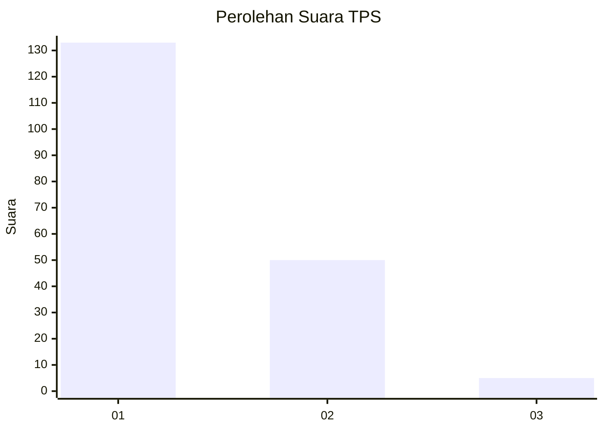
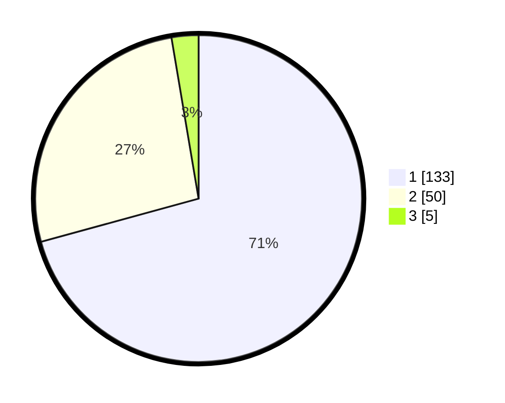

# Hasil

## Grafik

## Tabel

| No. | Nama Paslon    | Suara | Suara (raw) | Persentase |
|:--- |:-------------- | -----:| -----------:| ----------:|
| 1   | ANIES MUHAIMIN | 133   | [133][p-1]  | 70,74      |
| 2   | PRABOWO GIBRAN | 50    | [50][p-2]   | 26,60      |
| 3   | GANJAR MAHFUD  | 5     | [5][p-3]    | 2,66       |

[p-1]: https://github.com/gigit-pemilu/pemilu-2024-16-sumatera-selatan/blob/main/pilpres/hitung-suara/sub/16-sumatera-selatan/sub/71-kota-palembang/sub/14-plaju/sub/1005-komperta/sub/002-tps/sub/paslon-1.txt
[p-2]: https://github.com/gigit-pemilu/pemilu-2024-16-sumatera-selatan/blob/main/pilpres/hitung-suara/sub/16-sumatera-selatan/sub/71-kota-palembang/sub/14-plaju/sub/1005-komperta/sub/002-tps/sub/paslon-2.txt
[p-3]: https://github.com/gigit-pemilu/pemilu-2024-16-sumatera-selatan/blob/main/pilpres/hitung-suara/sub/16-sumatera-selatan/sub/71-kota-palembang/sub/14-plaju/sub/1005-komperta/sub/002-tps/sub/paslon-3.txt

## Foto C Plano

https://sirekap-obj-formc.kpu.go.id/322a/pemilu/ppwp/16/71/14/10/05/1671141005002-20240214-234241--a51799d0-71f5-4d6c-8cb0-5655e2777a3d.jpg

https://sirekap-obj-formc.kpu.go.id/322a/pemilu/ppwp/16/71/14/10/05/1671141005002-20240214-234357--e1ae63db-4c33-46fe-bba6-b67428eb476b.jpg

https://sirekap-obj-formc.kpu.go.id/322a/pemilu/ppwp/16/71/14/10/05/1671141005002-20240214-234501--e1d1805d-10f7-403f-8e18-619e548d00c7.jpg

## Metadata

| Key        | Value               |
| ---------- | ------------------- |
| Time Stamp | 2024-02-24 22:31:28 |

