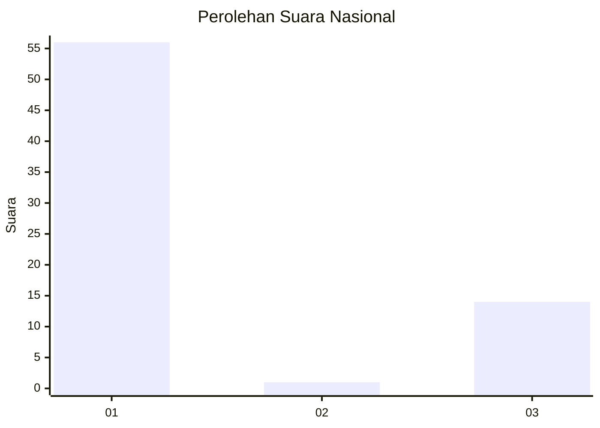
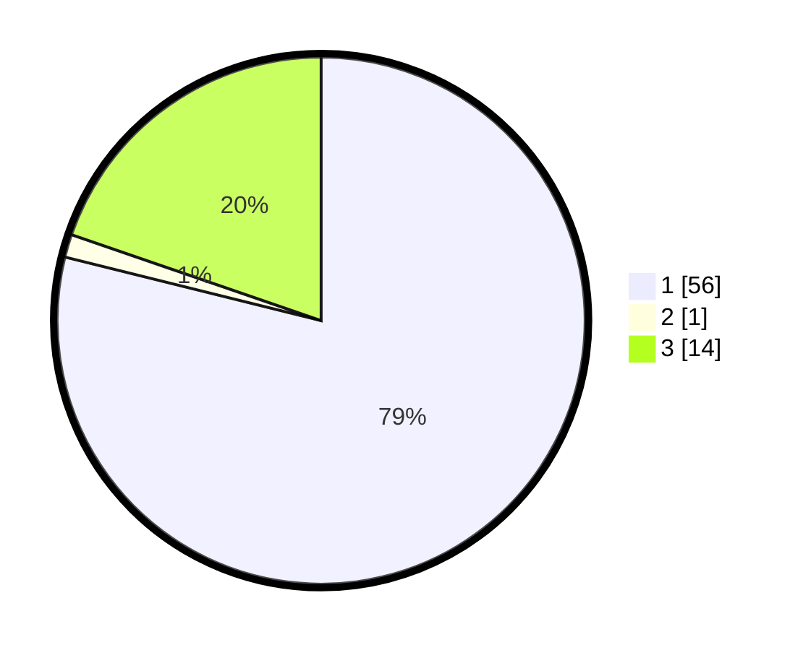

# Hasil

## Grafik

## Tabel

| No. | Nama Paslon    | Suara | Suara (raw) | Persentase |
|:--- |:-------------- | -----:| -----------:| ----------:|
| 1   | ANIES MUHAIMIN | 56    | [56][p-1]   | 78,87      |
| 2   | PRABOWO GIBRAN | 1     | [1][p-2]    | 1,41       |
| 3   | GANJAR MAHFUD  | 14    | [14][p-3]   | 19,72      |

[p-1]: https://github.com/gigit-pemilu/pemilu-2024/blob/main/pilpres/hitung-suara/sub/16-sumatera-selatan/sub/71-kota-palembang/sub/14-plaju/sub/1007-talangbubuk/sub/013-tps/sub/paslon-1.txt
[p-2]: https://github.com/gigit-pemilu/pemilu-2024/blob/main/pilpres/hitung-suara/sub/16-sumatera-selatan/sub/71-kota-palembang/sub/14-plaju/sub/1007-talangbubuk/sub/013-tps/sub/paslon-2.txt
[p-3]: https://github.com/gigit-pemilu/pemilu-2024/blob/main/pilpres/hitung-suara/sub/16-sumatera-selatan/sub/71-kota-palembang/sub/14-plaju/sub/1007-talangbubuk/sub/013-tps/sub/paslon-3.txt

## Foto C Plano

https://sirekap-obj-formc.kpu.go.id/6d9d/pemilu/ppwp/16/71/14/10/07/1671141007013-20240214-211216--68ce8e8d-4298-4337-8ab7-8dc92d477a21.jpg

https://sirekap-obj-formc.kpu.go.id/6d9d/pemilu/ppwp/16/71/14/10/07/1671141007013-20240214-211425--4380a9db-8dd4-4804-b5b9-bd66cda40c8b.jpg

https://sirekap-obj-formc.kpu.go.id/6d9d/pemilu/ppwp/16/71/14/10/07/1671141007013-20240214-211513--96cc9ecd-84bb-4088-afb0-bf3ca3500b12.jpg

## Metadata

| Key        | Value               |
| ---------- | ------------------- |
| Time Stamp | 2024-02-24 22:31:28 |

