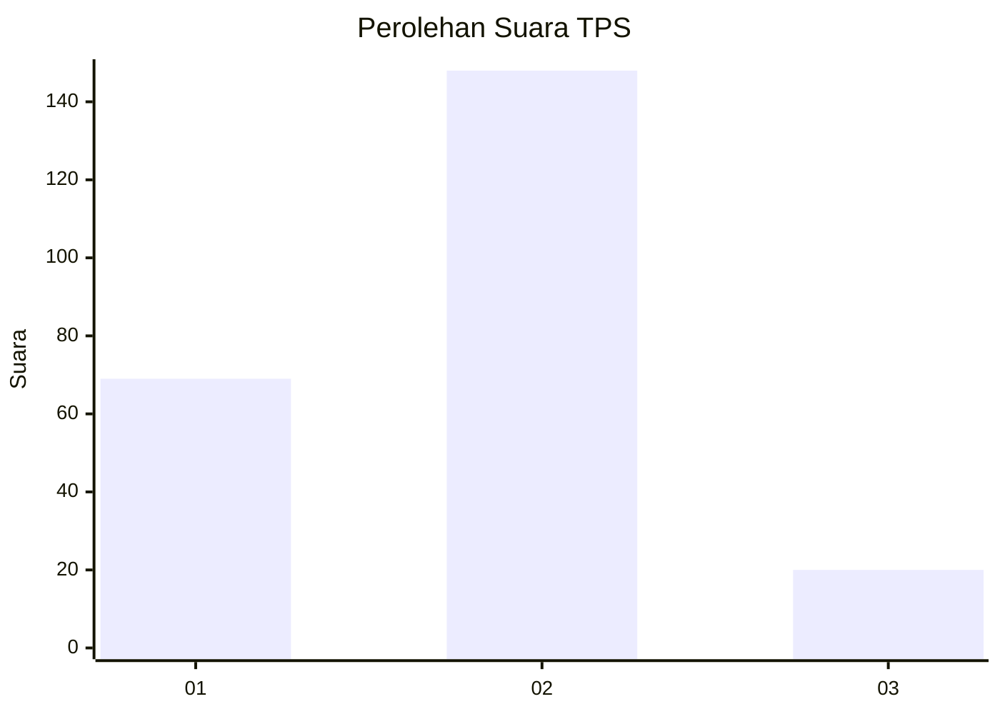
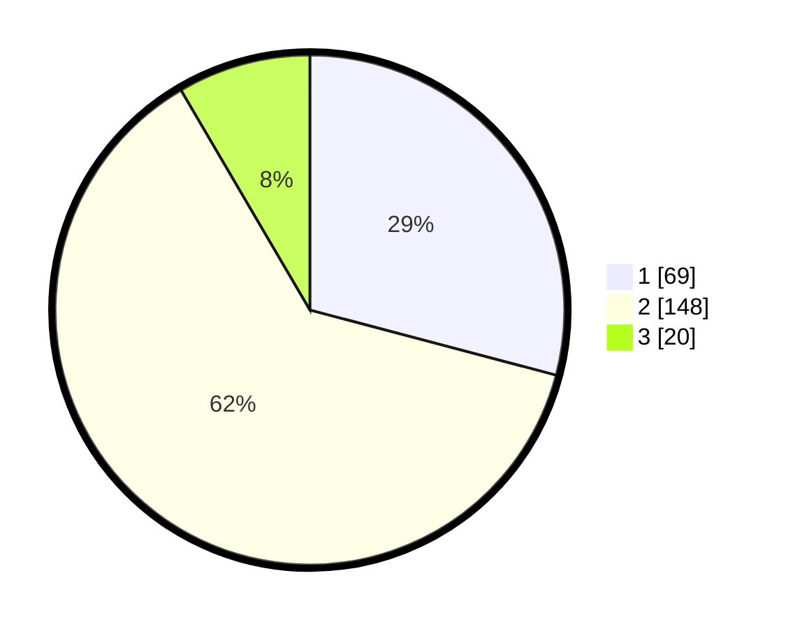

# Hasil

## Grafik

## Tabel

| No. | Nama Paslon    | Suara | Suara (raw) | Persentase |
|:--- |:-------------- | -----:| -----------:| ----------:|
| 1   | ANIES MUHAIMIN | 69    | [69][p-1]   | 29,11      |
| 2   | PRABOWO GIBRAN | 148   | [148][p-2]  | 62,45      |
| 3   | GANJAR MAHFUD  | 20    | [20][p-3]   | 8,44       |

[p-1]: https://github.com/gigit-pemilu/pemilu-2024-16-sumatera-selatan/blob/main/pilpres/hitung-suara/sub/16-sumatera-selatan/sub/71-kota-palembang/sub/15-alang-alang-lebar/sub/1001-alang-alang-lebar/sub/001-tps/sub/paslon-1.txt
[p-2]: https://github.com/gigit-pemilu/pemilu-2024-16-sumatera-selatan/blob/main/pilpres/hitung-suara/sub/16-sumatera-selatan/sub/71-kota-palembang/sub/15-alang-alang-lebar/sub/1001-alang-alang-lebar/sub/001-tps/sub/paslon-2.txt
[p-3]: https://github.com/gigit-pemilu/pemilu-2024-16-sumatera-selatan/blob/main/pilpres/hitung-suara/sub/16-sumatera-selatan/sub/71-kota-palembang/sub/15-alang-alang-lebar/sub/1001-alang-alang-lebar/sub/001-tps/sub/paslon-3.txt

## Foto C Plano

https://sirekap-obj-formc.kpu.go.id/a8f3/pemilu/ppwp/16/71/15/10/01/1671151001001-20240214-203925--0f1eefed-6061-4c3d-8358-f7f058a4d5a0.jpg

https://sirekap-obj-formc.kpu.go.id/a8f3/pemilu/ppwp/16/71/15/10/01/1671151001001-20240214-211757--931bcda0-3703-42c1-9619-a84f89bfadea.jpg

https://sirekap-obj-formc.kpu.go.id/a8f3/pemilu/ppwp/16/71/15/10/01/1671151001001-20240214-200423--01a7cc37-6bda-444f-84d3-4ca609de8c6a.jpg

## Metadata

| Key        | Value               |
| ---------- | ------------------- |
| Time Stamp | 2024-02-25 11:00:00 |

