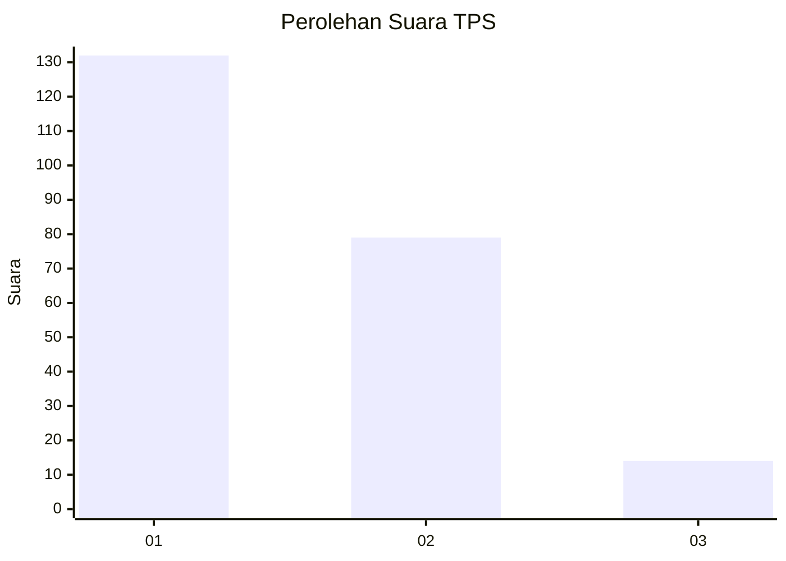
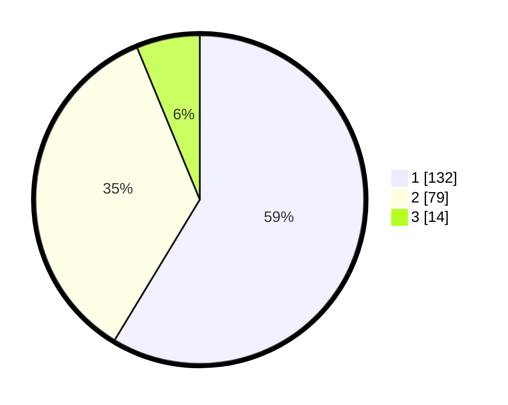

# Hasil

## Grafik

## Tabel

| No. | Nama Paslon    | Suara | Suara (raw) | Persentase |
|:--- |:-------------- | -----:| -----------:| ----------:|
| 1   | ANIES MUHAIMIN | 132   | [132][p-1]  | 58,67      |
| 2   | PRABOWO GIBRAN | 79    | [79][p-2]   | 35,11      |
| 3   | GANJAR MAHFUD  | 14    | [14][p-3]   | 6,22       |

[p-1]: https://github.com/gigit-pemilu/pemilu-2024-16-sumatera-selatan/blob/main/pilpres/hitung-suara/sub/16-sumatera-selatan/sub/71-kota-palembang/sub/15-alang-alang-lebar/sub/1001-alang-alang-lebar/sub/017-tps/sub/paslon-1.txt
[p-2]: https://github.com/gigit-pemilu/pemilu-2024-16-sumatera-selatan/blob/main/pilpres/hitung-suara/sub/16-sumatera-selatan/sub/71-kota-palembang/sub/15-alang-alang-lebar/sub/1001-alang-alang-lebar/sub/017-tps/sub/paslon-2.txt
[p-3]: https://github.com/gigit-pemilu/pemilu-2024-16-sumatera-selatan/blob/main/pilpres/hitung-suara/sub/16-sumatera-selatan/sub/71-kota-palembang/sub/15-alang-alang-lebar/sub/1001-alang-alang-lebar/sub/017-tps/sub/paslon-3.txt

## Foto C Plano

https://sirekap-obj-formc.kpu.go.id/c8b0/pemilu/ppwp/16/71/15/10/01/1671151001017-20240214-224007--364057b3-f32d-4057-9c52-77dd0a659f9d.jpg

https://sirekap-obj-formc.kpu.go.id/c8b0/pemilu/ppwp/16/71/15/10/01/1671151001017-20240214-224101--b12ba236-c03b-4d8c-bf3d-5a50264891fa.jpg

https://sirekap-obj-formc.kpu.go.id/c8b0/pemilu/ppwp/16/71/15/10/01/1671151001017-20240214-224139--466b6b47-3ed0-487d-934e-9a2c247fa3e9.jpg

## Metadata

| Key        | Value               |
| ---------- | ------------------- |
| Time Stamp | 2024-02-25 16:00:00 |

