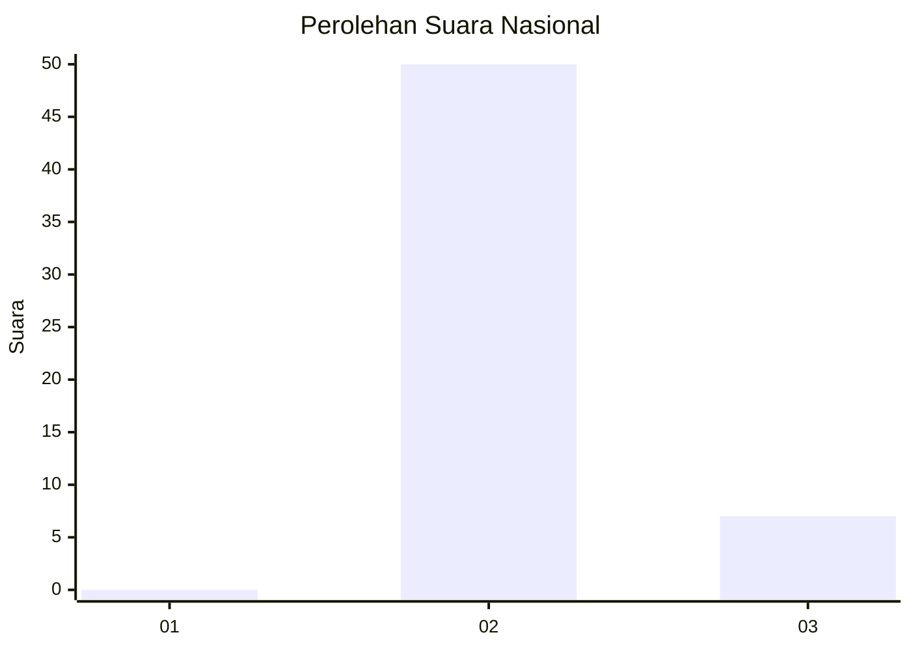
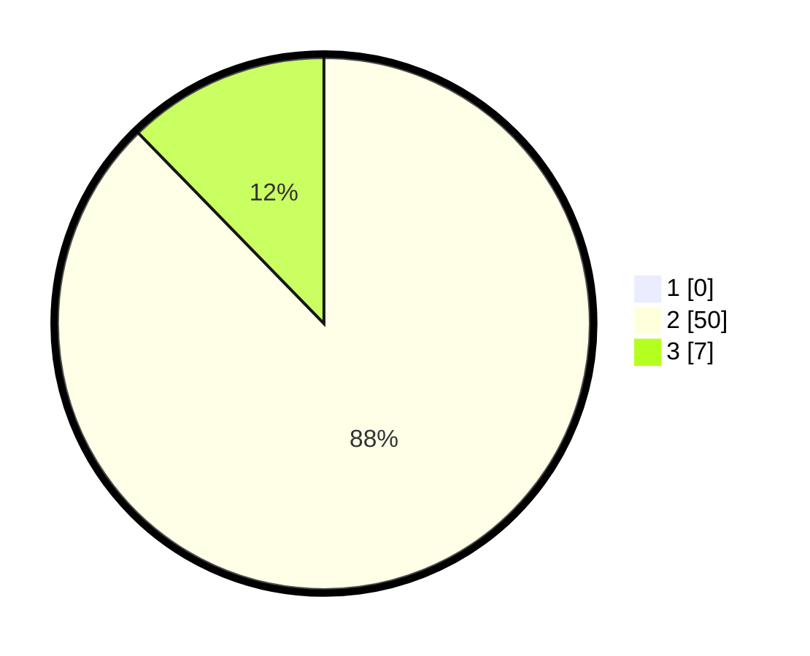

# Hasil

## Grafik

## Tabel

| No. | Nama Paslon    | Suara | Suara (raw) | Persentase |
|:--- |:-------------- | -----:| -----------:| ----------:|
| 1   | ANIES MUHAIMIN | 0     | [0][p-1]    | 0,00       |
| 2   | PRABOWO GIBRAN | 50    | [50][p-2]   | 87,72      |
| 3   | GANJAR MAHFUD  | 7     | [7][p-3]    | 12,28      |

[p-1]: https://github.com/gigit-pemilu/pemilu-2024/blob/main/pilpres/hitung-suara/sub/16-sumatera-selatan/sub/71-kota-palembang/sub/15-alang-alang-lebar/sub/1001-alang-alang-lebar/sub/025-tps/sub/paslon-1.txt
[p-2]: https://github.com/gigit-pemilu/pemilu-2024/blob/main/pilpres/hitung-suara/sub/16-sumatera-selatan/sub/71-kota-palembang/sub/15-alang-alang-lebar/sub/1001-alang-alang-lebar/sub/025-tps/sub/paslon-2.txt
[p-3]: https://github.com/gigit-pemilu/pemilu-2024/blob/main/pilpres/hitung-suara/sub/16-sumatera-selatan/sub/71-kota-palembang/sub/15-alang-alang-lebar/sub/1001-alang-alang-lebar/sub/025-tps/sub/paslon-3.txt

## Foto C Plano

https://sirekap-obj-formc.kpu.go.id/a839/pemilu/ppwp/16/71/15/10/01/1671151001025-20240219-153106--0226be32-7177-4d08-abc4-1c0f712342ba.jpg

https://sirekap-obj-formc.kpu.go.id/a839/pemilu/ppwp/16/71/15/10/01/1671151001025-20240219-153342--b638f34d-bf20-4561-88f1-41fcfb7697a9.jpg

https://sirekap-obj-formc.kpu.go.id/a839/pemilu/ppwp/16/71/15/10/01/1671151001025-20240219-153228--885c7304-547c-4c06-943e-9e969e22ed2e.jpg

## Metadata

| Key        | Value               |
| ---------- | ------------------- |
| Time Stamp | 2024-02-19 16:00:00 |

## DATA PEMILIH TETAP

Jumlah pemilih dalam DPT: **0**.
 * L: **5**.
 * P: **0**.

## DATA PENGGUNA HAK PILIH

Jumlah pengguna hak pilih dalam DPT: **100**.
 * L: **757**.
 * P: **550**.

Jumlah pengguna hak pilih dalam DPTb: **100**.
 * L: **774**.
 * P: **562**.

Jumlah pengguna hak pilih dalam DPK: **601**.
 * L: **477**.
 * P: **554**.

Jumlah pengguna hak pilih: **1**.
 * L: **0**.
 * P: **0**.

## JUMLAH SUARA SAH DAN TIDAK SAH

JUMLAH SELURUH SUARA SAH: **250**.

JUMLAH SUARA TIDAK SAH: **3**.

JUMLAH SELURUH SUARA SAH DAN SUARA TIDAK SAH: **261**.

