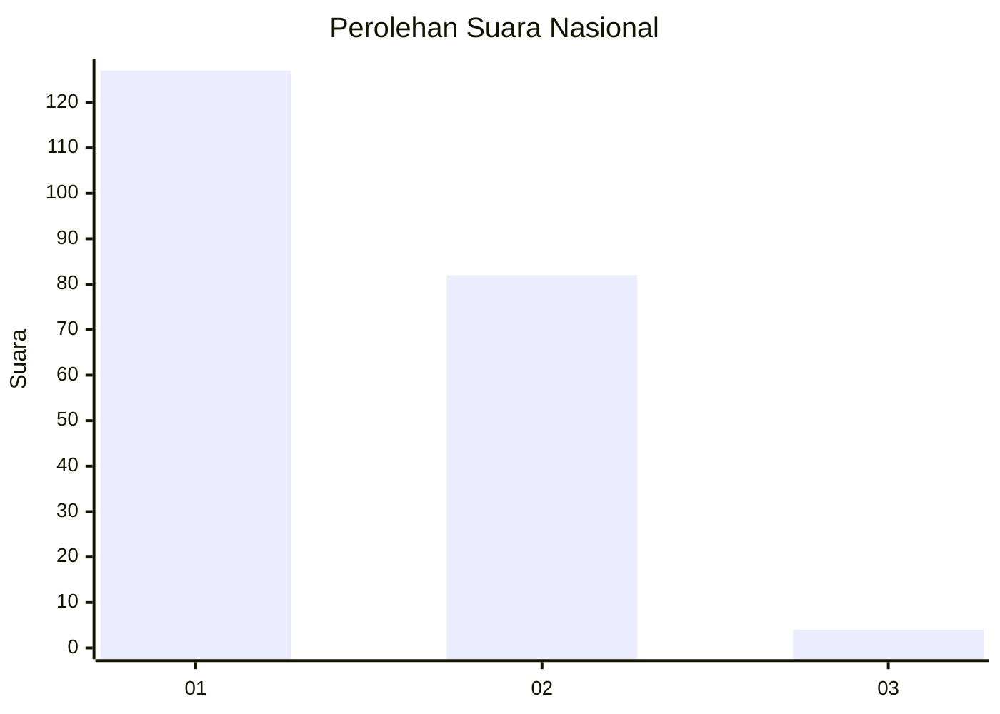
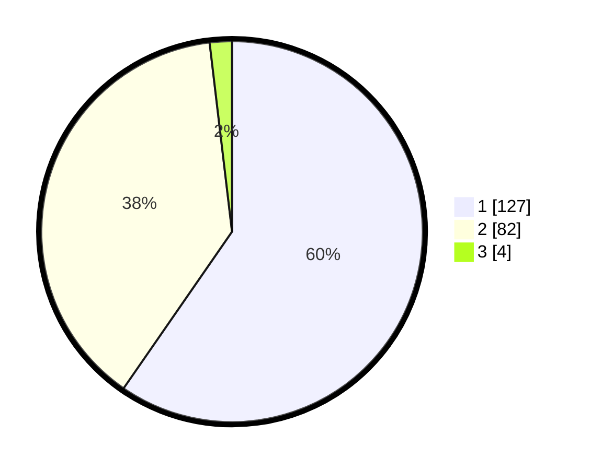

# Hasil

## Grafik

## Tabel

| No. | Nama Paslon    | Suara | Suara (raw) | Persentase |
|:--- |:-------------- | -----:| -----------:| ----------:|
| 1   | ANIES MUHAIMIN | 127   | [127][p-1]  | 59,62      |
| 2   | PRABOWO GIBRAN | 82    | [82][p-2]   | 38,50      |
| 3   | GANJAR MAHFUD  | 4     | [4][p-3]    | 1,88       |

[p-1]: https://github.com/gigit-pemilu/pemilu-2024/blob/main/pilpres/hitung-suara/sub/16-sumatera-selatan/sub/71-kota-palembang/sub/15-alang-alang-lebar/sub/1003-talangkelapa/sub/009-tps/sub/paslon-1.txt
[p-2]: https://github.com/gigit-pemilu/pemilu-2024/blob/main/pilpres/hitung-suara/sub/16-sumatera-selatan/sub/71-kota-palembang/sub/15-alang-alang-lebar/sub/1003-talangkelapa/sub/009-tps/sub/paslon-2.txt
[p-3]: https://github.com/gigit-pemilu/pemilu-2024/blob/main/pilpres/hitung-suara/sub/16-sumatera-selatan/sub/71-kota-palembang/sub/15-alang-alang-lebar/sub/1003-talangkelapa/sub/009-tps/sub/paslon-3.txt

## Foto C Plano

https://sirekap-obj-formc.kpu.go.id/e6a9/pemilu/ppwp/16/71/15/10/03/1671151003009-20240214-222719--31adcbe4-c8ff-44dc-8011-d218634a0524.jpg

https://sirekap-obj-formc.kpu.go.id/e6a9/pemilu/ppwp/16/71/15/10/03/1671151003009-20240214-222806--be2737b0-8a3c-4441-9544-56f702dd9774.jpg

https://sirekap-obj-formc.kpu.go.id/e6a9/pemilu/ppwp/16/71/15/10/03/1671151003009-20240214-222836--ace32a6e-efed-4125-b8d5-df951075cf3a.jpg

## Metadata

| Key        | Value               |
| ---------- | ------------------- |
| Time Stamp | 2024-02-25 12:00:00 |

