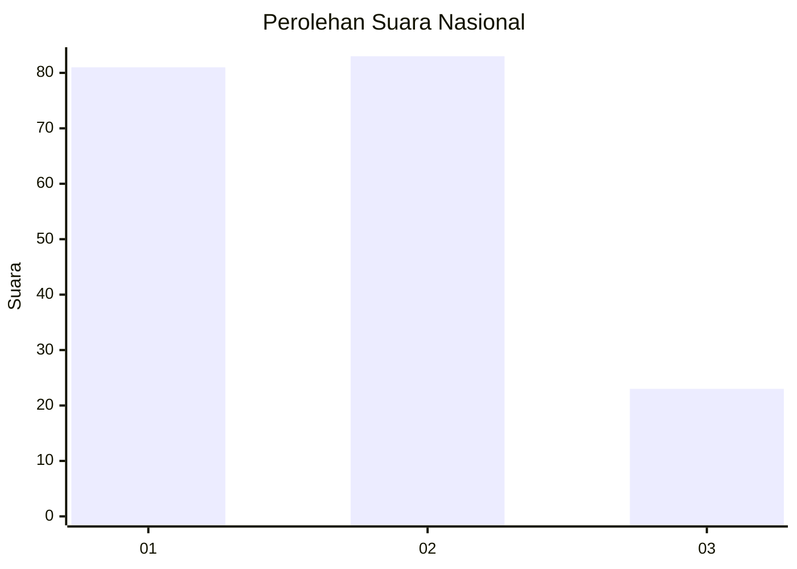
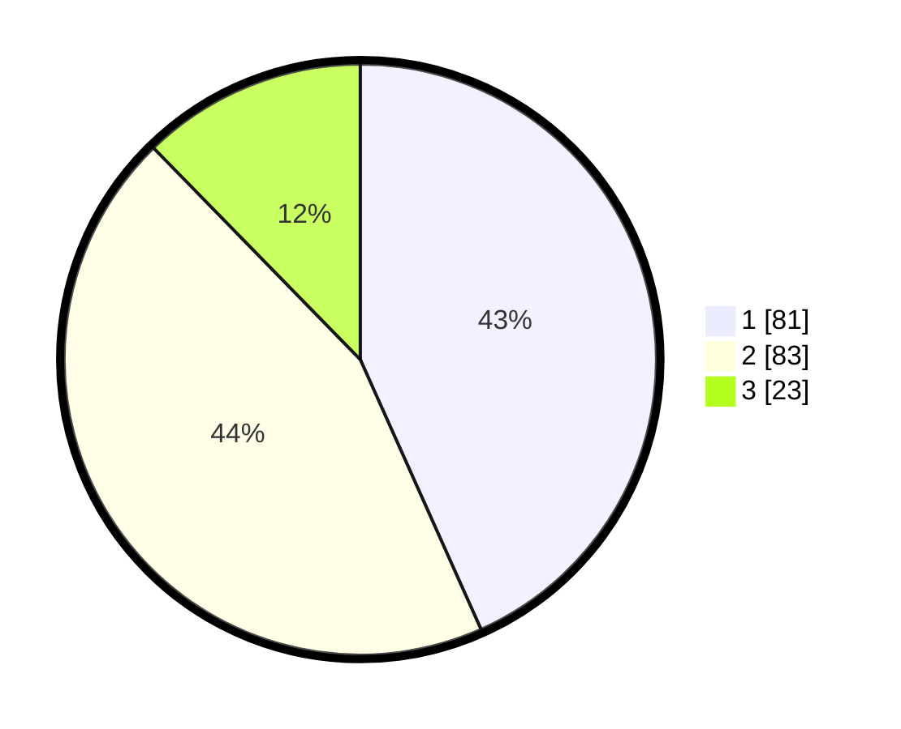

# Hasil

## Grafik

## Tabel

| No. | Nama Paslon    | Suara | Suara (raw) | Persentase |
|:--- |:-------------- | -----:| -----------:| ----------:|
| 1   | ANIES MUHAIMIN | 81    | [81][p-1]   | 43,32      |
| 2   | PRABOWO GIBRAN | 83    | [83][p-2]   | 44,39      |
| 3   | GANJAR MAHFUD  | 23    | [23][p-3]   | 12,30      |

[p-1]: https://github.com/gigit-pemilu/pemilu-2024/blob/main/pilpres/hitung-suara/sub/16-sumatera-selatan/sub/71-kota-palembang/sub/15-alang-alang-lebar/sub/1003-talangkelapa/sub/017-tps/sub/paslon-1.txt
[p-2]: https://github.com/gigit-pemilu/pemilu-2024/blob/main/pilpres/hitung-suara/sub/16-sumatera-selatan/sub/71-kota-palembang/sub/15-alang-alang-lebar/sub/1003-talangkelapa/sub/017-tps/sub/paslon-2.txt
[p-3]: https://github.com/gigit-pemilu/pemilu-2024/blob/main/pilpres/hitung-suara/sub/16-sumatera-selatan/sub/71-kota-palembang/sub/15-alang-alang-lebar/sub/1003-talangkelapa/sub/017-tps/sub/paslon-3.txt

## Foto C Plano

https://sirekap-obj-formc.kpu.go.id/3a2f/pemilu/ppwp/16/71/15/10/03/1671151003017-20240214-202947--c1bd3393-01ed-4184-a999-b12f4abe172c.jpg

https://sirekap-obj-formc.kpu.go.id/3a2f/pemilu/ppwp/16/71/15/10/03/1671151003017-20240214-203003--22b216f9-2026-4dd6-b521-8a5cd49c5b49.jpg

https://sirekap-obj-formc.kpu.go.id/3a2f/pemilu/ppwp/16/71/15/10/03/1671151003017-20240214-222616--cb472f85-53fb-44c4-8b37-7ad2b1243c10.jpg

## Metadata

| Key        | Value               |
| ---------- | ------------------- |
| Time Stamp | 2024-02-15 00:41:44 |

