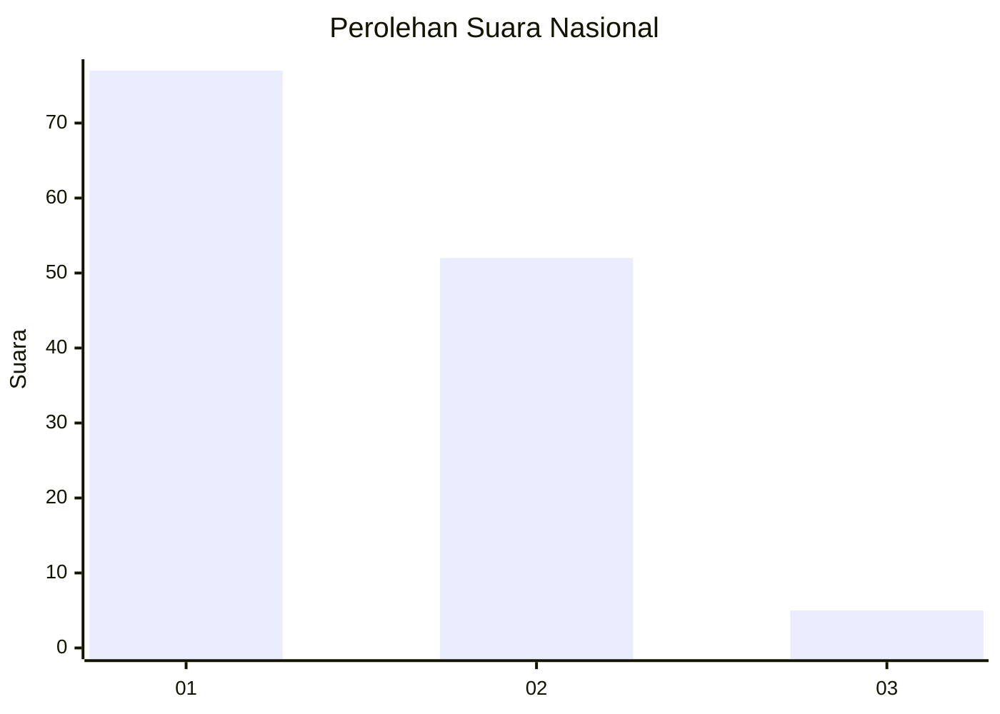
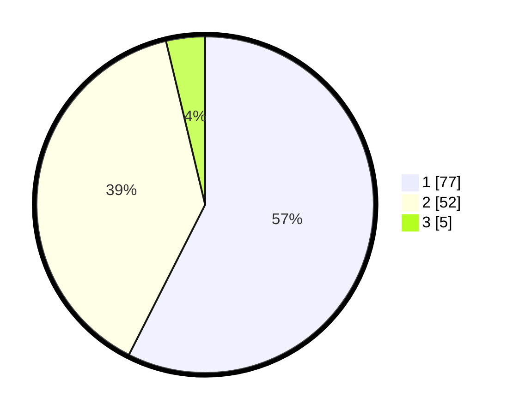

# Hasil

## Grafik

## Tabel

| No. | Nama Paslon    | Suara | Suara (raw) | Persentase |
|:--- |:-------------- | -----:| -----------:| ----------:|
| 1   | ANIES MUHAIMIN | 77    | [77][p-1]   | 57,46      |
| 2   | PRABOWO GIBRAN | 52    | [52][p-2]   | 38,81      |
| 3   | GANJAR MAHFUD  | 5     | [5][p-3]    | 3,73       |

[p-1]: https://github.com/gigit-pemilu/pemilu-2024/blob/main/pilpres/hitung-suara/sub/16-sumatera-selatan/sub/71-kota-palembang/sub/15-alang-alang-lebar/sub/1003-talangkelapa/sub/093-tps/sub/paslon-1.txt
[p-2]: https://github.com/gigit-pemilu/pemilu-2024/blob/main/pilpres/hitung-suara/sub/16-sumatera-selatan/sub/71-kota-palembang/sub/15-alang-alang-lebar/sub/1003-talangkelapa/sub/093-tps/sub/paslon-2.txt
[p-3]: https://github.com/gigit-pemilu/pemilu-2024/blob/main/pilpres/hitung-suara/sub/16-sumatera-selatan/sub/71-kota-palembang/sub/15-alang-alang-lebar/sub/1003-talangkelapa/sub/093-tps/sub/paslon-3.txt

## Foto C Plano

https://sirekap-obj-formc.kpu.go.id/6840/pemilu/ppwp/16/71/15/10/03/1671151003093-20240222-155721--7ea158ba-a495-4884-9ba1-b87b2b67260c.jpg

https://sirekap-obj-formc.kpu.go.id/6840/pemilu/ppwp/16/71/15/10/03/1671151003093-20240222-155001--c536183e-224c-4e7d-913e-afbf0606d3b6.jpg

https://sirekap-obj-formc.kpu.go.id/6840/pemilu/ppwp/16/71/15/10/03/1671151003093-20240222-155559--6792210a-9047-42c6-96a5-eaa341e9e98a.jpg

## Metadata

| Key        | Value               |
| ---------- | ------------------- |
| Time Stamp | 2024-02-22 16:00:00 |

## DATA PEMILIH TETAP

Jumlah pemilih dalam DPT: **286**.
 * L: **127**.
 * P: **159**.

## DATA PENGGUNA HAK PILIH

Jumlah pengguna hak pilih dalam DPT: **227**.
 * L: **0**.
 * P: **0**.

Jumlah pengguna hak pilih dalam DPTb: **7**.
 * L: **14**.
 * P: **3**.

Jumlah pengguna hak pilih dalam DPK: **7**.
 * L: **0**.
 * P: **1**.

Jumlah pengguna hak pilih: **225**.
 * L: **0**.
 * P: **0**.

## JUMLAH SUARA SAH DAN TIDAK SAH

JUMLAH SELURUH SUARA SAH: **272**.

JUMLAH SUARA TIDAK SAH: **802**.

JUMLAH SELURUH SUARA SAH DAN SUARA TIDAK SAH: **279**.

