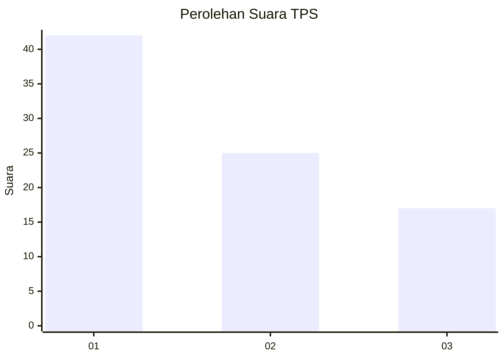
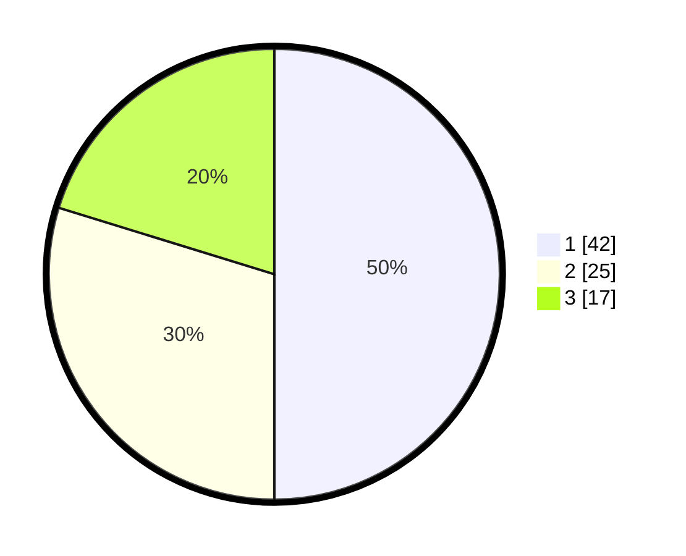

# Hasil

## Grafik

## Tabel

| No. | Nama Paslon    | Suara | Suara (raw) | Persentase |
|:--- |:-------------- | -----:| -----------:| ----------:|
| 1   | ANIES MUHAIMIN | 42    | [42][p-1]   | 50,00      |
| 2   | PRABOWO GIBRAN | 25    | [25][p-2]   | 29,76      |
| 3   | GANJAR MAHFUD  | 17    | [17][p-3]   | 20,24      |

[p-1]: https://github.com/gigit-pemilu/pemilu-2024-16-sumatera-selatan/blob/main/pilpres/hitung-suara/sub/16-sumatera-selatan/sub/71-kota-palembang/sub/15-alang-alang-lebar/sub/1003-talangkelapa/sub/098-tps/sub/paslon-1.txt
[p-2]: https://github.com/gigit-pemilu/pemilu-2024-16-sumatera-selatan/blob/main/pilpres/hitung-suara/sub/16-sumatera-selatan/sub/71-kota-palembang/sub/15-alang-alang-lebar/sub/1003-talangkelapa/sub/098-tps/sub/paslon-2.txt
[p-3]: https://github.com/gigit-pemilu/pemilu-2024-16-sumatera-selatan/blob/main/pilpres/hitung-suara/sub/16-sumatera-selatan/sub/71-kota-palembang/sub/15-alang-alang-lebar/sub/1003-talangkelapa/sub/098-tps/sub/paslon-3.txt

## Foto C Plano

https://sirekap-obj-formc.kpu.go.id/a10f/pemilu/ppwp/16/71/15/10/03/1671151003098-20240222-153601--a443f9e4-19f6-4030-8ef1-ede4e20b5cb4.jpg

https://sirekap-obj-formc.kpu.go.id/a10f/pemilu/ppwp/16/71/15/10/03/1671151003098-20240222-153638--038b7e07-569b-4a63-8540-4c2e779dba10.jpg

https://sirekap-obj-formc.kpu.go.id/a10f/pemilu/ppwp/16/71/15/10/03/1671151003098-20240222-153730--479d2460-93ae-4510-8465-49b7dfea1391.jpg

## Metadata

| Key        | Value               |
| ---------- | ------------------- |
| Time Stamp | 2024-02-22 16:00:00 |

## DATA PEMILIH TETAP

Jumlah pemilih dalam DPT: **8**.
 * L: **777**.
 * P: **777**.

## DATA PENGGUNA HAK PILIH

Jumlah pengguna hak pilih dalam DPT: **472**.
 * L: **444**.
 * P: **444**.

Jumlah pengguna hak pilih dalam DPTb: **401**.
 * L: **444**.
 * P: **444**.

Jumlah pengguna hak pilih dalam DPK: **447**.
 * L: **744**.
 * P: **444**.

Jumlah pengguna hak pilih: **443**.
 * L: **744**.
 * P: **444**.

## JUMLAH SUARA SAH DAN TIDAK SAH

JUMLAH SELURUH SUARA SAH: **248**.

JUMLAH SUARA TIDAK SAH: **8**.

JUMLAH SELURUH SUARA SAH DAN SUARA TIDAK SAH: **748**.

