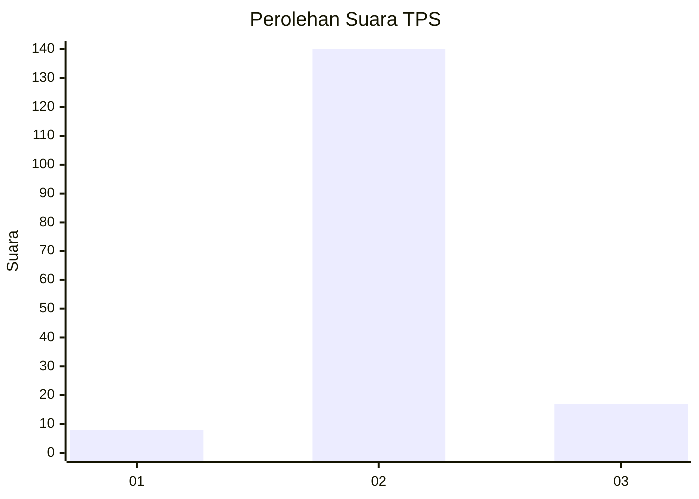
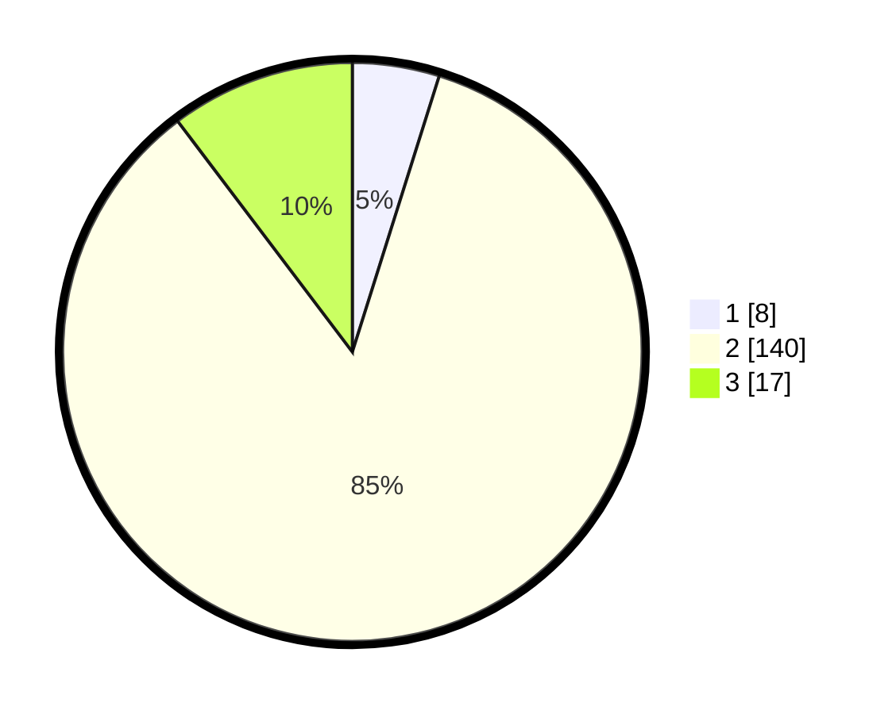

# Hasil

## Grafik

## Tabel

| No. | Nama Paslon    | Suara | Suara (raw) | Persentase |
|:--- |:-------------- | -----:| -----------:| ----------:|
| 1   | ANIES MUHAIMIN | 8     | [8][p-1]    | 4,85       |
| 2   | PRABOWO GIBRAN | 140   | [140][p-2]  | 84,85      |
| 3   | GANJAR MAHFUD  | 17    | [17][p-3]   | 10,30      |

[p-1]: https://github.com/gigit-pemilu/pemilu-2024-16-sumatera-selatan/blob/main/pilpres/hitung-suara/sub/16-sumatera-selatan/sub/71-kota-palembang/sub/15-alang-alang-lebar/sub/1003-talangkelapa/sub/107-tps/sub/paslon-1.txt
[p-2]: https://github.com/gigit-pemilu/pemilu-2024-16-sumatera-selatan/blob/main/pilpres/hitung-suara/sub/16-sumatera-selatan/sub/71-kota-palembang/sub/15-alang-alang-lebar/sub/1003-talangkelapa/sub/107-tps/sub/paslon-2.txt
[p-3]: https://github.com/gigit-pemilu/pemilu-2024-16-sumatera-selatan/blob/main/pilpres/hitung-suara/sub/16-sumatera-selatan/sub/71-kota-palembang/sub/15-alang-alang-lebar/sub/1003-talangkelapa/sub/107-tps/sub/paslon-3.txt

## Foto C Plano

https://sirekap-obj-formc.kpu.go.id/a74b/pemilu/ppwp/16/71/15/10/03/1671151003107-20240222-214847--0fa98688-a8f6-43e1-ac93-5ea58ebb79f9.jpg

https://sirekap-obj-formc.kpu.go.id/a74b/pemilu/ppwp/16/71/15/10/03/1671151003107-20240222-214936--5c0623ae-7e0b-4cdf-9590-951b57dd8294.jpg

https://sirekap-obj-formc.kpu.go.id/a74b/pemilu/ppwp/16/71/15/10/03/1671151003107-20240222-215029--61593508-c1c9-4113-9523-6e83037f278e.jpg

## Metadata

| Key        | Value               |
| ---------- | ------------------- |
| Time Stamp | 2024-02-22 22:00:00 |

## DATA PEMILIH TETAP

Jumlah pemilih dalam DPT: **270**.
 * L: **134**.
 * P: **136**.

## DATA PENGGUNA HAK PILIH

Jumlah pengguna hak pilih dalam DPT: **209**.
 * L: **804**.
 * P: **134**.

Jumlah pengguna hak pilih dalam DPTb: **555**.
 * L: **0**.
 * P: **7**.

Jumlah pengguna hak pilih dalam DPK: **10**.
 * L: **9**.
 * P: **1**.

Jumlah pengguna hak pilih: **219**.
 * L: **173**.
 * P: **105**.

## JUMLAH SUARA SAH DAN TIDAK SAH

JUMLAH SELURUH SUARA SAH: **218**.

JUMLAH SUARA TIDAK SAH: **3**.

JUMLAH SELURUH SUARA SAH DAN SUARA TIDAK SAH: **98**.

