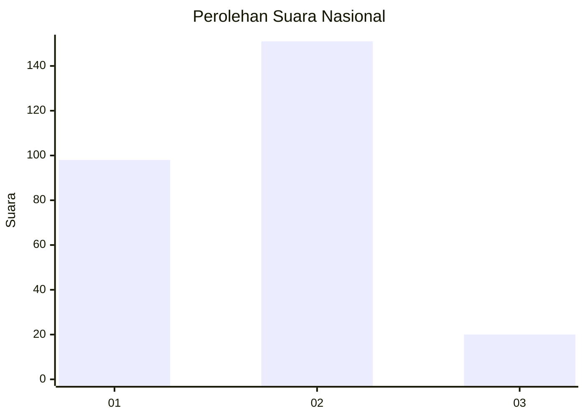

# Hasil

## Grafik

## Tabel

| No. | Nama Paslon    | Suara | Suara (raw) | Persentase |
|:--- |:-------------- | -----:| -----------:| ----------:|
| 1   | ANIES MUHAIMIN | 98    | [98][p-1]   | 36,43      |
| 2   | PRABOWO GIBRAN | 151   | [151][p-2]  | 56,13      |
| 3   | GANJAR MAHFUD  | 20    | [20][p-3]   | 7,43       |

[p-1]: https://github.com/gigit-pemilu/pemilu-2024/blob/main/pilpres/hitung-suara/sub/16-sumatera-selatan/sub/71-kota-palembang/sub/15-alang-alang-lebar/sub/1003-talangkelapa/sub/119-tps/sub/paslon-1.txt
[p-2]: https://github.com/gigit-pemilu/pemilu-2024/blob/main/pilpres/hitung-suara/sub/16-sumatera-selatan/sub/71-kota-palembang/sub/15-alang-alang-lebar/sub/1003-talangkelapa/sub/119-tps/sub/paslon-2.txt
[p-3]: https://github.com/gigit-pemilu/pemilu-2024/blob/main/pilpres/hitung-suara/sub/16-sumatera-selatan/sub/71-kota-palembang/sub/15-alang-alang-lebar/sub/1003-talangkelapa/sub/119-tps/sub/paslon-3.txt

## Foto C Plano

https://sirekap-obj-formc.kpu.go.id/29db/pemilu/ppwp/16/71/15/10/03/1671151003119-20240214-221610--d2a37d17-c257-404f-8136-a8480458cb39.jpg

https://sirekap-obj-formc.kpu.go.id/29db/pemilu/ppwp/16/71/15/10/03/1671151003119-20240214-221748--d982f3fd-4e0d-4ad1-be0e-2ed3c6c3fb4b.jpg

https://sirekap-obj-formc.kpu.go.id/29db/pemilu/ppwp/16/71/15/10/03/1671151003119-20240214-221645--affc14ac-9d34-454e-b14d-7f2bf39d0b78.jpg

## Metadata

| Key        | Value               |
| ---------- | ------------------- |
| Time Stamp | 2024-02-25 16:00:00 |

