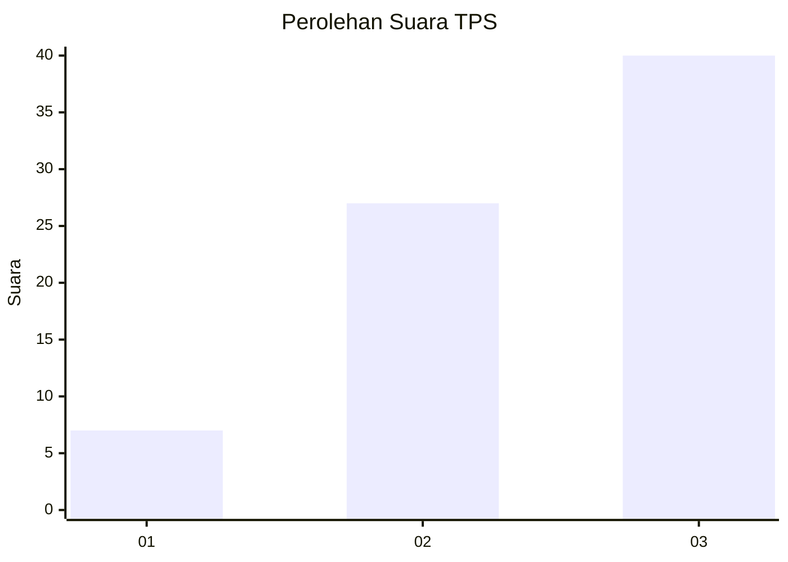
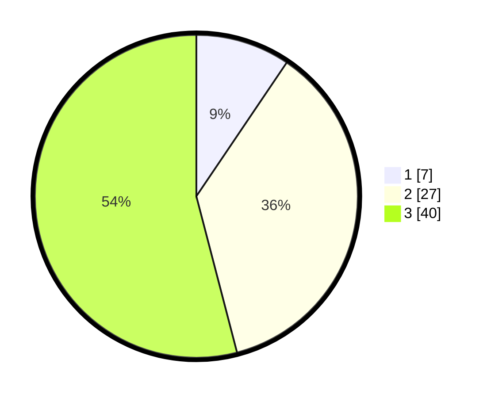

# Hasil

## Grafik

## Tabel

| No. | Nama Paslon    | Suara | Suara (raw) | Persentase |
|:--- |:-------------- | -----:| -----------:| ----------:|
| 1   | ANIES MUHAIMIN | 7     | [7][p-1]    | 9,46       |
| 2   | PRABOWO GIBRAN | 27    | [27][p-2]   | 36,49      |
| 3   | GANJAR MAHFUD  | 40    | [40][p-3]   | 54,05      |

[p-1]: https://github.com/gigit-pemilu/pemilu-2024-16-sumatera-selatan/blob/main/pilpres/hitung-suara/sub/16-sumatera-selatan/sub/71-kota-palembang/sub/15-alang-alang-lebar/sub/1004-karyabaru/sub/014-tps/sub/paslon-1.txt
[p-2]: https://github.com/gigit-pemilu/pemilu-2024-16-sumatera-selatan/blob/main/pilpres/hitung-suara/sub/16-sumatera-selatan/sub/71-kota-palembang/sub/15-alang-alang-lebar/sub/1004-karyabaru/sub/014-tps/sub/paslon-2.txt
[p-3]: https://github.com/gigit-pemilu/pemilu-2024-16-sumatera-selatan/blob/main/pilpres/hitung-suara/sub/16-sumatera-selatan/sub/71-kota-palembang/sub/15-alang-alang-lebar/sub/1004-karyabaru/sub/014-tps/sub/paslon-3.txt

## Foto C Plano

https://sirekap-obj-formc.kpu.go.id/4b64/pemilu/ppwp/16/71/15/10/04/1671151004014-20240222-153253--5f81db14-b410-4e79-b748-b457acbfcbaa.jpg

https://sirekap-obj-formc.kpu.go.id/4b64/pemilu/ppwp/16/71/15/10/04/1671151004014-20240222-153355--c8e744a6-61cf-4075-88fa-50620452d82b.jpg

https://sirekap-obj-formc.kpu.go.id/4b64/pemilu/ppwp/16/71/15/10/04/1671151004014-20240222-153457--0dcc78ff-8bf7-4e3a-8523-6569a1d0e516.jpg

## Metadata

| Key        | Value               |
| ---------- | ------------------- |
| Time Stamp | 2024-02-22 16:00:00 |

## DATA PEMILIH TETAP

Jumlah pemilih dalam DPT: **811**.
 * L: **0**.
 * P: **10**.

## DATA PENGGUNA HAK PILIH

Jumlah pengguna hak pilih dalam DPT: **0**.
 * L: **0**.
 * P: **0**.

Jumlah pengguna hak pilih dalam DPTb: **0**.
 * L: **575**.
 * P: **0**.

Jumlah pengguna hak pilih dalam DPK: **7**.
 * L: **555**.
 * P: **1**.

Jumlah pengguna hak pilih: **172**.
 * L: **20**.
 * P: **708**.

## JUMLAH SUARA SAH DAN TIDAK SAH

JUMLAH SELURUH SUARA SAH: **174**.

JUMLAH SUARA TIDAK SAH: **4**.

JUMLAH SELURUH SUARA SAH DAN SUARA TIDAK SAH: **177**.

