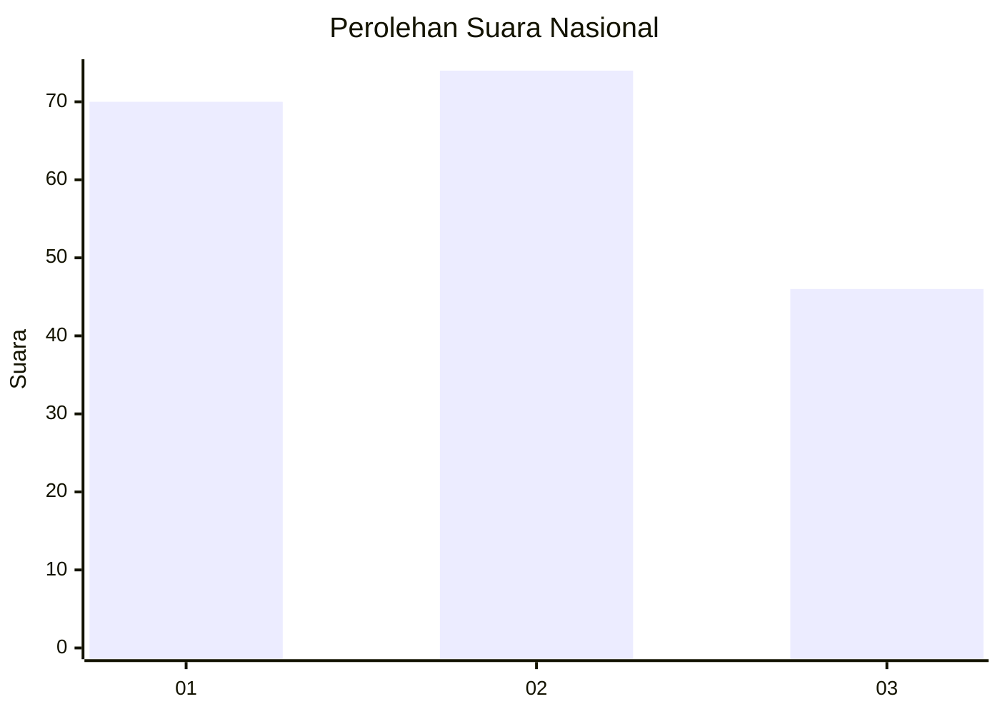
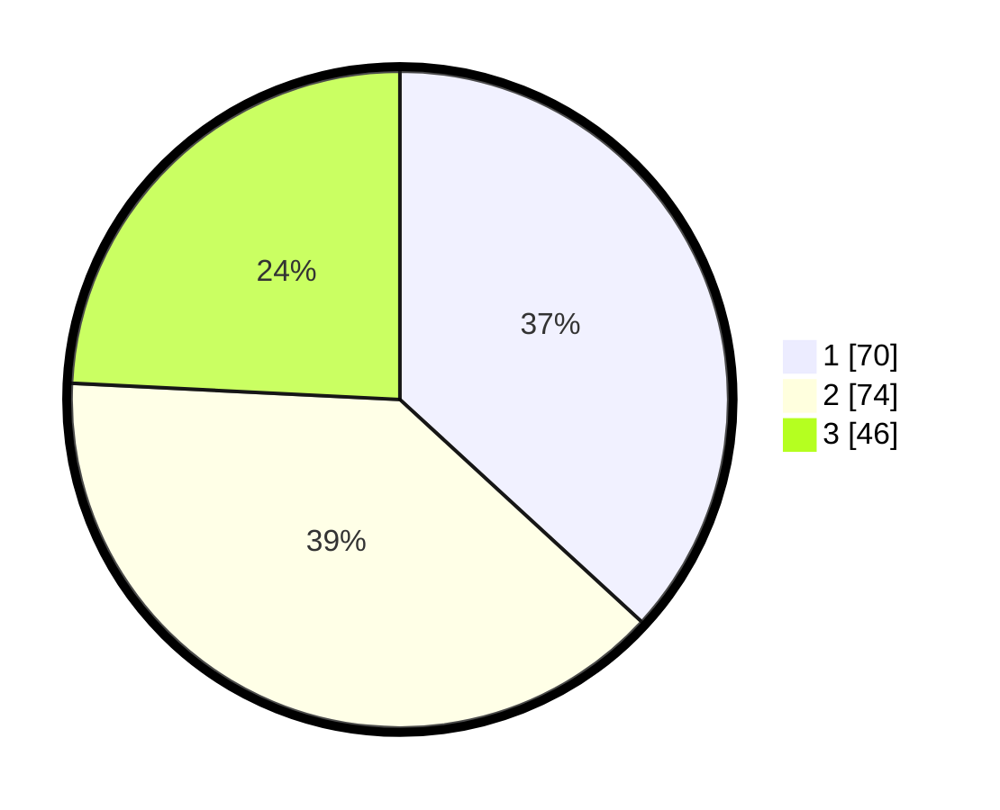

# Hasil

## Grafik

## Tabel

| No. | Nama Paslon    | Suara | Suara (raw) | Persentase |
|:--- |:-------------- | -----:| -----------:| ----------:|
| 1   | ANIES MUHAIMIN | 70    | [70][p-1]   | 36,84      |
| 2   | PRABOWO GIBRAN | 74    | [74][p-2]   | 38,95      |
| 3   | GANJAR MAHFUD  | 46    | [46][p-3]   | 24,21      |

[p-1]: https://github.com/gigit-pemilu/pemilu-2024/blob/main/pilpres/hitung-suara/sub/16-sumatera-selatan/sub/71-kota-palembang/sub/15-alang-alang-lebar/sub/1004-karyabaru/sub/027-tps/sub/paslon-1.txt
[p-2]: https://github.com/gigit-pemilu/pemilu-2024/blob/main/pilpres/hitung-suara/sub/16-sumatera-selatan/sub/71-kota-palembang/sub/15-alang-alang-lebar/sub/1004-karyabaru/sub/027-tps/sub/paslon-2.txt
[p-3]: https://github.com/gigit-pemilu/pemilu-2024/blob/main/pilpres/hitung-suara/sub/16-sumatera-selatan/sub/71-kota-palembang/sub/15-alang-alang-lebar/sub/1004-karyabaru/sub/027-tps/sub/paslon-3.txt

## Foto C Plano

https://sirekap-obj-formc.kpu.go.id/2fac/pemilu/ppwp/16/71/15/10/04/1671151004027-20240222-173523--5541e7b4-d63b-46fe-9c78-ea5964c49752.jpg

https://sirekap-obj-formc.kpu.go.id/2fac/pemilu/ppwp/16/71/15/10/04/1671151004027-20240222-173601--77083085-464f-4449-9c1e-3092bb6c5553.jpg

https://sirekap-obj-formc.kpu.go.id/2fac/pemilu/ppwp/16/71/15/10/04/1671151004027-20240222-173638--95a88051-76e4-4c59-b753-403d7a38284f.jpg

## Metadata

| Key        | Value               |
| ---------- | ------------------- |
| Time Stamp | 2024-02-22 18:00:00 |

## DATA PEMILIH TETAP

Jumlah pemilih dalam DPT: **241**.
 * L: **119**.
 * P: **122**.

## DATA PENGGUNA HAK PILIH

Jumlah pengguna hak pilih dalam DPT: **194**.
 * L: **97**.
 * P: **95**.

Jumlah pengguna hak pilih dalam DPTb: **7**.
 * L: **537**.
 * P: **707**.

Jumlah pengguna hak pilih dalam DPK: **1**.
 * L: **0**.
 * P: **801**.

Jumlah pengguna hak pilih: **192**.
 * L: **0**.
 * P: **0**.

## JUMLAH SUARA SAH DAN TIDAK SAH

JUMLAH SELURUH SUARA SAH: **190**.

JUMLAH SUARA TIDAK SAH: **2**.

JUMLAH SELURUH SUARA SAH DAN SUARA TIDAK SAH: **192**.

