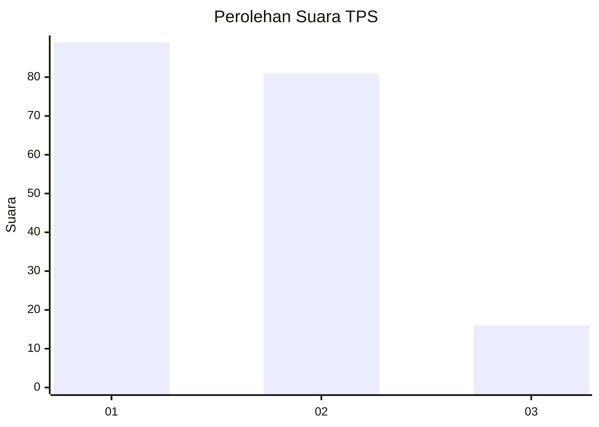
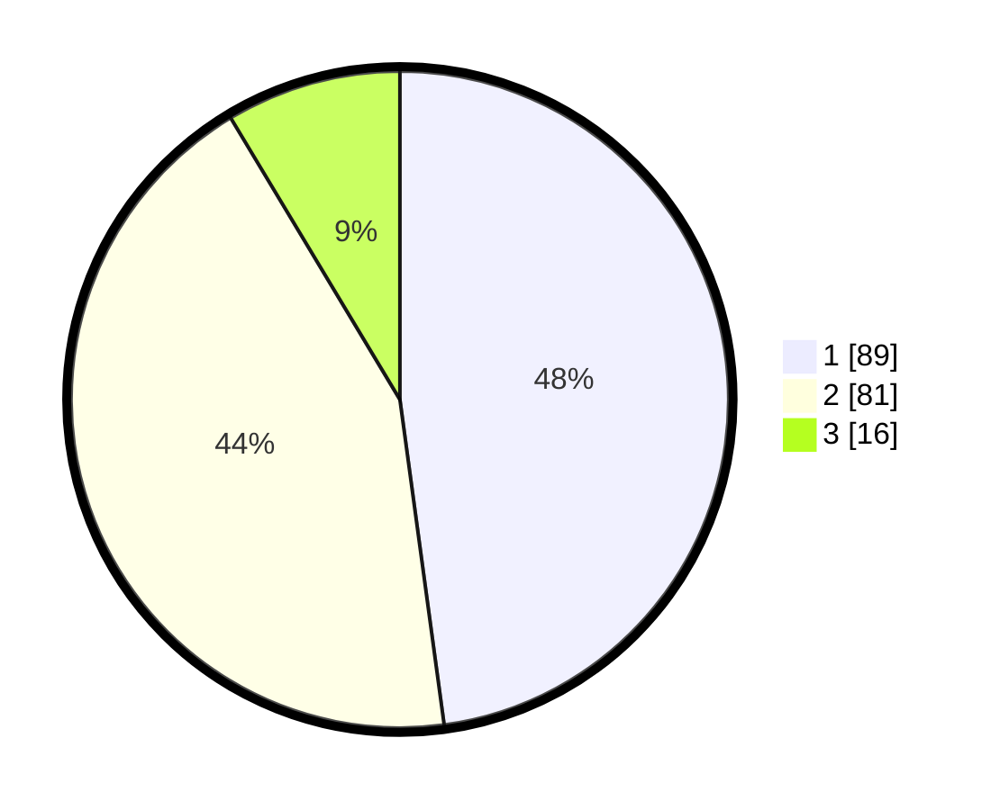

# Hasil

## Grafik

## Tabel

| No. | Nama Paslon    | Suara | Suara (raw) | Persentase |
|:--- |:-------------- | -----:| -----------:| ----------:|
| 1   | ANIES MUHAIMIN | 89    | [89][p-1]   | 47,85      |
| 2   | PRABOWO GIBRAN | 81    | [81][p-2]   | 43,55      |
| 3   | GANJAR MAHFUD  | 16    | [16][p-3]   | 8,60       |

[p-1]: https://github.com/gigit-pemilu/pemilu-2024-16-sumatera-selatan/blob/main/pilpres/hitung-suara/sub/16-sumatera-selatan/sub/71-kota-palembang/sub/15-alang-alang-lebar/sub/1004-karyabaru/sub/070-tps/sub/paslon-1.txt
[p-2]: https://github.com/gigit-pemilu/pemilu-2024-16-sumatera-selatan/blob/main/pilpres/hitung-suara/sub/16-sumatera-selatan/sub/71-kota-palembang/sub/15-alang-alang-lebar/sub/1004-karyabaru/sub/070-tps/sub/paslon-2.txt
[p-3]: https://github.com/gigit-pemilu/pemilu-2024-16-sumatera-selatan/blob/main/pilpres/hitung-suara/sub/16-sumatera-selatan/sub/71-kota-palembang/sub/15-alang-alang-lebar/sub/1004-karyabaru/sub/070-tps/sub/paslon-3.txt

## Foto C Plano

https://sirekap-obj-formc.kpu.go.id/a3b3/pemilu/ppwp/16/71/15/10/04/1671151004070-20240214-155757--b0d2252f-453c-43d9-8820-f234b0ec7e88.jpg

https://sirekap-obj-formc.kpu.go.id/a3b3/pemilu/ppwp/16/71/15/10/04/1671151004070-20240214-155320--825c3276-5c4a-438c-ac49-4baa20fc385e.jpg

https://sirekap-obj-formc.kpu.go.id/a3b3/pemilu/ppwp/16/71/15/10/04/1671151004070-20240214-155242--40748a2b-e715-451f-9cf0-c842afc8dcbd.jpg

## Metadata

| Key        | Value               |
| ---------- | ------------------- |
| Time Stamp | 2024-02-14 21:46:01 |

