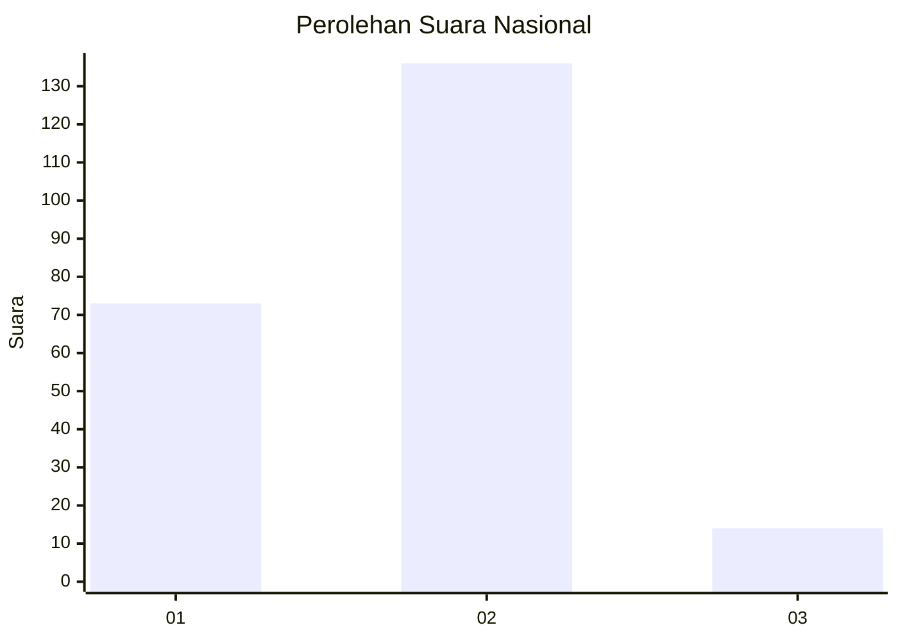
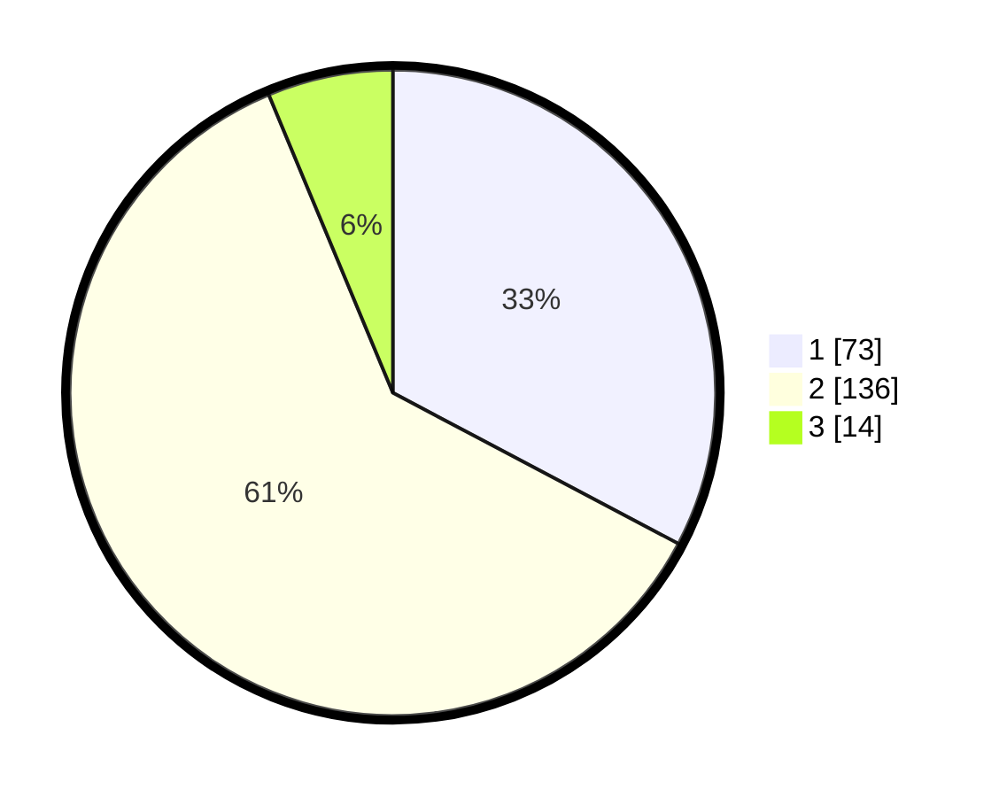

# Hasil

## Grafik

## Tabel

| No. | Nama Paslon    | Suara | Suara (raw) | Persentase |
|:--- |:-------------- | -----:| -----------:| ----------:|
| 1   | ANIES MUHAIMIN | 73    | [73][p-1]   | 32,74      |
| 2   | PRABOWO GIBRAN | 136   | [136][p-2]  | 60,99      |
| 3   | GANJAR MAHFUD  | 14    | [14][p-3]   | 6,28       |

[p-1]: https://github.com/gigit-pemilu/pemilu-2024/blob/main/pilpres/hitung-suara/sub/16-sumatera-selatan/sub/71-kota-palembang/sub/16-sematangborang/sub/1001-srimulya/sub/001-tps/sub/paslon-1.txt
[p-2]: https://github.com/gigit-pemilu/pemilu-2024/blob/main/pilpres/hitung-suara/sub/16-sumatera-selatan/sub/71-kota-palembang/sub/16-sematangborang/sub/1001-srimulya/sub/001-tps/sub/paslon-2.txt
[p-3]: https://github.com/gigit-pemilu/pemilu-2024/blob/main/pilpres/hitung-suara/sub/16-sumatera-selatan/sub/71-kota-palembang/sub/16-sematangborang/sub/1001-srimulya/sub/001-tps/sub/paslon-3.txt

## Foto C Plano

https://sirekap-obj-formc.kpu.go.id/6985/pemilu/ppwp/16/71/16/10/01/1671161001001-20240219-175029--c3d223ef-3dbc-4c72-99a8-1a336492cff0.jpg

https://sirekap-obj-formc.kpu.go.id/6985/pemilu/ppwp/16/71/16/10/01/1671161001001-20240219-175131--02a306d5-0d25-445a-8ab2-70d09c4aec05.jpg

https://sirekap-obj-formc.kpu.go.id/6985/pemilu/ppwp/16/71/16/10/01/1671161001001-20240219-175216--59d9b0d8-cf1f-42bd-945e-2096a21c03d7.jpg

## Metadata

| Key        | Value               |
| ---------- | ------------------- |
| Time Stamp | 2024-02-25 01:00:00 |

