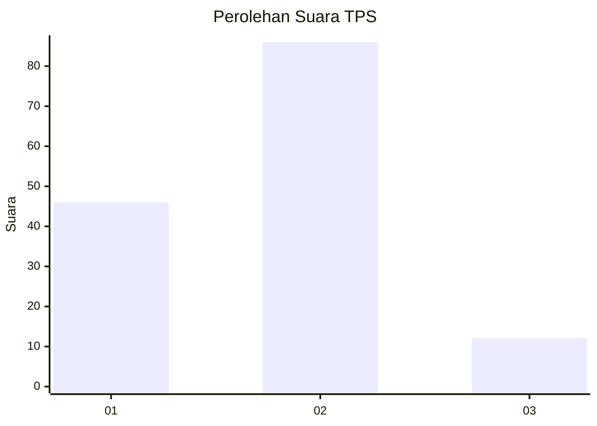
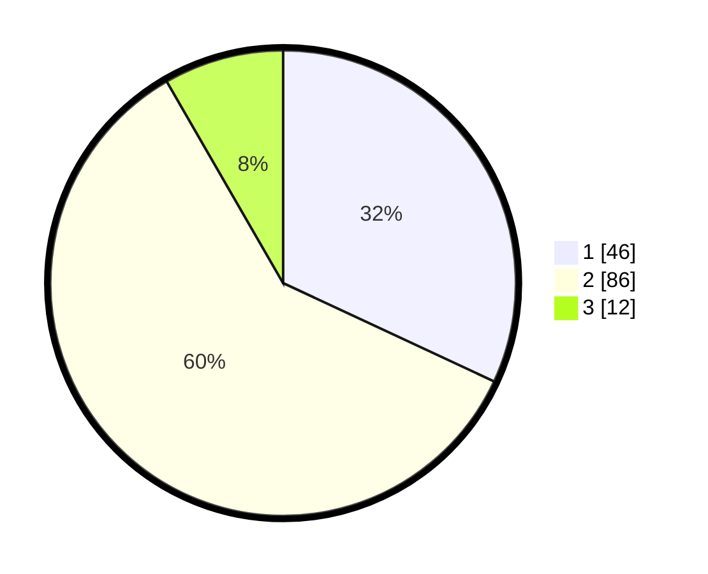

# Hasil

## Grafik

## Tabel

| No. | Nama Paslon    | Suara | Suara (raw) | Persentase |
|:--- |:-------------- | -----:| -----------:| ----------:|
| 1   | ANIES MUHAIMIN | 46    | [46][p-1]   | 31,94      |
| 2   | PRABOWO GIBRAN | 86    | [86][p-2]   | 59,72      |
| 3   | GANJAR MAHFUD  | 12    | [12][p-3]   | 8,33       |

[p-1]: https://github.com/gigit-pemilu/pemilu-2024-16-sumatera-selatan/blob/main/pilpres/hitung-suara/sub/16-sumatera-selatan/sub/71-kota-palembang/sub/16-sematangborang/sub/1001-srimulya/sub/003-tps/sub/paslon-1.txt
[p-2]: https://github.com/gigit-pemilu/pemilu-2024-16-sumatera-selatan/blob/main/pilpres/hitung-suara/sub/16-sumatera-selatan/sub/71-kota-palembang/sub/16-sematangborang/sub/1001-srimulya/sub/003-tps/sub/paslon-2.txt
[p-3]: https://github.com/gigit-pemilu/pemilu-2024-16-sumatera-selatan/blob/main/pilpres/hitung-suara/sub/16-sumatera-selatan/sub/71-kota-palembang/sub/16-sematangborang/sub/1001-srimulya/sub/003-tps/sub/paslon-3.txt

## Foto C Plano

https://sirekap-obj-formc.kpu.go.id/ac4f/pemilu/ppwp/16/71/16/10/01/1671161001003-20240219-205616--33ab153e-edec-46ad-95a2-18dc64b61451.jpg

https://sirekap-obj-formc.kpu.go.id/ac4f/pemilu/ppwp/16/71/16/10/01/1671161001003-20240219-205719--43f26f8a-e2b3-4546-84b4-f8af0f088145.jpg

https://sirekap-obj-formc.kpu.go.id/ac4f/pemilu/ppwp/16/71/16/10/01/1671161001003-20240219-205800--bee3c171-b74b-4c99-85c7-6a8c0c607dd0.jpg

## Metadata

| Key        | Value               |
| ---------- | ------------------- |
| Time Stamp | 2024-02-25 14:00:00 |

