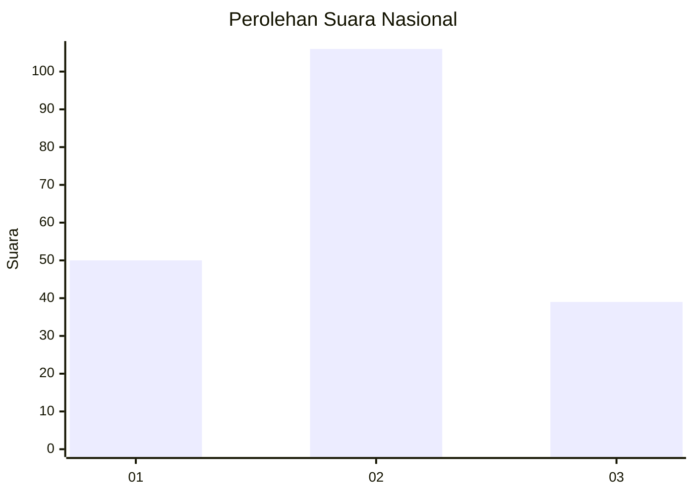
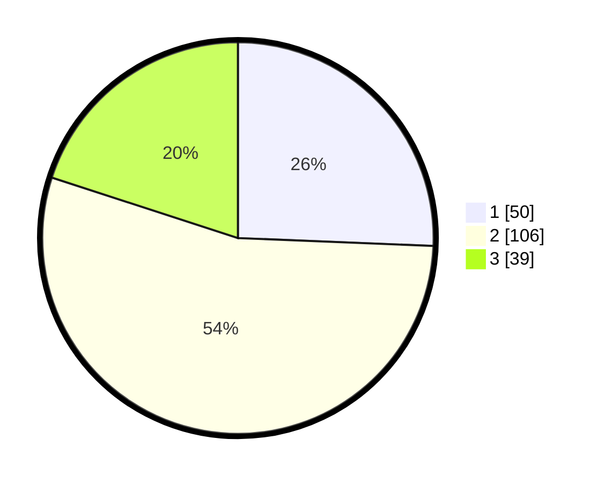

# Hasil

## Grafik

## Tabel

| No. | Nama Paslon    | Suara | Suara (raw) | Persentase |
|:--- |:-------------- | -----:| -----------:| ----------:|
| 1   | ANIES MUHAIMIN | 50    | [50][p-1]   | 25,64      |
| 2   | PRABOWO GIBRAN | 106   | [106][p-2]  | 54,36      |
| 3   | GANJAR MAHFUD  | 39    | [39][p-3]   | 20,00      |

[p-1]: https://github.com/gigit-pemilu/pemilu-2024/blob/main/pilpres/hitung-suara/sub/16-sumatera-selatan/sub/71-kota-palembang/sub/16-sematangborang/sub/1001-srimulya/sub/005-tps/sub/paslon-1.txt
[p-2]: https://github.com/gigit-pemilu/pemilu-2024/blob/main/pilpres/hitung-suara/sub/16-sumatera-selatan/sub/71-kota-palembang/sub/16-sematangborang/sub/1001-srimulya/sub/005-tps/sub/paslon-2.txt
[p-3]: https://github.com/gigit-pemilu/pemilu-2024/blob/main/pilpres/hitung-suara/sub/16-sumatera-selatan/sub/71-kota-palembang/sub/16-sematangborang/sub/1001-srimulya/sub/005-tps/sub/paslon-3.txt

## Foto C Plano

https://sirekap-obj-formc.kpu.go.id/8779/pemilu/ppwp/16/71/16/10/01/1671161001005-20240219-212223--fb538489-7ba1-4943-a80f-125c4685a9df.jpg

https://sirekap-obj-formc.kpu.go.id/8779/pemilu/ppwp/16/71/16/10/01/1671161001005-20240219-212451--a590f625-8b3f-4439-be98-c5d6d6b79d5d.jpg

https://sirekap-obj-formc.kpu.go.id/8779/pemilu/ppwp/16/71/16/10/01/1671161001005-20240219-212556--db1806c8-b299-48ef-b628-84ea4021af2a.jpg

## Metadata

| Key        | Value               |
| ---------- | ------------------- |
| Time Stamp | 2024-02-24 22:31:28 |

