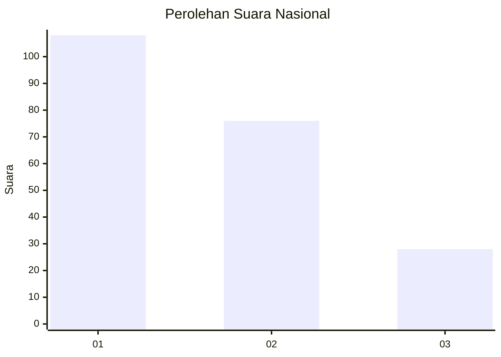
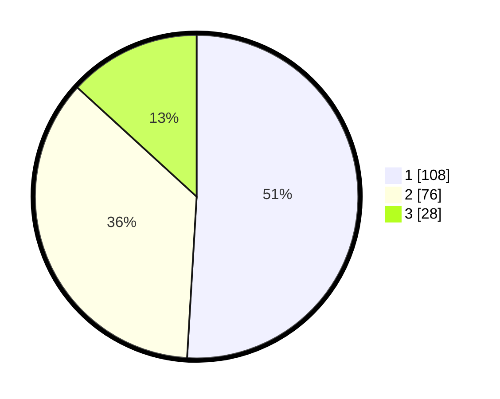

# Hasil

## Grafik

## Tabel

| No. | Nama Paslon    | Suara | Suara (raw) | Persentase |
|:--- |:-------------- | -----:| -----------:| ----------:|
| 1   | ANIES MUHAIMIN | 108   | [108][p-1]  | 50,94      |
| 2   | PRABOWO GIBRAN | 76    | [76][p-2]   | 35,85      |
| 3   | GANJAR MAHFUD  | 28    | [28][p-3]   | 13,21      |

[p-1]: https://github.com/gigit-pemilu/pemilu-2024/blob/main/pilpres/hitung-suara/sub/16-sumatera-selatan/sub/71-kota-palembang/sub/16-sematangborang/sub/1001-srimulya/sub/013-tps/sub/paslon-1.txt
[p-2]: https://github.com/gigit-pemilu/pemilu-2024/blob/main/pilpres/hitung-suara/sub/16-sumatera-selatan/sub/71-kota-palembang/sub/16-sematangborang/sub/1001-srimulya/sub/013-tps/sub/paslon-2.txt
[p-3]: https://github.com/gigit-pemilu/pemilu-2024/blob/main/pilpres/hitung-suara/sub/16-sumatera-selatan/sub/71-kota-palembang/sub/16-sematangborang/sub/1001-srimulya/sub/013-tps/sub/paslon-3.txt

## Foto C Plano

https://sirekap-obj-formc.kpu.go.id/e920/pemilu/ppwp/16/71/16/10/01/1671161001013-20240219-231814--f7f03bf7-2bee-4575-847c-93293c32a078.jpg

https://sirekap-obj-formc.kpu.go.id/e920/pemilu/ppwp/16/71/16/10/01/1671161001013-20240219-232308--3790ab05-33fb-46d8-9915-6528d273efbc.jpg

https://sirekap-obj-formc.kpu.go.id/e920/pemilu/ppwp/16/71/16/10/01/1671161001013-20240219-232356--0741544e-f12c-4f3f-acca-583c2ee9a813.jpg

## Metadata

| Key        | Value               |
| ---------- | ------------------- |
| Time Stamp | 2024-02-25 11:00:00 |

