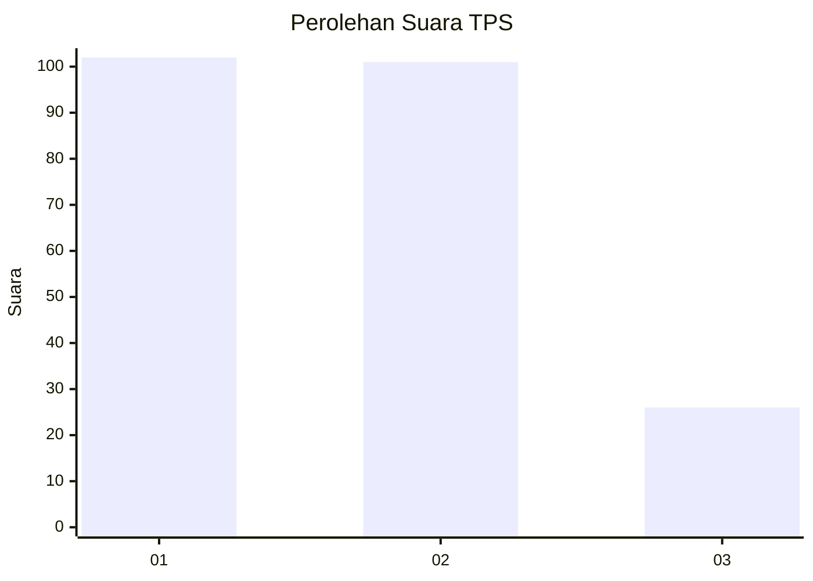
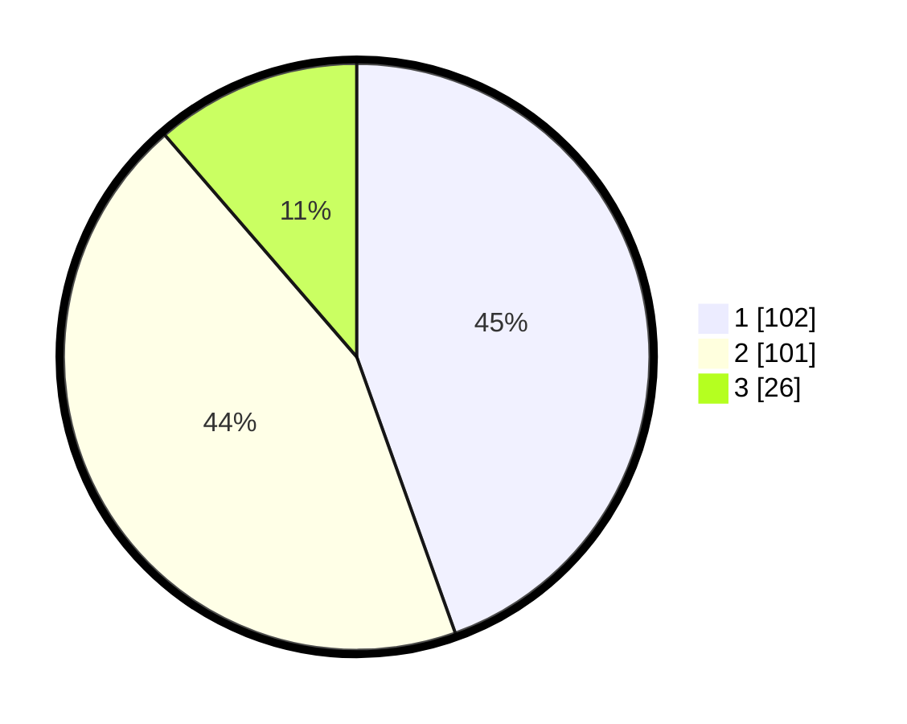

# Hasil

## Grafik

## Tabel

| No. | Nama Paslon    | Suara | Suara (raw) | Persentase |
|:--- |:-------------- | -----:| -----------:| ----------:|
| 1   | ANIES MUHAIMIN | 102   | [102][p-1]  | 44,54      |
| 2   | PRABOWO GIBRAN | 101   | [101][p-2]  | 44,10      |
| 3   | GANJAR MAHFUD  | 26    | [26][p-3]   | 11,35      |

[p-1]: https://github.com/gigit-pemilu/pemilu-2024-16-sumatera-selatan/blob/main/pilpres/hitung-suara/sub/16-sumatera-selatan/sub/71-kota-palembang/sub/16-sematangborang/sub/1001-srimulya/sub/026-tps/sub/paslon-1.txt
[p-2]: https://github.com/gigit-pemilu/pemilu-2024-16-sumatera-selatan/blob/main/pilpres/hitung-suara/sub/16-sumatera-selatan/sub/71-kota-palembang/sub/16-sematangborang/sub/1001-srimulya/sub/026-tps/sub/paslon-2.txt
[p-3]: https://github.com/gigit-pemilu/pemilu-2024-16-sumatera-selatan/blob/main/pilpres/hitung-suara/sub/16-sumatera-selatan/sub/71-kota-palembang/sub/16-sematangborang/sub/1001-srimulya/sub/026-tps/sub/paslon-3.txt

## Foto C Plano

https://sirekap-obj-formc.kpu.go.id/9e70/pemilu/ppwp/16/71/16/10/01/1671161001026-20240220-154357--78612ccf-3428-4048-acd5-4528469a4176.jpg

https://sirekap-obj-formc.kpu.go.id/9e70/pemilu/ppwp/16/71/16/10/01/1671161001026-20240220-154632--e2dccd0b-fee4-44e9-b119-e00592d7f35f.jpg

https://sirekap-obj-formc.kpu.go.id/9e70/pemilu/ppwp/16/71/16/10/01/1671161001026-20240220-154720--efaa2044-0398-453f-a54e-e1511d0e1543.jpg

## Metadata

| Key        | Value               |
| ---------- | ------------------- |
| Time Stamp | 2024-02-24 22:31:28 |

