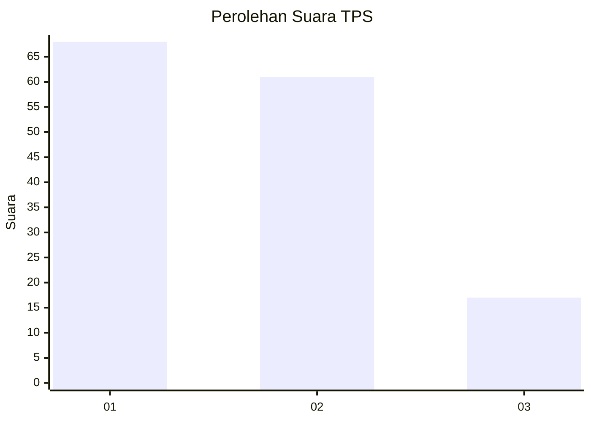
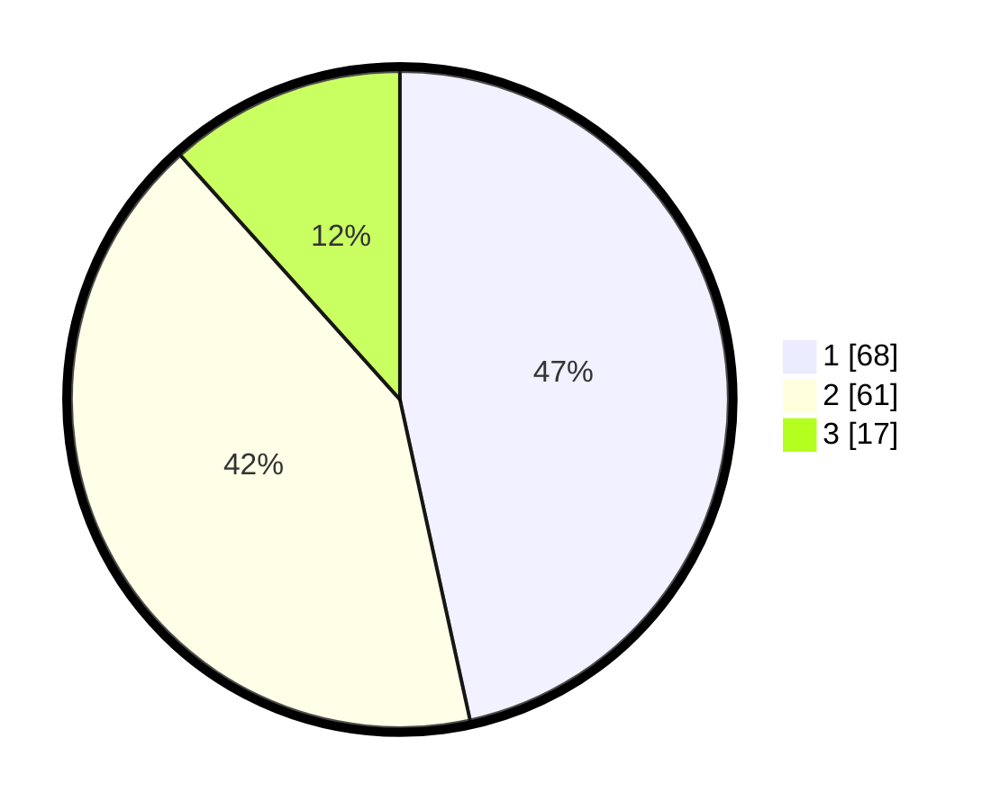

# Hasil

## Grafik

## Tabel

| No. | Nama Paslon    | Suara | Suara (raw) | Persentase |
|:--- |:-------------- | -----:| -----------:| ----------:|
| 1   | ANIES MUHAIMIN | 68    | [68][p-1]   | 46,58      |
| 2   | PRABOWO GIBRAN | 61    | [61][p-2]   | 41,78      |
| 3   | GANJAR MAHFUD  | 17    | [17][p-3]   | 11,64      |

[p-1]: https://github.com/gigit-pemilu/pemilu-2024-16-sumatera-selatan/blob/main/pilpres/hitung-suara/sub/16-sumatera-selatan/sub/71-kota-palembang/sub/16-sematangborang/sub/1002-sukamulya/sub/001-tps/sub/paslon-1.txt
[p-2]: https://github.com/gigit-pemilu/pemilu-2024-16-sumatera-selatan/blob/main/pilpres/hitung-suara/sub/16-sumatera-selatan/sub/71-kota-palembang/sub/16-sematangborang/sub/1002-sukamulya/sub/001-tps/sub/paslon-2.txt
[p-3]: https://github.com/gigit-pemilu/pemilu-2024-16-sumatera-selatan/blob/main/pilpres/hitung-suara/sub/16-sumatera-selatan/sub/71-kota-palembang/sub/16-sematangborang/sub/1002-sukamulya/sub/001-tps/sub/paslon-3.txt

## Foto C Plano

https://sirekap-obj-formc.kpu.go.id/2a7a/pemilu/ppwp/16/71/16/10/02/1671161002001-20240215-013018--966ab07a-6299-4e07-9130-863b5c98216b.jpg

https://sirekap-obj-formc.kpu.go.id/2a7a/pemilu/ppwp/16/71/16/10/02/1671161002001-20240215-013202--245ccfee-3e74-4f08-b6a7-414728fa5207.jpg

https://sirekap-obj-formc.kpu.go.id/2a7a/pemilu/ppwp/16/71/16/10/02/1671161002001-20240215-013348--61bb7629-8926-4310-9577-a3ea4042eb21.jpg

## Metadata

| Key        | Value               |
| ---------- | ------------------- |
| Time Stamp | 2024-02-24 22:31:28 |

