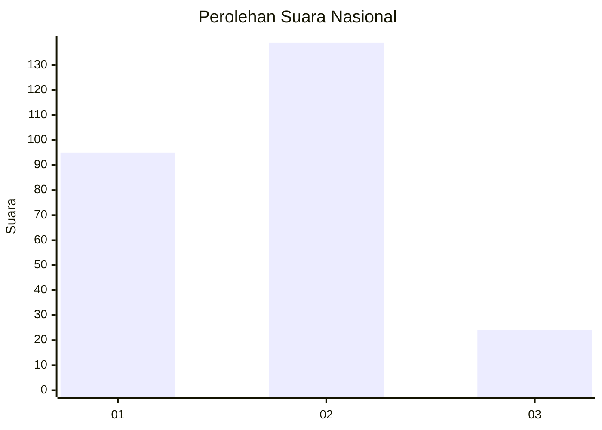

# Hasil

## Grafik

## Tabel

| No. | Nama Paslon    | Suara | Suara (raw) | Persentase |
|:--- |:-------------- | -----:| -----------:| ----------:|
| 1   | ANIES MUHAIMIN | 95    | [95][p-1]   | 36,82      |
| 2   | PRABOWO GIBRAN | 139   | [139][p-2]  | 53,88      |
| 3   | GANJAR MAHFUD  | 24    | [24][p-3]   | 9,30       |

[p-1]: https://github.com/gigit-pemilu/pemilu-2024/blob/main/pilpres/hitung-suara/sub/16-sumatera-selatan/sub/71-kota-palembang/sub/16-sematangborang/sub/1002-sukamulya/sub/022-tps/sub/paslon-1.txt
[p-2]: https://github.com/gigit-pemilu/pemilu-2024/blob/main/pilpres/hitung-suara/sub/16-sumatera-selatan/sub/71-kota-palembang/sub/16-sematangborang/sub/1002-sukamulya/sub/022-tps/sub/paslon-2.txt
[p-3]: https://github.com/gigit-pemilu/pemilu-2024/blob/main/pilpres/hitung-suara/sub/16-sumatera-selatan/sub/71-kota-palembang/sub/16-sematangborang/sub/1002-sukamulya/sub/022-tps/sub/paslon-3.txt

## Foto C Plano

https://sirekap-obj-formc.kpu.go.id/a37d/pemilu/ppwp/16/71/16/10/02/1671161002022-20240214-160117--09f0f7c5-f856-44f0-b2fe-9e9de5d6d9ab.jpg

https://sirekap-obj-formc.kpu.go.id/a37d/pemilu/ppwp/16/71/16/10/02/1671161002022-20240214-155252--3f94d8ae-c0bd-4d24-b5e3-3d32e19c389a.jpg

https://sirekap-obj-formc.kpu.go.id/a37d/pemilu/ppwp/16/71/16/10/02/1671161002022-20240214-155337--654c4091-392d-4e11-a8d4-c7b88700e23b.jpg

## Metadata

| Key        | Value               |
| ---------- | ------------------- |
| Time Stamp | 2024-02-24 22:31:28 |

