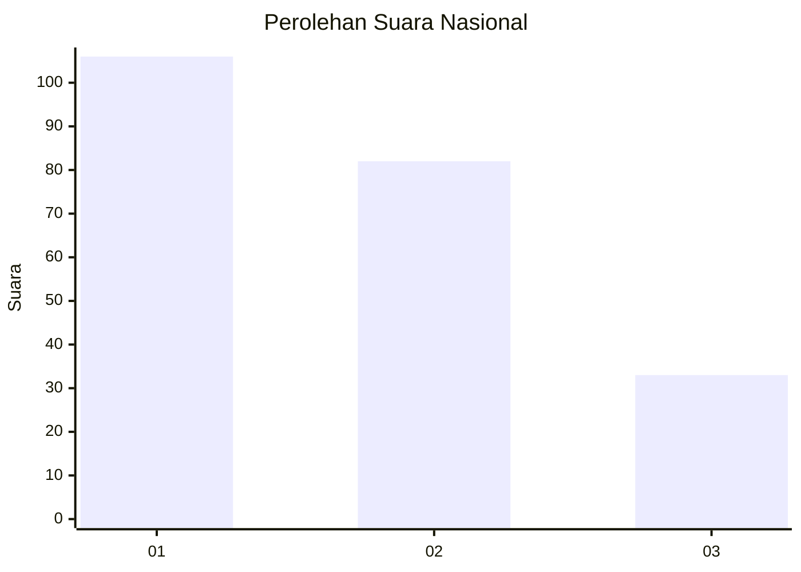
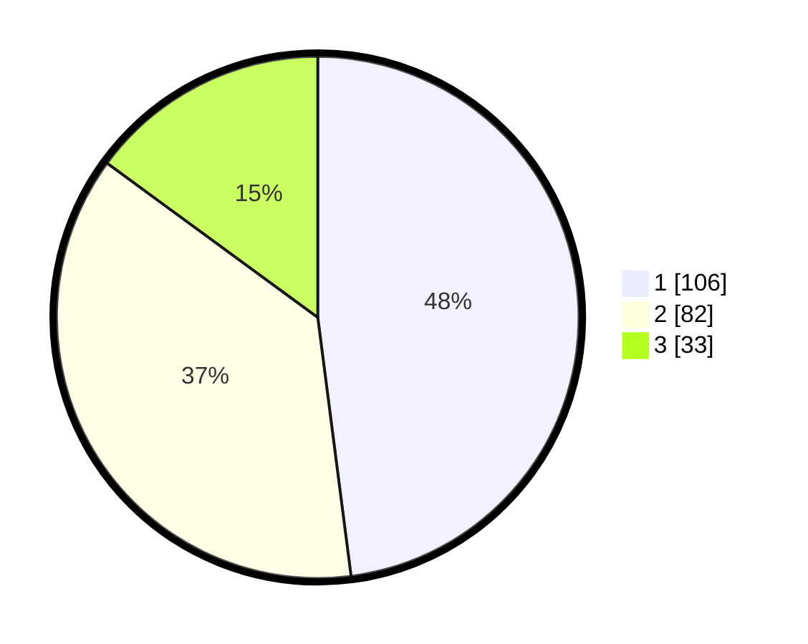

# Hasil

## Grafik

## Tabel

| No. | Nama Paslon    | Suara | Suara (raw) | Persentase |
|:--- |:-------------- | -----:| -----------:| ----------:|
| 1   | ANIES MUHAIMIN | 106   | [106][p-1]  | 47,96      |
| 2   | PRABOWO GIBRAN | 82    | [82][p-2]   | 37,10      |
| 3   | GANJAR MAHFUD  | 33    | [33][p-3]   | 14,93      |

[p-1]: https://github.com/gigit-pemilu/pemilu-2024/blob/main/pilpres/hitung-suara/sub/16-sumatera-selatan/sub/71-kota-palembang/sub/16-sematangborang/sub/1003-lebung-gajah/sub/010-tps/sub/paslon-1.txt
[p-2]: https://github.com/gigit-pemilu/pemilu-2024/blob/main/pilpres/hitung-suara/sub/16-sumatera-selatan/sub/71-kota-palembang/sub/16-sematangborang/sub/1003-lebung-gajah/sub/010-tps/sub/paslon-2.txt
[p-3]: https://github.com/gigit-pemilu/pemilu-2024/blob/main/pilpres/hitung-suara/sub/16-sumatera-selatan/sub/71-kota-palembang/sub/16-sematangborang/sub/1003-lebung-gajah/sub/010-tps/sub/paslon-3.txt

## Foto C Plano

https://sirekap-obj-formc.kpu.go.id/93b7/pemilu/ppwp/16/71/16/10/03/1671161003010-20240214-190823--01060312-62d5-45fe-8818-d7d60442280f.jpg

https://sirekap-obj-formc.kpu.go.id/93b7/pemilu/ppwp/16/71/16/10/03/1671161003010-20240214-201745--45389831-5d17-4a21-9af6-ed4f7e87d449.jpg

https://sirekap-obj-formc.kpu.go.id/93b7/pemilu/ppwp/16/71/16/10/03/1671161003010-20240214-220829--b80aebb0-8d6d-4f8f-8f61-5d68fc4c6b70.jpg

## Metadata

| Key        | Value               |
| ---------- | ------------------- |
| Time Stamp | 2024-02-15 03:06:03 |

