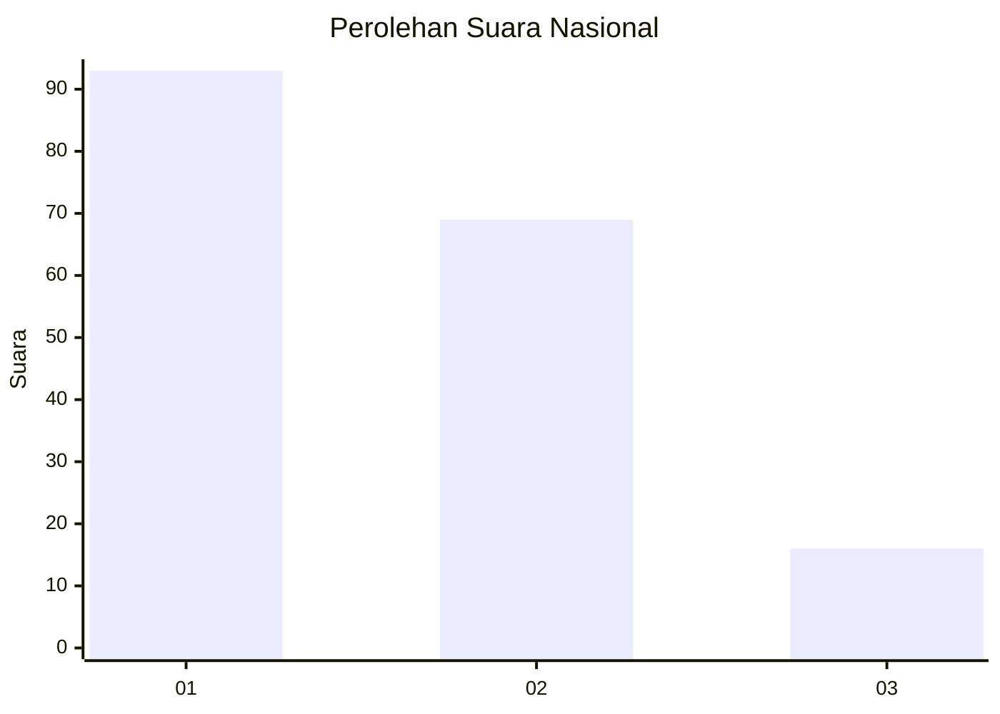
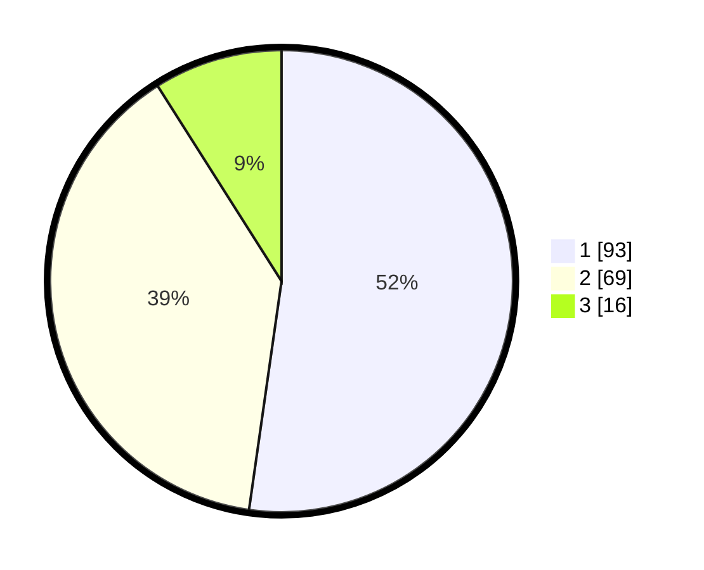

# Hasil

## Grafik

## Tabel

| No. | Nama Paslon    | Suara | Suara (raw) | Persentase |
|:--- |:-------------- | -----:| -----------:| ----------:|
| 1   | ANIES MUHAIMIN | 93    | [93][p-1]   | 52,25      |
| 2   | PRABOWO GIBRAN | 69    | [69][p-2]   | 38,76      |
| 3   | GANJAR MAHFUD  | 16    | [16][p-3]   | 8,99       |

[p-1]: https://github.com/gigit-pemilu/pemilu-2024/blob/main/pilpres/hitung-suara/sub/16-sumatera-selatan/sub/71-kota-palembang/sub/16-sematangborang/sub/1003-lebung-gajah/sub/016-tps/sub/paslon-1.txt
[p-2]: https://github.com/gigit-pemilu/pemilu-2024/blob/main/pilpres/hitung-suara/sub/16-sumatera-selatan/sub/71-kota-palembang/sub/16-sematangborang/sub/1003-lebung-gajah/sub/016-tps/sub/paslon-2.txt
[p-3]: https://github.com/gigit-pemilu/pemilu-2024/blob/main/pilpres/hitung-suara/sub/16-sumatera-selatan/sub/71-kota-palembang/sub/16-sematangborang/sub/1003-lebung-gajah/sub/016-tps/sub/paslon-3.txt

## Foto C Plano

https://sirekap-obj-formc.kpu.go.id/a93f/pemilu/ppwp/16/71/16/10/03/1671161003016-20240214-200005--ddf76b4c-4184-48a3-a593-f3e7c7341947.jpg

https://sirekap-obj-formc.kpu.go.id/a93f/pemilu/ppwp/16/71/16/10/03/1671161003016-20240214-201343--ddcc3650-62bb-4728-8488-29457cbf8949.jpg

https://sirekap-obj-formc.kpu.go.id/a93f/pemilu/ppwp/16/71/16/10/03/1671161003016-20240214-213144--e038d6a8-9b8a-4a10-888e-b78696f35122.jpg

## Metadata

| Key        | Value               |
| ---------- | ------------------- |
| Time Stamp | 2024-02-24 22:31:28 |

