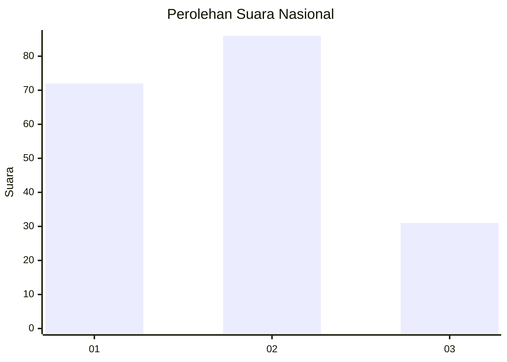
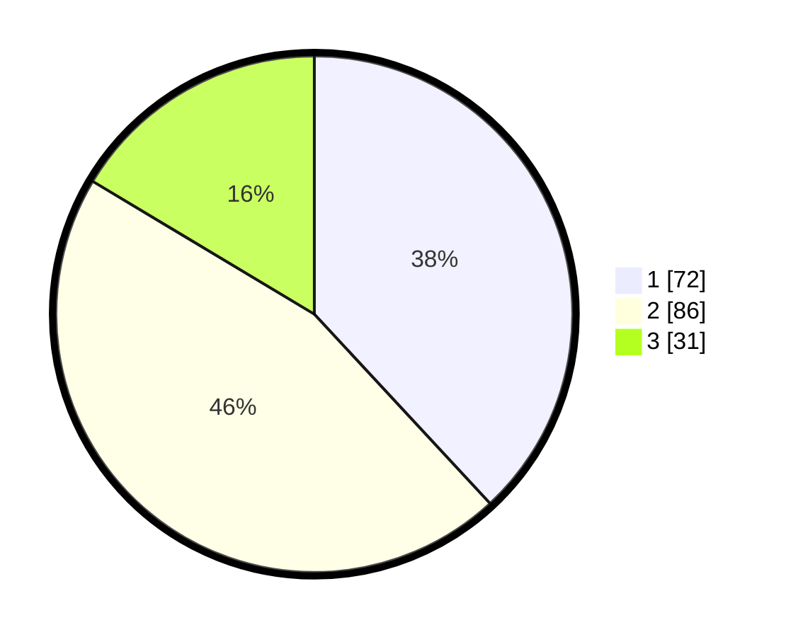

# Hasil

## Grafik

## Tabel

| No. | Nama Paslon    | Suara | Suara (raw) | Persentase |
|:--- |:-------------- | -----:| -----------:| ----------:|
| 1   | ANIES MUHAIMIN | 72    | [72][p-1]   | 38,10      |
| 2   | PRABOWO GIBRAN | 86    | [86][p-2]   | 45,50      |
| 3   | GANJAR MAHFUD  | 31    | [31][p-3]   | 16,40      |

[p-1]: https://github.com/gigit-pemilu/pemilu-2024/blob/main/pilpres/hitung-suara/sub/16-sumatera-selatan/sub/71-kota-palembang/sub/16-sematangborang/sub/1003-lebung-gajah/sub/060-tps/sub/paslon-1.txt
[p-2]: https://github.com/gigit-pemilu/pemilu-2024/blob/main/pilpres/hitung-suara/sub/16-sumatera-selatan/sub/71-kota-palembang/sub/16-sematangborang/sub/1003-lebung-gajah/sub/060-tps/sub/paslon-2.txt
[p-3]: https://github.com/gigit-pemilu/pemilu-2024/blob/main/pilpres/hitung-suara/sub/16-sumatera-selatan/sub/71-kota-palembang/sub/16-sematangborang/sub/1003-lebung-gajah/sub/060-tps/sub/paslon-3.txt

## Foto C Plano

https://sirekap-obj-formc.kpu.go.id/301c/pemilu/ppwp/16/71/16/10/03/1671161003060-20240214-232419--7c1eb37f-9ab2-402a-9251-0123ec959ab0.jpg

https://sirekap-obj-formc.kpu.go.id/301c/pemilu/ppwp/16/71/16/10/03/1671161003060-20240214-232604--2d4faab0-f5cc-4d66-98dd-184c9adbb8fb.jpg

https://sirekap-obj-formc.kpu.go.id/301c/pemilu/ppwp/16/71/16/10/03/1671161003060-20240214-232807--4f486374-0708-43a1-8918-a02def630665.jpg

## Metadata

| Key        | Value               |
| ---------- | ------------------- |
| Time Stamp | 2024-02-24 22:31:28 |

