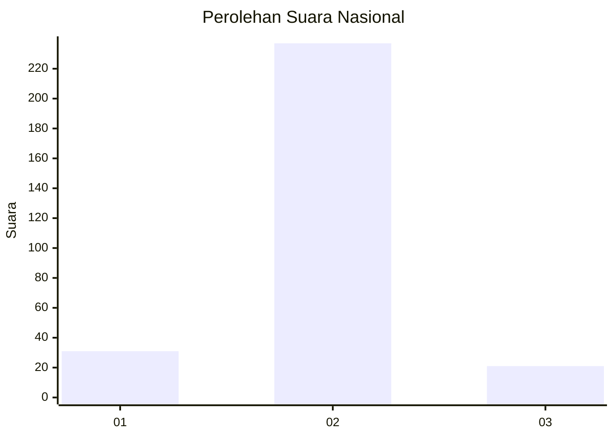
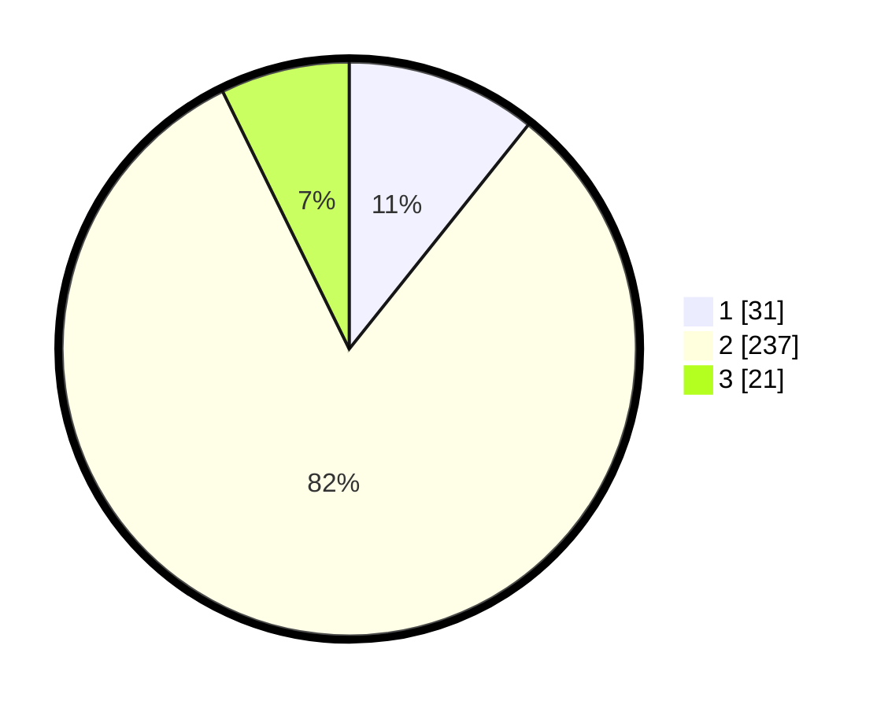

# Hasil

## Grafik

## Tabel

| No. | Nama Paslon    | Suara | Suara (raw) | Persentase |
|:--- |:-------------- | -----:| -----------:| ----------:|
| 1   | ANIES MUHAIMIN | 31    | [31][p-1]   | 10,73      |
| 2   | PRABOWO GIBRAN | 237   | [237][p-2]  | 82,01      |
| 3   | GANJAR MAHFUD  | 21    | [21][p-3]   | 7,27       |

[p-1]: https://github.com/gigit-pemilu/pemilu-2024/blob/main/pilpres/hitung-suara/sub/16-sumatera-selatan/sub/71-kota-palembang/sub/16-sematangborang/sub/1005-karyamulya/sub/901-tps/sub/paslon-1.txt
[p-2]: https://github.com/gigit-pemilu/pemilu-2024/blob/main/pilpres/hitung-suara/sub/16-sumatera-selatan/sub/71-kota-palembang/sub/16-sematangborang/sub/1005-karyamulya/sub/901-tps/sub/paslon-2.txt
[p-3]: https://github.com/gigit-pemilu/pemilu-2024/blob/main/pilpres/hitung-suara/sub/16-sumatera-selatan/sub/71-kota-palembang/sub/16-sematangborang/sub/1005-karyamulya/sub/901-tps/sub/paslon-3.txt

## Foto C Plano

https://sirekap-obj-formc.kpu.go.id/3c95/pemilu/ppwp/16/71/16/10/05/1671161005901-20240218-214646--19c9d586-ca73-49ea-9ca9-3ccb59150a81.jpg

https://sirekap-obj-formc.kpu.go.id/3c95/pemilu/ppwp/16/71/16/10/05/1671161005901-20240218-214758--a429992d-1413-48d5-a64b-9c0c76aabf84.jpg

https://sirekap-obj-formc.kpu.go.id/3c95/pemilu/ppwp/16/71/16/10/05/1671161005901-20240218-214907--5aa00c83-8c71-4508-9528-857a1c31fe44.jpg

## Metadata

| Key        | Value               |
| ---------- | ------------------- |
| Time Stamp | 2024-02-24 22:31:28 |

