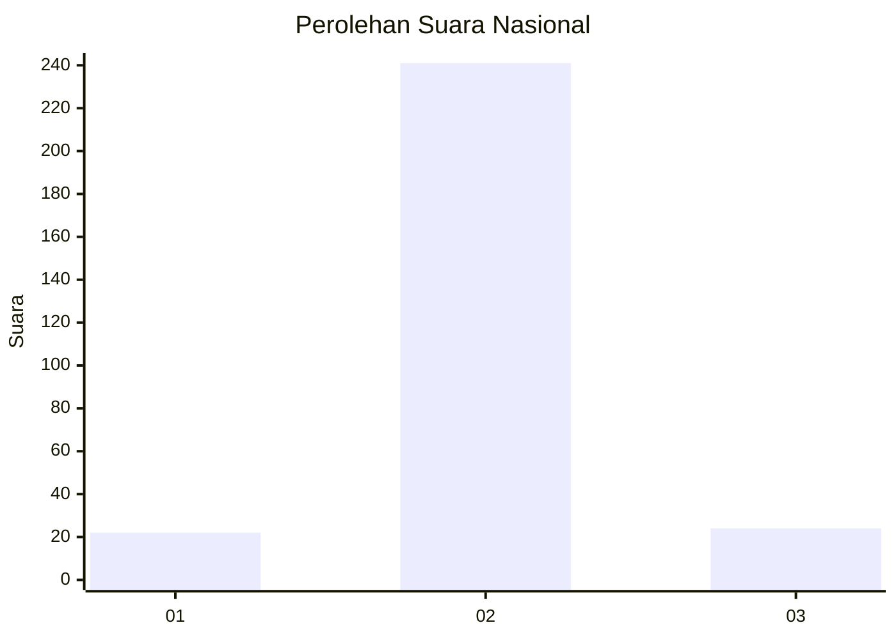
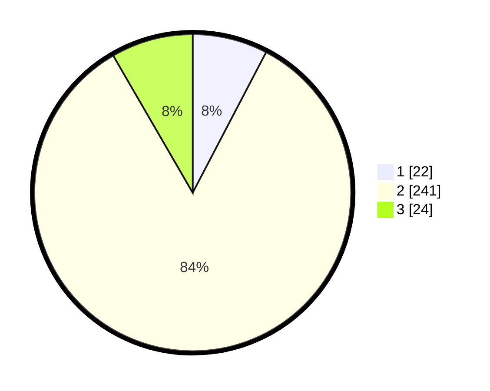

# Hasil

## Grafik

## Tabel

| No. | Nama Paslon    | Suara | Suara (raw) | Persentase |
|:--- |:-------------- | -----:| -----------:| ----------:|
| 1   | ANIES MUHAIMIN | 22    | [22][p-1]   | 7,67       |
| 2   | PRABOWO GIBRAN | 241   | [241][p-2]  | 83,97      |
| 3   | GANJAR MAHFUD  | 24    | [24][p-3]   | 8,36       |

[p-1]: https://github.com/gigit-pemilu/pemilu-2024/blob/main/pilpres/hitung-suara/sub/16-sumatera-selatan/sub/71-kota-palembang/sub/16-sematangborang/sub/1005-karyamulya/sub/902-tps/sub/paslon-1.txt
[p-2]: https://github.com/gigit-pemilu/pemilu-2024/blob/main/pilpres/hitung-suara/sub/16-sumatera-selatan/sub/71-kota-palembang/sub/16-sematangborang/sub/1005-karyamulya/sub/902-tps/sub/paslon-2.txt
[p-3]: https://github.com/gigit-pemilu/pemilu-2024/blob/main/pilpres/hitung-suara/sub/16-sumatera-selatan/sub/71-kota-palembang/sub/16-sematangborang/sub/1005-karyamulya/sub/902-tps/sub/paslon-3.txt

## Foto C Plano

https://sirekap-obj-formc.kpu.go.id/ce0c/pemilu/ppwp/16/71/16/10/05/1671161005902-20240214-215954--1cad9f31-d838-48c8-86f6-0a2b5c958dc2.jpg

https://sirekap-obj-formc.kpu.go.id/ce0c/pemilu/ppwp/16/71/16/10/05/1671161005902-20240214-220105--2a6bbd32-e439-4582-b7cc-61a0ce9a7c4d.jpg

https://sirekap-obj-formc.kpu.go.id/ce0c/pemilu/ppwp/16/71/16/10/05/1671161005902-20240214-220213--c53e0d70-1609-4942-8094-8ac2e7d6b6d2.jpg

## Metadata

| Key        | Value               |
| ---------- | ------------------- |
| Time Stamp | 2024-02-15 09:00:24 |

## DATA PEMILIH TETAP

Jumlah pemilih dalam DPT: **286**.
 * L: **286**.
 * P: **0**.

## DATA PENGGUNA HAK PILIH

Jumlah pengguna hak pilih dalam DPT: **233**.
 * L: **233**.
 * P: **0**.

Jumlah pengguna hak pilih dalam DPTb: **54**.
 * L: **53**.
 * P: **1**.

Jumlah pengguna hak pilih dalam DPK: **6**.
 * L: **6**.
 * P: **0**.

Jumlah pengguna hak pilih: **293**.
 * L: **292**.
 * P: **1**.

## JUMLAH SUARA SAH DAN TIDAK SAH

JUMLAH SELURUH SUARA SAH: **287**.

JUMLAH SUARA TIDAK SAH: **6**.

JUMLAH SELURUH SUARA SAH DAN SUARA TIDAK SAH: **293**.

