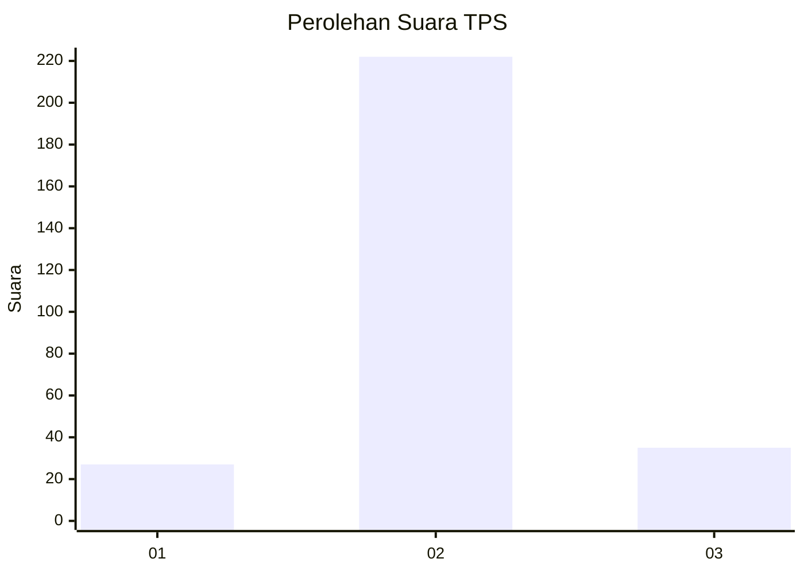
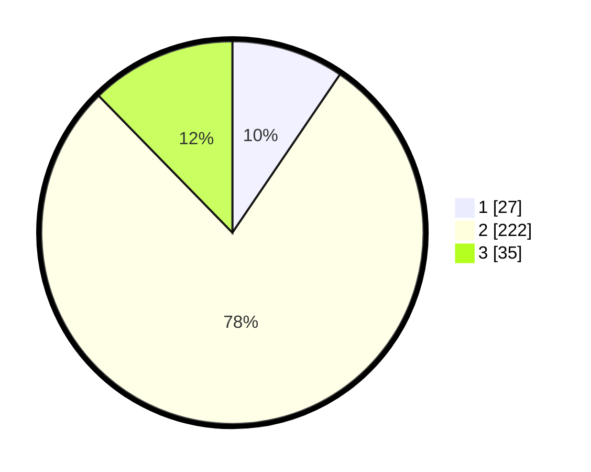

# Hasil

## Grafik

## Tabel

| No. | Nama Paslon    | Suara | Suara (raw) | Persentase |
|:--- |:-------------- | -----:| -----------:| ----------:|
| 1   | ANIES MUHAIMIN | 27    | [27][p-1]   | 9,51       |
| 2   | PRABOWO GIBRAN | 222   | [222][p-2]  | 78,17      |
| 3   | GANJAR MAHFUD  | 35    | [35][p-3]   | 12,32      |

[p-1]: https://github.com/gigit-pemilu/pemilu-2024-16-sumatera-selatan/blob/main/pilpres/hitung-suara/sub/16-sumatera-selatan/sub/71-kota-palembang/sub/16-sematangborang/sub/1005-karyamulya/sub/903-tps/sub/paslon-1.txt
[p-2]: https://github.com/gigit-pemilu/pemilu-2024-16-sumatera-selatan/blob/main/pilpres/hitung-suara/sub/16-sumatera-selatan/sub/71-kota-palembang/sub/16-sematangborang/sub/1005-karyamulya/sub/903-tps/sub/paslon-2.txt
[p-3]: https://github.com/gigit-pemilu/pemilu-2024-16-sumatera-selatan/blob/main/pilpres/hitung-suara/sub/16-sumatera-selatan/sub/71-kota-palembang/sub/16-sematangborang/sub/1005-karyamulya/sub/903-tps/sub/paslon-3.txt

## Foto C Plano

https://sirekap-obj-formc.kpu.go.id/0b31/pemilu/ppwp/16/71/16/10/05/1671161005903-20240219-152322--0d29cfb6-c38f-4c2e-886c-435f7e3a5518.jpg

https://sirekap-obj-formc.kpu.go.id/0b31/pemilu/ppwp/16/71/16/10/05/1671161005903-20240219-152445--3a6a2b14-27c1-4811-841f-70d056c6af5f.jpg

https://sirekap-obj-formc.kpu.go.id/0b31/pemilu/ppwp/16/71/16/10/05/1671161005903-20240219-152608--86bbba95-359b-4dda-95fe-9b8eb2cd52cd.jpg

## Metadata

| Key        | Value               |
| ---------- | ------------------- |
| Time Stamp | 2024-02-25 16:00:00 |

