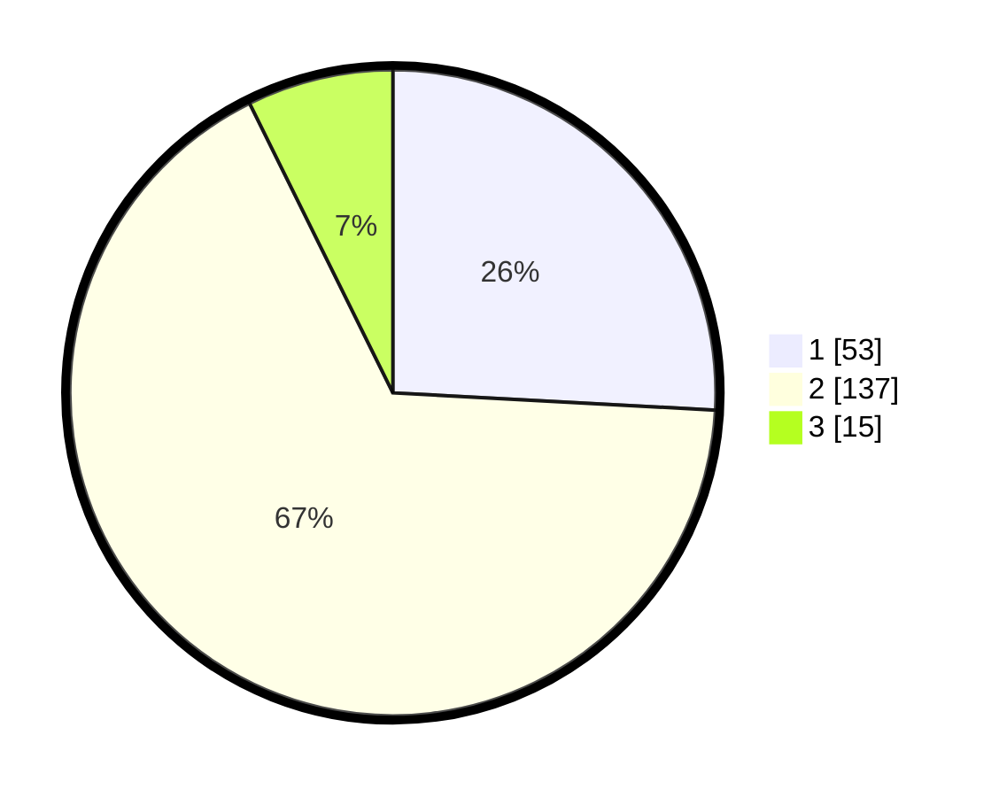

# Hasil

## Grafik

## Tabel

| No. | Nama Paslon    | Suara | Suara (raw) | Persentase |
|:--- |:-------------- | -----:| -----------:| ----------:|
| 1   | ANIES MUHAIMIN | 53    | [53][p-1]   | 25,85      |
| 2   | PRABOWO GIBRAN | 137   | [137][p-2]  | 66,83      |
| 3   | GANJAR MAHFUD  | 15    | [15][p-3]   | 7,32       |

[p-1]: https://github.com/gigit-pemilu/pemilu-2024-16-sumatera-selatan/blob/main/pilpres/hitung-suara/sub/16-sumatera-selatan/sub/71-kota-palembang/sub/17-jakabaring/sub/1001-delapan-ulu/sub/004-tps/sub/paslon-1.txt
[p-2]: https://github.com/gigit-pemilu/pemilu-2024-16-sumatera-selatan/blob/main/pilpres/hitung-suara/sub/16-sumatera-selatan/sub/71-kota-palembang/sub/17-jakabaring/sub/1001-delapan-ulu/sub/004-tps/sub/paslon-2.txt
[p-3]: https://github.com/gigit-pemilu/pemilu-2024-16-sumatera-selatan/blob/main/pilpres/hitung-suara/sub/16-sumatera-selatan/sub/71-kota-palembang/sub/17-jakabaring/sub/1001-delapan-ulu/sub/004-tps/sub/paslon-3.txt

## Foto C Plano

https://sirekap-obj-formc.kpu.go.id/90aa/pemilu/ppwp/16/71/17/10/01/1671171001004-20240215-015857--87821d5f-a4a2-4e2f-9554-d3ab67904a15.jpg

https://sirekap-obj-formc.kpu.go.id/90aa/pemilu/ppwp/16/71/17/10/01/1671171001004-20240215-015927--8facf30e-e1f6-4e5c-8a3d-13ee98a4a2df.jpg

https://sirekap-obj-formc.kpu.go.id/90aa/pemilu/ppwp/16/71/17/10/01/1671171001004-20240215-015958--3d78eae2-54ae-4e48-b128-4c94ab57268e.jpg

## Metadata

| Key        | Value               |
| ---------- | ------------------- |
| Time Stamp | 2024-02-19 06:16:00 |

