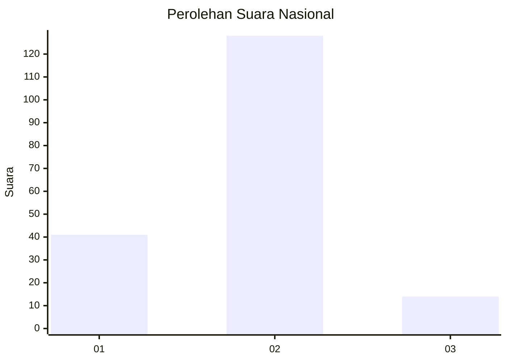
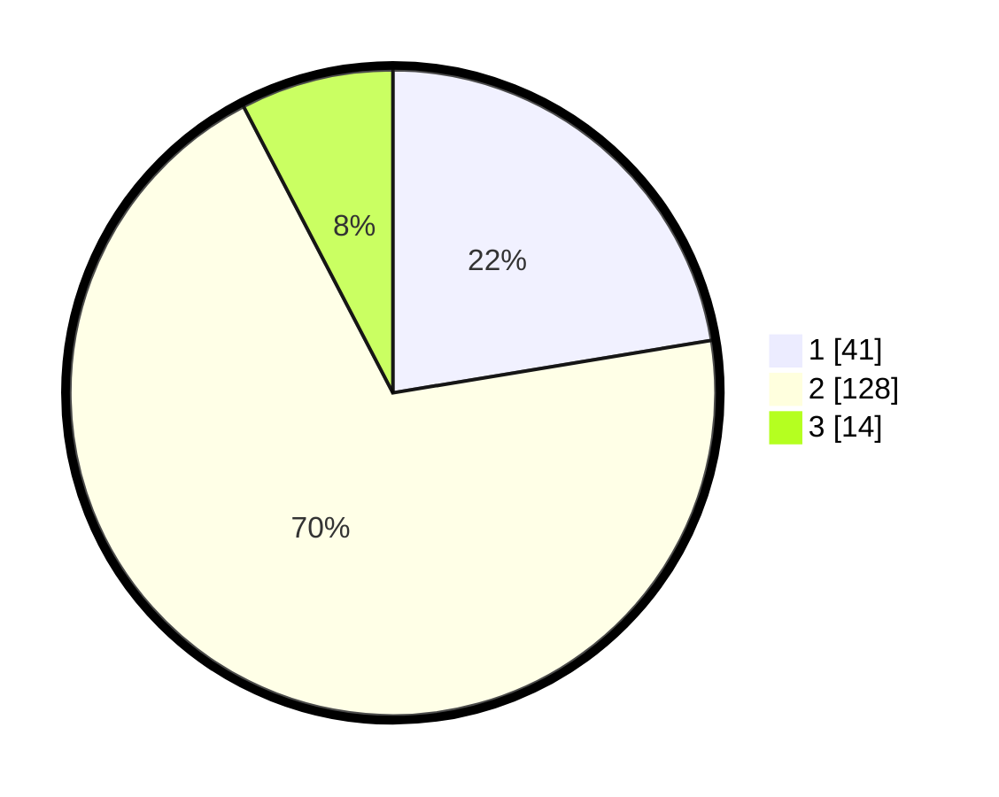

# Hasil

## Grafik

## Tabel

| No. | Nama Paslon    | Suara | Suara (raw) | Persentase |
|:--- |:-------------- | -----:| -----------:| ----------:|
| 1   | ANIES MUHAIMIN | 41    | [41][p-1]   | 22,40      |
| 2   | PRABOWO GIBRAN | 128   | [128][p-2]  | 69,95      |
| 3   | GANJAR MAHFUD  | 14    | [14][p-3]   | 7,65       |

[p-1]: https://github.com/gigit-pemilu/pemilu-2024/blob/main/pilpres/hitung-suara/sub/16-sumatera-selatan/sub/71-kota-palembang/sub/17-jakabaring/sub/1001-delapan-ulu/sub/005-tps/sub/paslon-1.txt
[p-2]: https://github.com/gigit-pemilu/pemilu-2024/blob/main/pilpres/hitung-suara/sub/16-sumatera-selatan/sub/71-kota-palembang/sub/17-jakabaring/sub/1001-delapan-ulu/sub/005-tps/sub/paslon-2.txt
[p-3]: https://github.com/gigit-pemilu/pemilu-2024/blob/main/pilpres/hitung-suara/sub/16-sumatera-selatan/sub/71-kota-palembang/sub/17-jakabaring/sub/1001-delapan-ulu/sub/005-tps/sub/paslon-3.txt

## Foto C Plano

https://sirekap-obj-formc.kpu.go.id/8340/pemilu/ppwp/16/71/17/10/01/1671171001005-20240215-023409--1e8f6de4-39de-4dd6-9258-2912fa422163.jpg

https://sirekap-obj-formc.kpu.go.id/8340/pemilu/ppwp/16/71/17/10/01/1671171001005-20240215-023509--591cf203-e2bf-49a8-a767-93831af58a60.jpg

https://sirekap-obj-formc.kpu.go.id/8340/pemilu/ppwp/16/71/17/10/01/1671171001005-20240215-023617--ae1a6aa8-95c3-4ffc-91ef-52405f1f0bcc.jpg

## Metadata

| Key        | Value               |
| ---------- | ------------------- |
| Time Stamp | 2024-02-25 18:00:00 |

