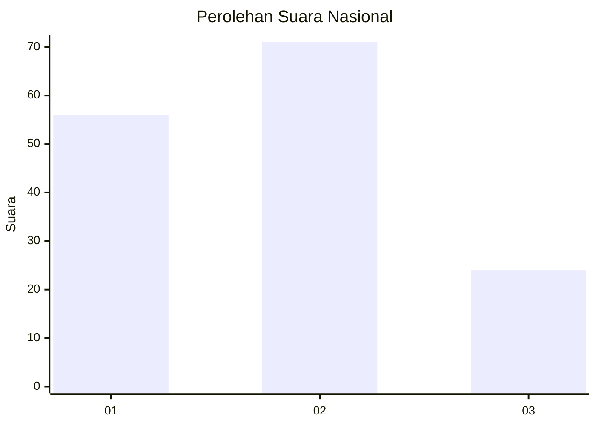
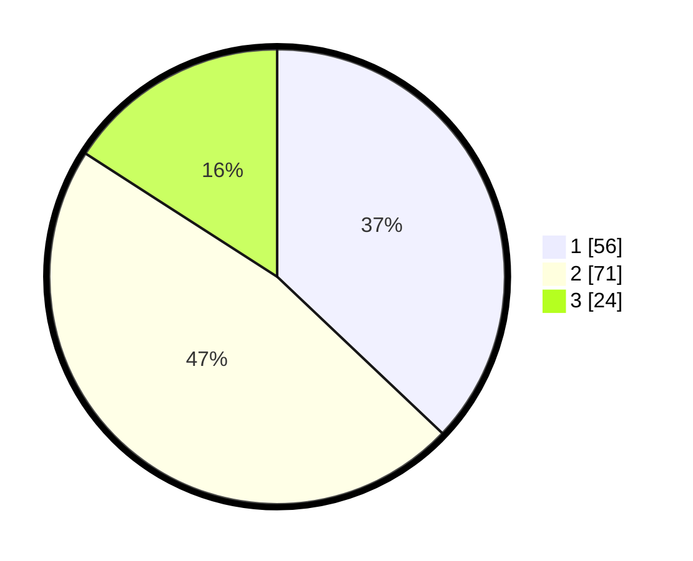

# Hasil

## Grafik

## Tabel

| No. | Nama Paslon    | Suara | Suara (raw) | Persentase |
|:--- |:-------------- | -----:| -----------:| ----------:|
| 1   | ANIES MUHAIMIN | 56    | [56][p-1]   | 37,09      |
| 2   | PRABOWO GIBRAN | 71    | [71][p-2]   | 47,02      |
| 3   | GANJAR MAHFUD  | 24    | [24][p-3]   | 15,89      |

[p-1]: https://github.com/gigit-pemilu/pemilu-2024/blob/main/pilpres/hitung-suara/sub/16-sumatera-selatan/sub/71-kota-palembang/sub/17-jakabaring/sub/1003-lima-belas-ulu/sub/015-tps/sub/paslon-1.txt
[p-2]: https://github.com/gigit-pemilu/pemilu-2024/blob/main/pilpres/hitung-suara/sub/16-sumatera-selatan/sub/71-kota-palembang/sub/17-jakabaring/sub/1003-lima-belas-ulu/sub/015-tps/sub/paslon-2.txt
[p-3]: https://github.com/gigit-pemilu/pemilu-2024/blob/main/pilpres/hitung-suara/sub/16-sumatera-selatan/sub/71-kota-palembang/sub/17-jakabaring/sub/1003-lima-belas-ulu/sub/015-tps/sub/paslon-3.txt

## Foto C Plano

https://sirekap-obj-formc.kpu.go.id/cc3c/pemilu/ppwp/16/71/17/10/03/1671171003015-20240214-200908--cc7e13ea-337d-484b-91b2-71073e3947fe.jpg

https://sirekap-obj-formc.kpu.go.id/cc3c/pemilu/ppwp/16/71/17/10/03/1671171003015-20240214-201117--6a5a8d19-c11c-4c60-a0e9-c8437e246729.jpg

https://sirekap-obj-formc.kpu.go.id/cc3c/pemilu/ppwp/16/71/17/10/03/1671171003015-20240214-201200--55a0aa2b-5ba0-49e4-b7dd-720ce7a4365a.jpg

## Metadata

| Key        | Value               |
| ---------- | ------------------- |
| Time Stamp | 2024-02-25 22:00:00 |

