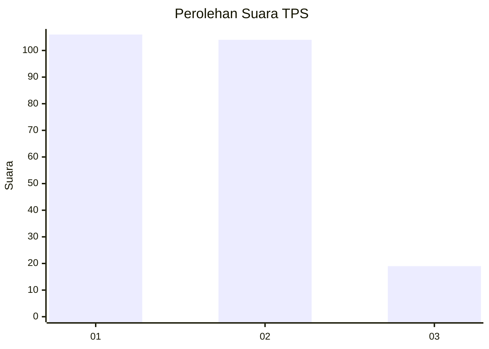
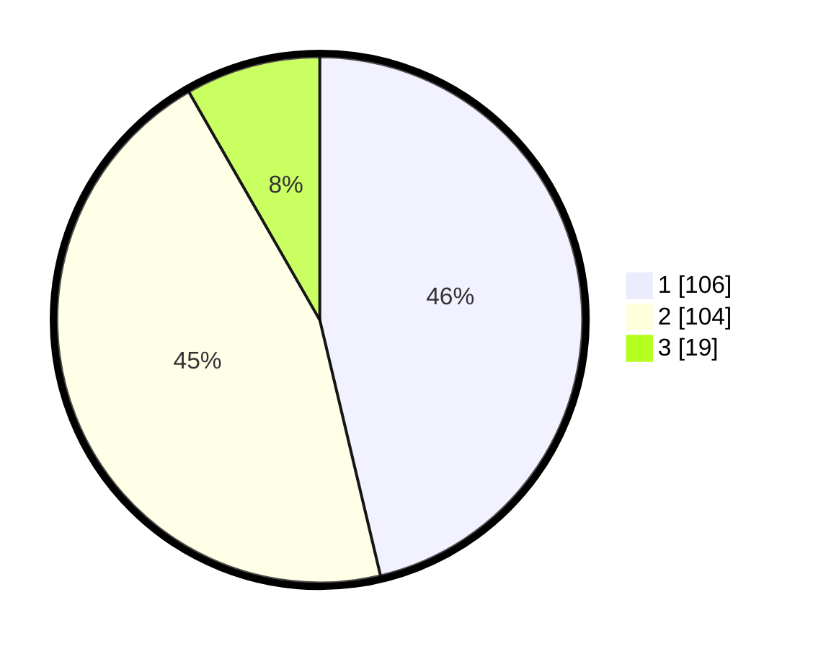

# Hasil

## Grafik

## Tabel

| No. | Nama Paslon    | Suara | Suara (raw) | Persentase |
|:--- |:-------------- | -----:| -----------:| ----------:|
| 1   | ANIES MUHAIMIN | 106   | [106][p-1]  | 46,29      |
| 2   | PRABOWO GIBRAN | 104   | [104][p-2]  | 45,41      |
| 3   | GANJAR MAHFUD  | 19    | [19][p-3]   | 8,30       |

[p-1]: https://github.com/gigit-pemilu/pemilu-2024-16-sumatera-selatan/blob/main/pilpres/hitung-suara/sub/16-sumatera-selatan/sub/71-kota-palembang/sub/17-jakabaring/sub/1003-lima-belas-ulu/sub/029-tps/sub/paslon-1.txt
[p-2]: https://github.com/gigit-pemilu/pemilu-2024-16-sumatera-selatan/blob/main/pilpres/hitung-suara/sub/16-sumatera-selatan/sub/71-kota-palembang/sub/17-jakabaring/sub/1003-lima-belas-ulu/sub/029-tps/sub/paslon-2.txt
[p-3]: https://github.com/gigit-pemilu/pemilu-2024-16-sumatera-selatan/blob/main/pilpres/hitung-suara/sub/16-sumatera-selatan/sub/71-kota-palembang/sub/17-jakabaring/sub/1003-lima-belas-ulu/sub/029-tps/sub/paslon-3.txt

## Foto C Plano

https://sirekap-obj-formc.kpu.go.id/d1f0/pemilu/ppwp/16/71/17/10/03/1671171003029-20240214-192434--e05301af-1fd9-4fba-a9fb-bd80c235301a.jpg

https://sirekap-obj-formc.kpu.go.id/d1f0/pemilu/ppwp/16/71/17/10/03/1671171003029-20240214-192437--cb29f602-a709-49a6-9882-9fad41af8b46.jpg

https://sirekap-obj-formc.kpu.go.id/d1f0/pemilu/ppwp/16/71/17/10/03/1671171003029-20240214-192441--fb4068ed-0810-44ff-8a69-9705694619e0.jpg

## Metadata

| Key        | Value               |
| ---------- | ------------------- |
| Time Stamp | 2024-02-25 16:00:00 |

