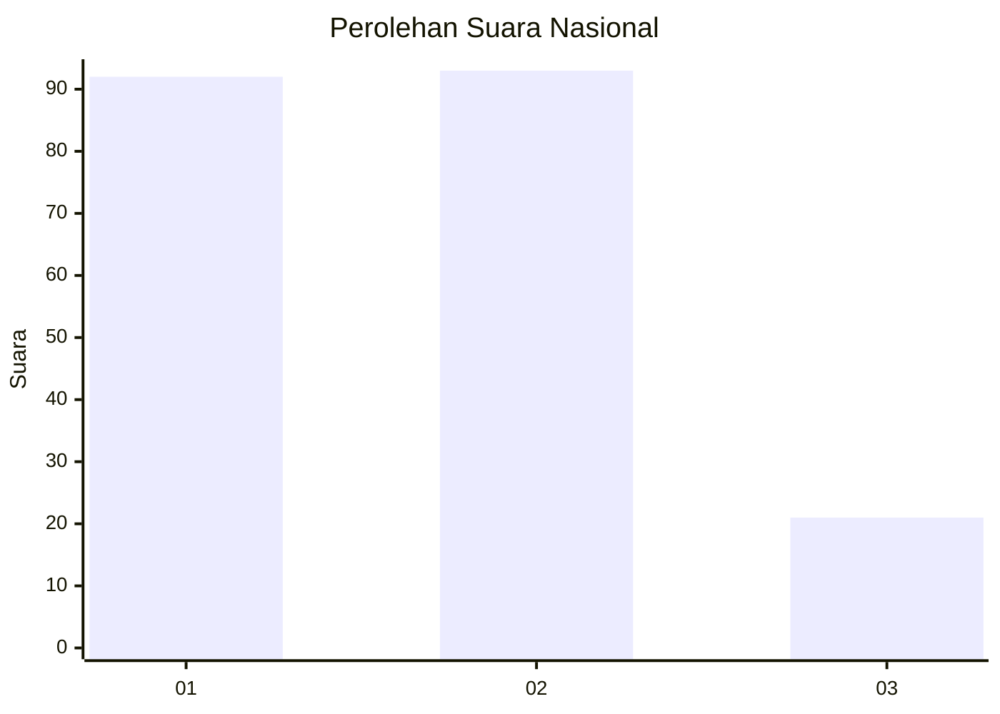
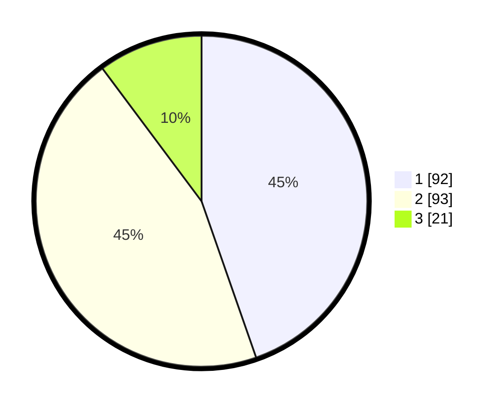

# Hasil

## Grafik

## Tabel

| No. | Nama Paslon    | Suara | Suara (raw) | Persentase |
|:--- |:-------------- | -----:| -----------:| ----------:|
| 1   | ANIES MUHAIMIN | 92    | [92][p-1]   | 44,66      |
| 2   | PRABOWO GIBRAN | 93    | [93][p-2]   | 45,15      |
| 3   | GANJAR MAHFUD  | 21    | [21][p-3]   | 10,19      |

[p-1]: https://github.com/gigit-pemilu/pemilu-2024/blob/main/pilpres/hitung-suara/sub/16-sumatera-selatan/sub/71-kota-palembang/sub/17-jakabaring/sub/1003-lima-belas-ulu/sub/075-tps/sub/paslon-1.txt
[p-2]: https://github.com/gigit-pemilu/pemilu-2024/blob/main/pilpres/hitung-suara/sub/16-sumatera-selatan/sub/71-kota-palembang/sub/17-jakabaring/sub/1003-lima-belas-ulu/sub/075-tps/sub/paslon-2.txt
[p-3]: https://github.com/gigit-pemilu/pemilu-2024/blob/main/pilpres/hitung-suara/sub/16-sumatera-selatan/sub/71-kota-palembang/sub/17-jakabaring/sub/1003-lima-belas-ulu/sub/075-tps/sub/paslon-3.txt

## Foto C Plano

https://sirekap-obj-formc.kpu.go.id/8c89/pemilu/ppwp/16/71/17/10/03/1671171003075-20240214-204756--ef3d9165-642f-4ba1-9e61-bb4b9b44eaa8.jpg

https://sirekap-obj-formc.kpu.go.id/8c89/pemilu/ppwp/16/71/17/10/03/1671171003075-20240215-044104--9fdc2b8b-fc0c-46c7-aa4a-1821a0e1f026.jpg

https://sirekap-obj-formc.kpu.go.id/8c89/pemilu/ppwp/16/71/17/10/03/1671171003075-20240214-212714--02123642-50bb-443b-8f8f-12b87cc177f6.jpg

## Metadata

| Key        | Value               |
| ---------- | ------------------- |
| Time Stamp | 2024-02-25 16:00:00 |

