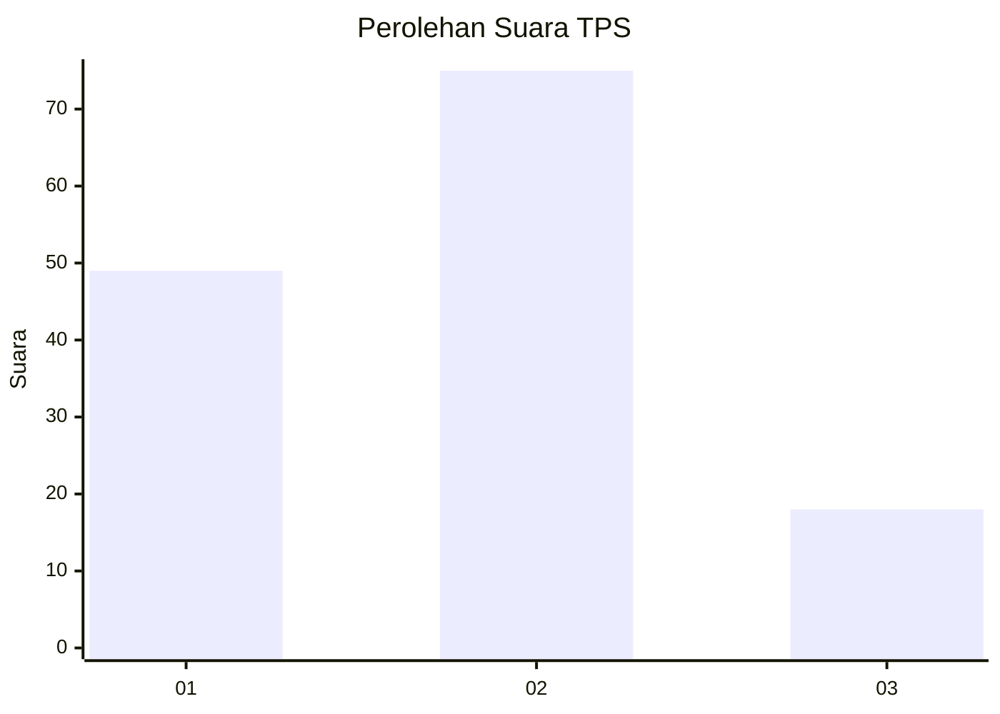
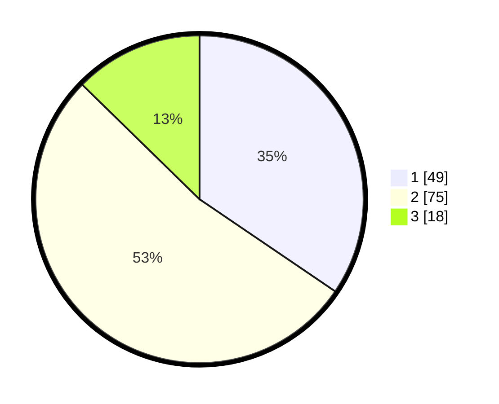

# Hasil

## Grafik

## Tabel

| No. | Nama Paslon    | Suara | Suara (raw) | Persentase |
|:--- |:-------------- | -----:| -----------:| ----------:|
| 1   | ANIES MUHAIMIN | 49    | [49][p-1]   | 34,51      |
| 2   | PRABOWO GIBRAN | 75    | [75][p-2]   | 52,82      |
| 3   | GANJAR MAHFUD  | 18    | [18][p-3]   | 12,68      |

[p-1]: https://github.com/gigit-pemilu/pemilu-2024-16-sumatera-selatan/blob/main/pilpres/hitung-suara/sub/16-sumatera-selatan/sub/71-kota-palembang/sub/17-jakabaring/sub/1004-silaberanti/sub/053-tps/sub/paslon-1.txt
[p-2]: https://github.com/gigit-pemilu/pemilu-2024-16-sumatera-selatan/blob/main/pilpres/hitung-suara/sub/16-sumatera-selatan/sub/71-kota-palembang/sub/17-jakabaring/sub/1004-silaberanti/sub/053-tps/sub/paslon-2.txt
[p-3]: https://github.com/gigit-pemilu/pemilu-2024-16-sumatera-selatan/blob/main/pilpres/hitung-suara/sub/16-sumatera-selatan/sub/71-kota-palembang/sub/17-jakabaring/sub/1004-silaberanti/sub/053-tps/sub/paslon-3.txt

## Foto C Plano

https://sirekap-obj-formc.kpu.go.id/ce38/pemilu/ppwp/16/71/17/10/04/1671171004053-20240214-204603--0013ff75-aaef-48aa-89be-88c1224320c5.jpg

https://sirekap-obj-formc.kpu.go.id/ce38/pemilu/ppwp/16/71/17/10/04/1671171004053-20240214-204623--7d61f937-6c6c-4f4e-9f5c-0e562f6c3a63.jpg

https://sirekap-obj-formc.kpu.go.id/ce38/pemilu/ppwp/16/71/17/10/04/1671171004053-20240214-204630--57cda7f9-7a80-4067-a73d-1d261fcce4c2.jpg

## Metadata

| Key        | Value               |
| ---------- | ------------------- |
| Time Stamp | 2024-02-24 22:31:28 |

