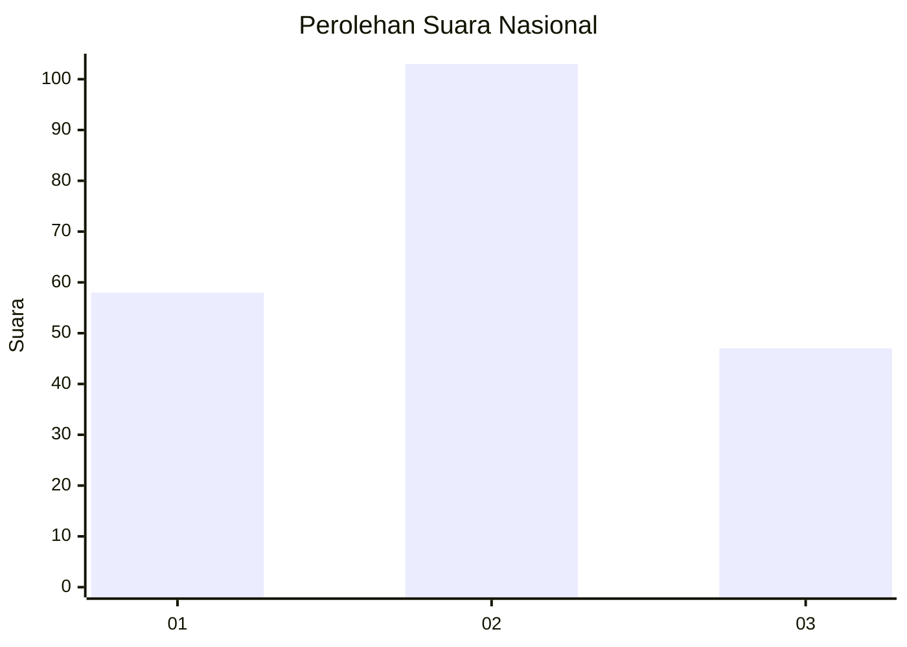
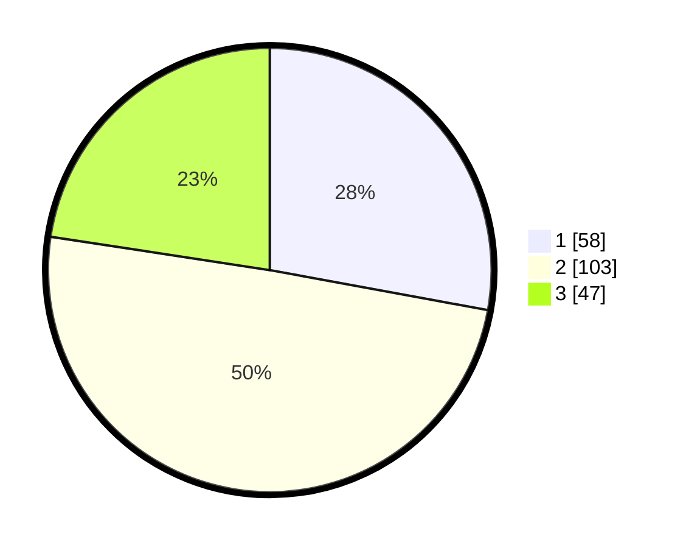

# Hasil

## Grafik

## Tabel

| No. | Nama Paslon    | Suara | Suara (raw) | Persentase |
|:--- |:-------------- | -----:| -----------:| ----------:|
| 1   | ANIES MUHAIMIN | 58    | [58][p-1]   | 27,88      |
| 2   | PRABOWO GIBRAN | 103   | [103][p-2]  | 49,52      |
| 3   | GANJAR MAHFUD  | 47    | [47][p-3]   | 22,60      |

[p-1]: https://github.com/gigit-pemilu/pemilu-2024/blob/main/pilpres/hitung-suara/sub/16-sumatera-selatan/sub/71-kota-palembang/sub/18-ilir-timur-tiga/sub/1001-delapan-ilir/sub/004-tps/sub/paslon-1.txt
[p-2]: https://github.com/gigit-pemilu/pemilu-2024/blob/main/pilpres/hitung-suara/sub/16-sumatera-selatan/sub/71-kota-palembang/sub/18-ilir-timur-tiga/sub/1001-delapan-ilir/sub/004-tps/sub/paslon-2.txt
[p-3]: https://github.com/gigit-pemilu/pemilu-2024/blob/main/pilpres/hitung-suara/sub/16-sumatera-selatan/sub/71-kota-palembang/sub/18-ilir-timur-tiga/sub/1001-delapan-ilir/sub/004-tps/sub/paslon-3.txt

## Foto C Plano

https://sirekap-obj-formc.kpu.go.id/c78b/pemilu/ppwp/16/71/18/10/01/1671181001004-20240301-130048--4c5c0143-6b85-4399-8ec6-ed9c0d737ce7.jpg

https://sirekap-obj-formc.kpu.go.id/c78b/pemilu/ppwp/16/71/18/10/01/1671181001004-20240214-222430--80022ec0-6b4d-41ae-9c81-3a70b5c85965.jpg

https://sirekap-obj-formc.kpu.go.id/c78b/pemilu/ppwp/16/71/18/10/01/1671181001004-20240214-222515--3b2520d5-ef98-4888-a3ae-a783e79472bb.jpg

## Metadata

| Key        | Value               |
| ---------- | ------------------- |
| Time Stamp | 2024-03-01 14:00:00 |

