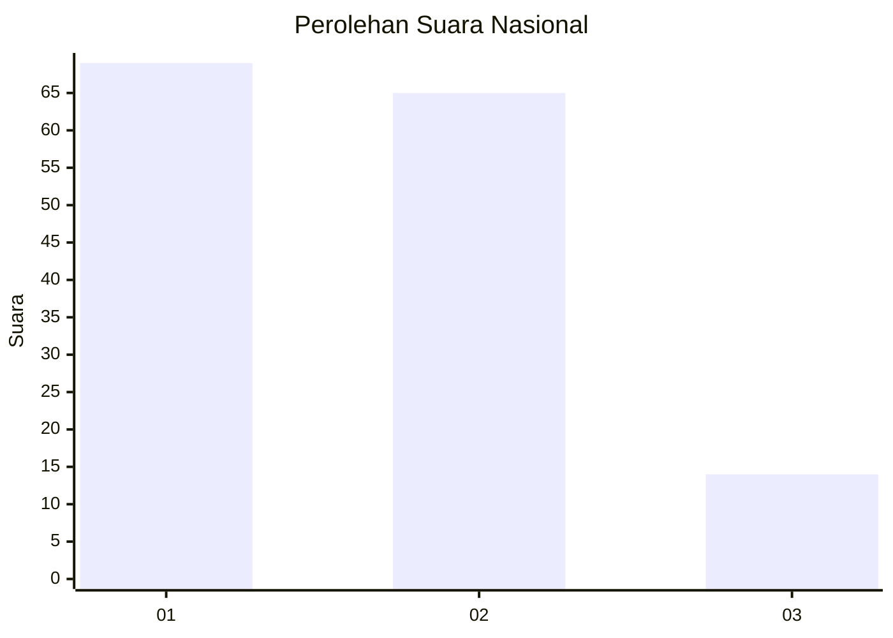
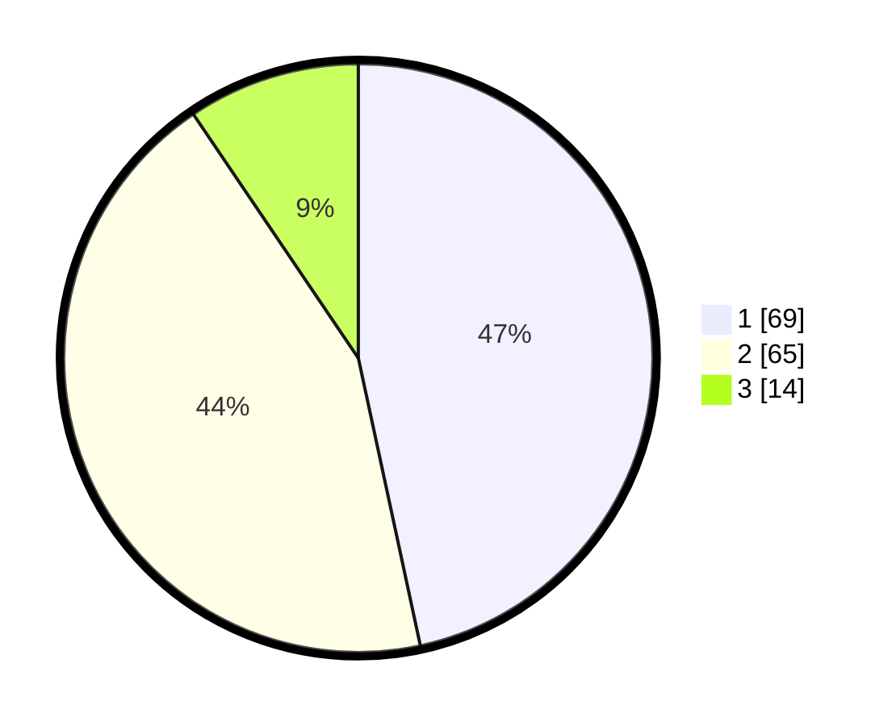

# Hasil

## Grafik

## Tabel

| No. | Nama Paslon    | Suara | Suara (raw) | Persentase |
|:--- |:-------------- | -----:| -----------:| ----------:|
| 1   | ANIES MUHAIMIN | 69    | [69][p-1]   | 46,62      |
| 2   | PRABOWO GIBRAN | 65    | [65][p-2]   | 43,92      |
| 3   | GANJAR MAHFUD  | 14    | [14][p-3]   | 9,46       |

[p-1]: https://github.com/gigit-pemilu/pemilu-2024/blob/main/pilpres/hitung-suara/sub/16-sumatera-selatan/sub/71-kota-palembang/sub/18-ilir-timur-tiga/sub/1001-delapan-ilir/sub/039-tps/sub/paslon-1.txt
[p-2]: https://github.com/gigit-pemilu/pemilu-2024/blob/main/pilpres/hitung-suara/sub/16-sumatera-selatan/sub/71-kota-palembang/sub/18-ilir-timur-tiga/sub/1001-delapan-ilir/sub/039-tps/sub/paslon-2.txt
[p-3]: https://github.com/gigit-pemilu/pemilu-2024/blob/main/pilpres/hitung-suara/sub/16-sumatera-selatan/sub/71-kota-palembang/sub/18-ilir-timur-tiga/sub/1001-delapan-ilir/sub/039-tps/sub/paslon-3.txt

## Foto C Plano

https://sirekap-obj-formc.kpu.go.id/7e65/pemilu/ppwp/16/71/18/10/01/1671181001039-20240229-181434--a71a5d1d-ce24-4f87-8beb-e11681fc96d5.jpg

https://sirekap-obj-formc.kpu.go.id/7e65/pemilu/ppwp/16/71/18/10/01/1671181001039-20240215-005944--4ecdf762-f562-4174-abdd-93708e5765d1.jpg

https://sirekap-obj-formc.kpu.go.id/7e65/pemilu/ppwp/16/71/18/10/01/1671181001039-20240215-010026--e6338813-0114-4e15-987b-9584846fbff8.jpg

## Metadata

| Key        | Value               |
| ---------- | ------------------- |
| Time Stamp | 2024-02-29 19:00:00 |

