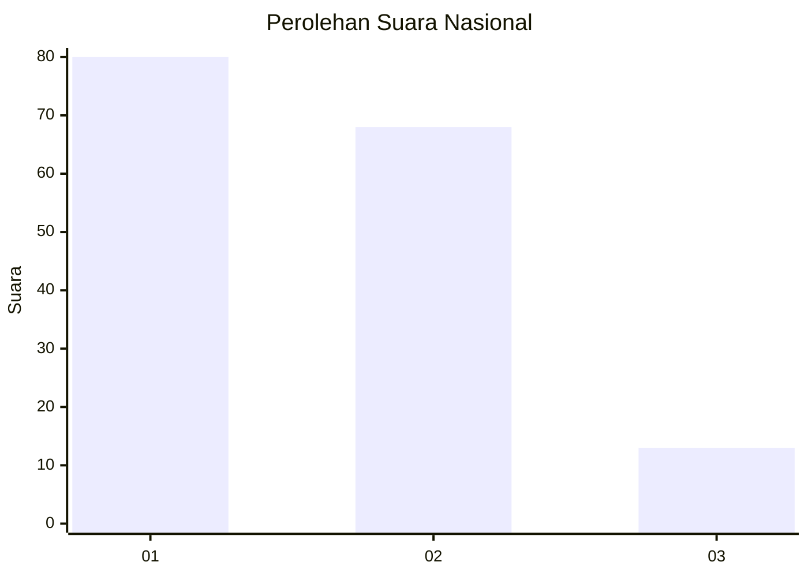
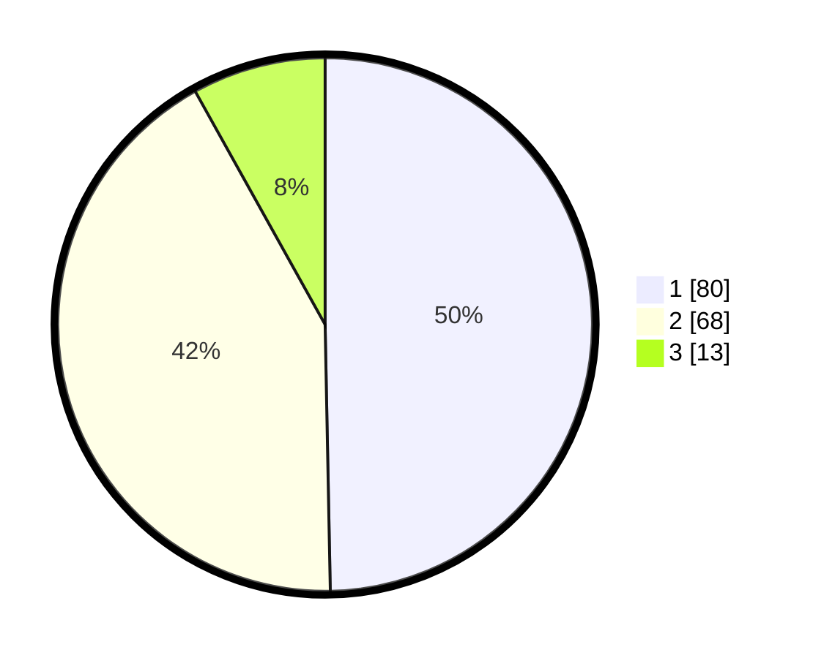

# Hasil

## Grafik

## Tabel

| No. | Nama Paslon    | Suara | Suara (raw) | Persentase |
|:--- |:-------------- | -----:| -----------:| ----------:|
| 1   | ANIES MUHAIMIN | 80    | [80][p-1]   | 49,69      |
| 2   | PRABOWO GIBRAN | 68    | [68][p-2]   | 42,24      |
| 3   | GANJAR MAHFUD  | 13    | [13][p-3]   | 8,07       |

[p-1]: https://github.com/gigit-pemilu/pemilu-2024/blob/main/pilpres/hitung-suara/sub/16-sumatera-selatan/sub/71-kota-palembang/sub/18-ilir-timur-tiga/sub/1001-delapan-ilir/sub/053-tps/sub/paslon-1.txt
[p-2]: https://github.com/gigit-pemilu/pemilu-2024/blob/main/pilpres/hitung-suara/sub/16-sumatera-selatan/sub/71-kota-palembang/sub/18-ilir-timur-tiga/sub/1001-delapan-ilir/sub/053-tps/sub/paslon-2.txt
[p-3]: https://github.com/gigit-pemilu/pemilu-2024/blob/main/pilpres/hitung-suara/sub/16-sumatera-selatan/sub/71-kota-palembang/sub/18-ilir-timur-tiga/sub/1001-delapan-ilir/sub/053-tps/sub/paslon-3.txt

## Foto C Plano

https://sirekap-obj-formc.kpu.go.id/006a/pemilu/ppwp/16/71/18/10/01/1671181001053-20240301-112847--7d9072b2-be8f-417e-8295-66367987dcae.jpg

https://sirekap-obj-formc.kpu.go.id/006a/pemilu/ppwp/16/71/18/10/01/1671181001053-20240214-220942--fd86569b-746a-46a9-9b3a-2a737a31c10c.jpg

https://sirekap-obj-formc.kpu.go.id/006a/pemilu/ppwp/16/71/18/10/01/1671181001053-20240214-221044--ff4f7cb8-1510-44c8-b827-384685fde62e.jpg

## Metadata

| Key        | Value               |
| ---------- | ------------------- |
| Time Stamp | 2024-03-01 12:00:00 |

