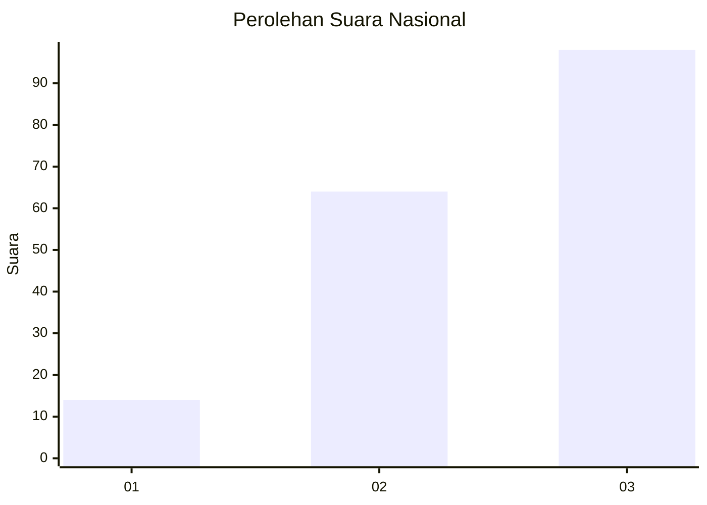
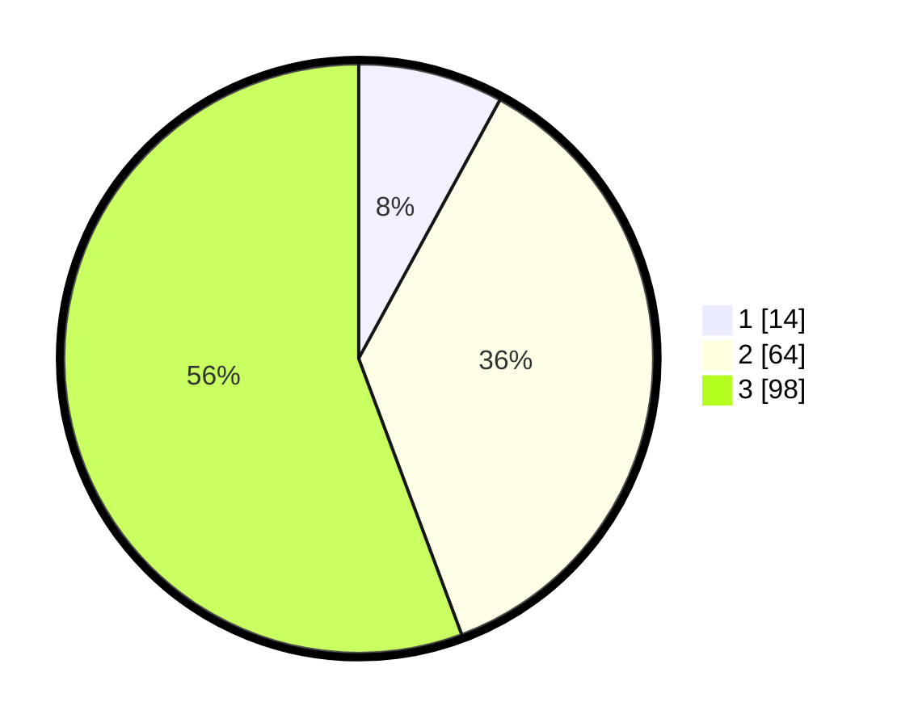

# Hasil

## Grafik

## Tabel

| No. | Nama Paslon    | Suara | Suara (raw) | Persentase |
|:--- |:-------------- | -----:| -----------:| ----------:|
| 1   | ANIES MUHAIMIN | 14    | [14][p-1]   | 7,95       |
| 2   | PRABOWO GIBRAN | 64    | [64][p-2]   | 36,36      |
| 3   | GANJAR MAHFUD  | 98    | [98][p-3]   | 55,68      |

[p-1]: https://github.com/gigit-pemilu/pemilu-2024/blob/main/pilpres/hitung-suara/sub/16-sumatera-selatan/sub/71-kota-palembang/sub/18-ilir-timur-tiga/sub/1002-sembilan-ilir/sub/021-tps/sub/paslon-1.txt
[p-2]: https://github.com/gigit-pemilu/pemilu-2024/blob/main/pilpres/hitung-suara/sub/16-sumatera-selatan/sub/71-kota-palembang/sub/18-ilir-timur-tiga/sub/1002-sembilan-ilir/sub/021-tps/sub/paslon-2.txt
[p-3]: https://github.com/gigit-pemilu/pemilu-2024/blob/main/pilpres/hitung-suara/sub/16-sumatera-selatan/sub/71-kota-palembang/sub/18-ilir-timur-tiga/sub/1002-sembilan-ilir/sub/021-tps/sub/paslon-3.txt

## Foto C Plano

https://sirekap-obj-formc.kpu.go.id/f4a1/pemilu/ppwp/16/71/18/10/02/1671181002021-20240229-180057--c5515402-e4e6-4458-93e4-a7400c204136.jpg

https://sirekap-obj-formc.kpu.go.id/f4a1/pemilu/ppwp/16/71/18/10/02/1671181002021-20240214-212009--f1fc1e4b-f177-4ca7-bafa-e608b972c2e6.jpg

https://sirekap-obj-formc.kpu.go.id/f4a1/pemilu/ppwp/16/71/18/10/02/1671181002021-20240214-211947--92f9d56c-71bc-47c6-b08d-05e13267e79a.jpg

## Metadata

| Key        | Value               |
| ---------- | ------------------- |
| Time Stamp | 2024-02-29 19:00:00 |

