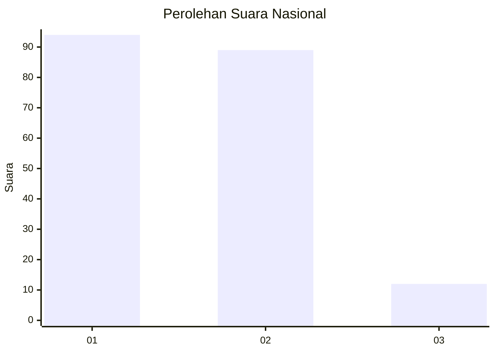
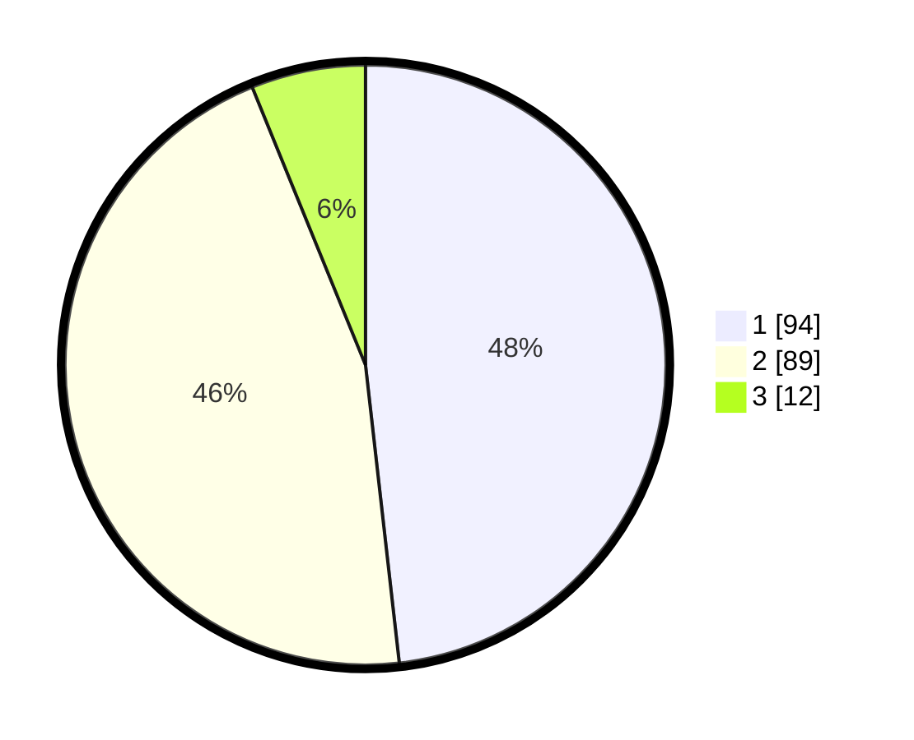

# Hasil

## Grafik

## Tabel

| No. | Nama Paslon    | Suara | Suara (raw) | Persentase |
|:--- |:-------------- | -----:| -----------:| ----------:|
| 1   | ANIES MUHAIMIN | 94    | [94][p-1]   | 48,21      |
| 2   | PRABOWO GIBRAN | 89    | [89][p-2]   | 45,64      |
| 3   | GANJAR MAHFUD  | 12    | [12][p-3]   | 6,15       |

[p-1]: https://github.com/gigit-pemilu/pemilu-2024/blob/main/pilpres/hitung-suara/sub/16-sumatera-selatan/sub/71-kota-palembang/sub/18-ilir-timur-tiga/sub/1002-sembilan-ilir/sub/037-tps/sub/paslon-1.txt
[p-2]: https://github.com/gigit-pemilu/pemilu-2024/blob/main/pilpres/hitung-suara/sub/16-sumatera-selatan/sub/71-kota-palembang/sub/18-ilir-timur-tiga/sub/1002-sembilan-ilir/sub/037-tps/sub/paslon-2.txt
[p-3]: https://github.com/gigit-pemilu/pemilu-2024/blob/main/pilpres/hitung-suara/sub/16-sumatera-selatan/sub/71-kota-palembang/sub/18-ilir-timur-tiga/sub/1002-sembilan-ilir/sub/037-tps/sub/paslon-3.txt

## Foto C Plano

https://sirekap-obj-formc.kpu.go.id/f00d/pemilu/ppwp/16/71/18/10/02/1671181002037-20240215-035909--480dc48f-1bc5-4ec4-8f0c-92c1c42b5be4.jpg

https://sirekap-obj-formc.kpu.go.id/f00d/pemilu/ppwp/16/71/18/10/02/1671181002037-20240215-035955--a0049f6f-9a08-48c1-9f9d-efa62e1a7f56.jpg

https://sirekap-obj-formc.kpu.go.id/f00d/pemilu/ppwp/16/71/18/10/02/1671181002037-20240215-040037--477697f7-679e-48df-9308-069e4fd03f1b.jpg

## Metadata

| Key        | Value               |
| ---------- | ------------------- |
| Time Stamp | 2024-02-24 22:31:28 |

