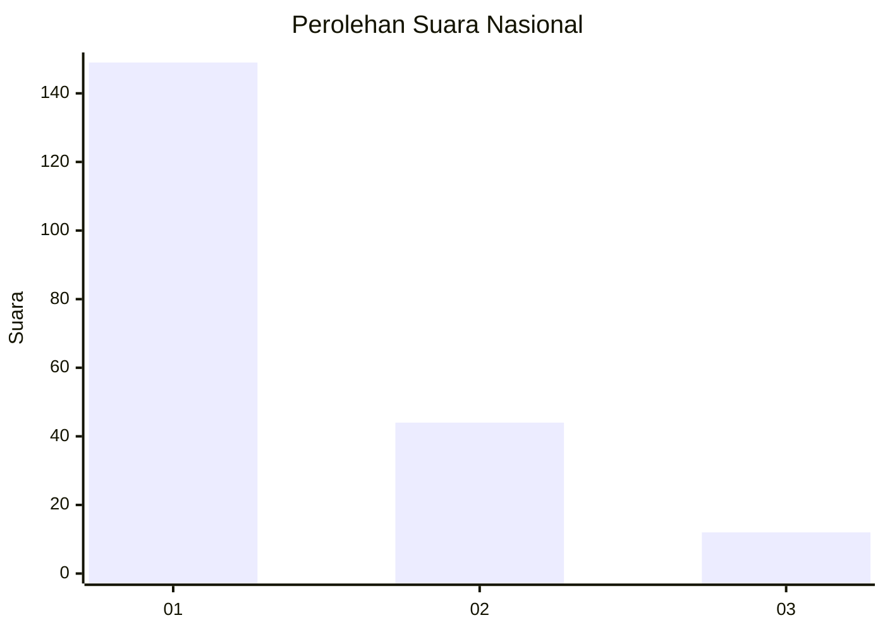
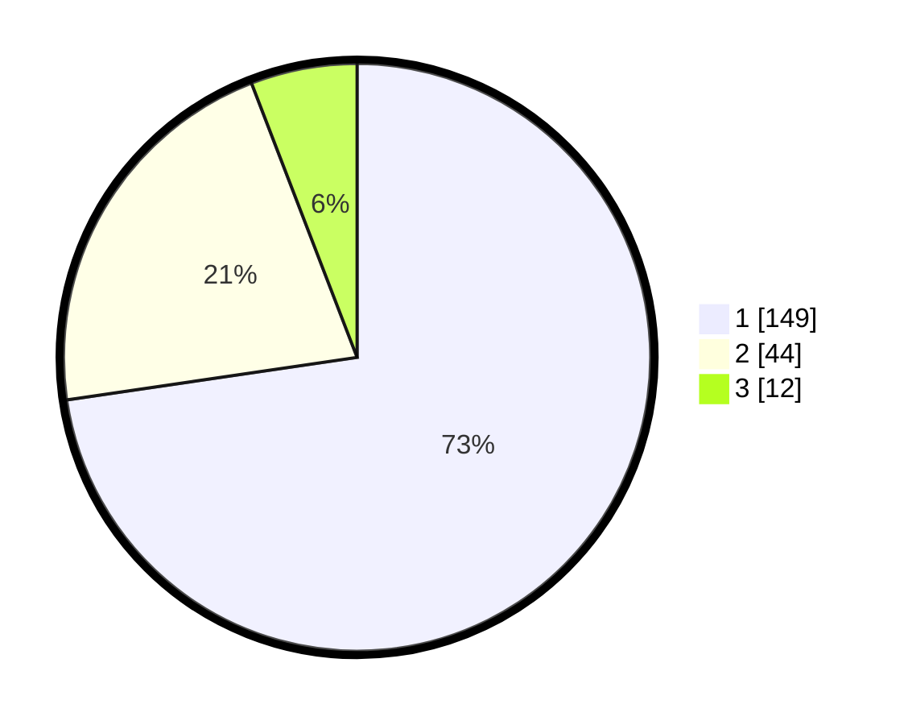

# Hasil

## Grafik

## Tabel

| No. | Nama Paslon    | Suara | Suara (raw) | Persentase |
|:--- |:-------------- | -----:| -----------:| ----------:|
| 1   | ANIES MUHAIMIN | 149   | [149][p-1]  | 72,68      |
| 2   | PRABOWO GIBRAN | 44    | [44][p-2]   | 21,46      |
| 3   | GANJAR MAHFUD  | 12    | [12][p-3]   | 5,85       |

[p-1]: https://github.com/gigit-pemilu/pemilu-2024/blob/main/pilpres/hitung-suara/sub/16-sumatera-selatan/sub/71-kota-palembang/sub/18-ilir-timur-tiga/sub/1003-sepuluh-ilir/sub/009-tps/sub/paslon-1.txt
[p-2]: https://github.com/gigit-pemilu/pemilu-2024/blob/main/pilpres/hitung-suara/sub/16-sumatera-selatan/sub/71-kota-palembang/sub/18-ilir-timur-tiga/sub/1003-sepuluh-ilir/sub/009-tps/sub/paslon-2.txt
[p-3]: https://github.com/gigit-pemilu/pemilu-2024/blob/main/pilpres/hitung-suara/sub/16-sumatera-selatan/sub/71-kota-palembang/sub/18-ilir-timur-tiga/sub/1003-sepuluh-ilir/sub/009-tps/sub/paslon-3.txt

## Foto C Plano

https://sirekap-obj-formc.kpu.go.id/7cf1/pemilu/ppwp/16/71/18/10/03/1671181003009-20240229-133324--0210da1b-1de5-4942-b03b-9aaa00502a26.jpg

https://sirekap-obj-formc.kpu.go.id/7cf1/pemilu/ppwp/16/71/18/10/03/1671181003009-20240215-034337--61a39cf9-4064-4370-a926-507cf82a0b5f.jpg

https://sirekap-obj-formc.kpu.go.id/7cf1/pemilu/ppwp/16/71/18/10/03/1671181003009-20240215-034354--12498e64-d3dc-464c-819d-3f409046860f.jpg

## Metadata

| Key        | Value               |
| ---------- | ------------------- |
| Time Stamp | 2024-02-29 14:00:00 |

