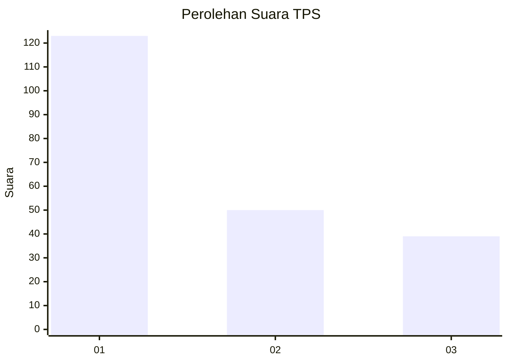
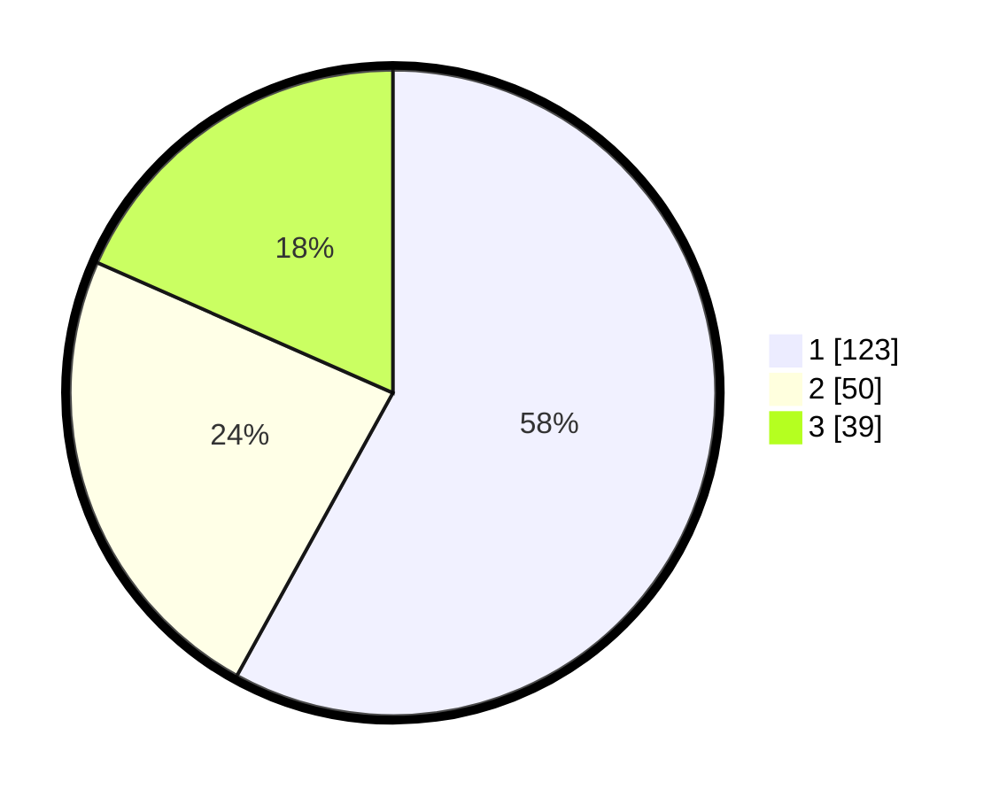

# Hasil

## Grafik

## Tabel

| No. | Nama Paslon    | Suara | Suara (raw) | Persentase |
|:--- |:-------------- | -----:| -----------:| ----------:|
| 1   | ANIES MUHAIMIN | 123   | [123][p-1]  | 58,02      |
| 2   | PRABOWO GIBRAN | 50    | [50][p-2]   | 23,58      |
| 3   | GANJAR MAHFUD  | 39    | [39][p-3]   | 18,40      |

[p-1]: https://github.com/gigit-pemilu/pemilu-2024-16-sumatera-selatan/blob/main/pilpres/hitung-suara/sub/16-sumatera-selatan/sub/71-kota-palembang/sub/18-ilir-timur-tiga/sub/1005-kutobatu/sub/025-tps/sub/paslon-1.txt
[p-2]: https://github.com/gigit-pemilu/pemilu-2024-16-sumatera-selatan/blob/main/pilpres/hitung-suara/sub/16-sumatera-selatan/sub/71-kota-palembang/sub/18-ilir-timur-tiga/sub/1005-kutobatu/sub/025-tps/sub/paslon-2.txt
[p-3]: https://github.com/gigit-pemilu/pemilu-2024-16-sumatera-selatan/blob/main/pilpres/hitung-suara/sub/16-sumatera-selatan/sub/71-kota-palembang/sub/18-ilir-timur-tiga/sub/1005-kutobatu/sub/025-tps/sub/paslon-3.txt

## Foto C Plano

https://sirekap-obj-formc.kpu.go.id/1229/pemilu/ppwp/16/71/18/10/05/1671181005025-20240218-174923--82d2ed86-705c-4919-8592-a441fab6af00.jpg

https://sirekap-obj-formc.kpu.go.id/1229/pemilu/ppwp/16/71/18/10/05/1671181005025-20240218-175135--373802f1-18a8-4fc2-b4fe-57f22545e85f.jpg

https://sirekap-obj-formc.kpu.go.id/1229/pemilu/ppwp/16/71/18/10/05/1671181005025-20240214-212626--9cf6812e-51f9-4def-8af8-6e1bf4be8055.jpg

## Metadata

| Key        | Value               |
| ---------- | ------------------- |
| Time Stamp | 2024-02-24 22:31:28 |

