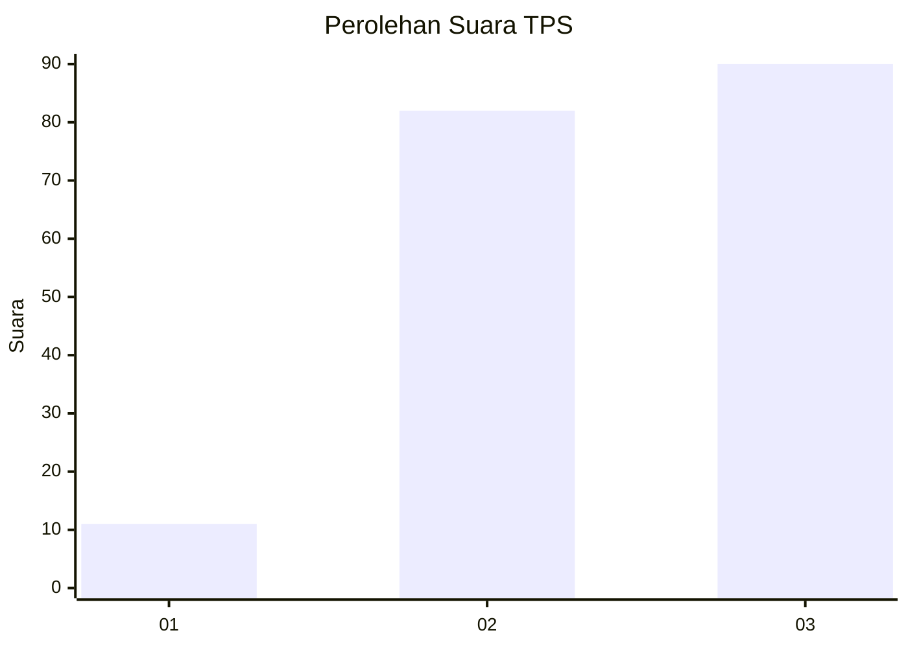
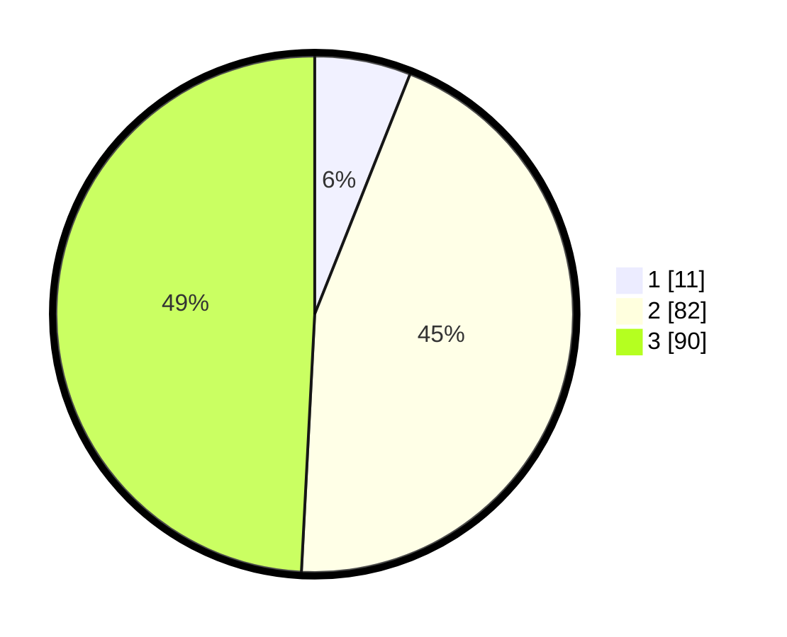

# Hasil

## Grafik

## Tabel

| No. | Nama Paslon    | Suara | Suara (raw) | Persentase |
|:--- |:-------------- | -----:| -----------:| ----------:|
| 1   | ANIES MUHAIMIN | 11    | [11][p-1]   | 6,01       |
| 2   | PRABOWO GIBRAN | 82    | [82][p-2]   | 44,81      |
| 3   | GANJAR MAHFUD  | 90    | [90][p-3]   | 49,18      |

[p-1]: https://github.com/gigit-pemilu/pemilu-2024-16-sumatera-selatan/blob/main/pilpres/hitung-suara/sub/16-sumatera-selatan/sub/71-kota-palembang/sub/18-ilir-timur-tiga/sub/1006-duku/sub/001-tps/sub/paslon-1.txt
[p-2]: https://github.com/gigit-pemilu/pemilu-2024-16-sumatera-selatan/blob/main/pilpres/hitung-suara/sub/16-sumatera-selatan/sub/71-kota-palembang/sub/18-ilir-timur-tiga/sub/1006-duku/sub/001-tps/sub/paslon-2.txt
[p-3]: https://github.com/gigit-pemilu/pemilu-2024-16-sumatera-selatan/blob/main/pilpres/hitung-suara/sub/16-sumatera-selatan/sub/71-kota-palembang/sub/18-ilir-timur-tiga/sub/1006-duku/sub/001-tps/sub/paslon-3.txt

## Foto C Plano

https://sirekap-obj-formc.kpu.go.id/d3f7/pemilu/ppwp/16/71/18/10/06/1671181006001-20240218-153234--c6c2a1cb-1339-49d1-b580-06c59e1cca42.jpg

https://sirekap-obj-formc.kpu.go.id/d3f7/pemilu/ppwp/16/71/18/10/06/1671181006001-20240218-153336--9e27cc22-cb68-4b29-9795-f6b294b5488c.jpg

https://sirekap-obj-formc.kpu.go.id/d3f7/pemilu/ppwp/16/71/18/10/06/1671181006001-20240218-153705--d2de99af-054c-4ace-91c1-cda0c3634336.jpg

## Metadata

| Key        | Value               |
| ---------- | ------------------- |
| Time Stamp | 2024-02-25 00:00:00 |

