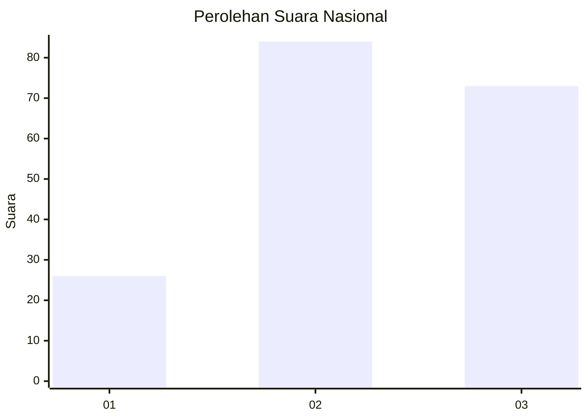
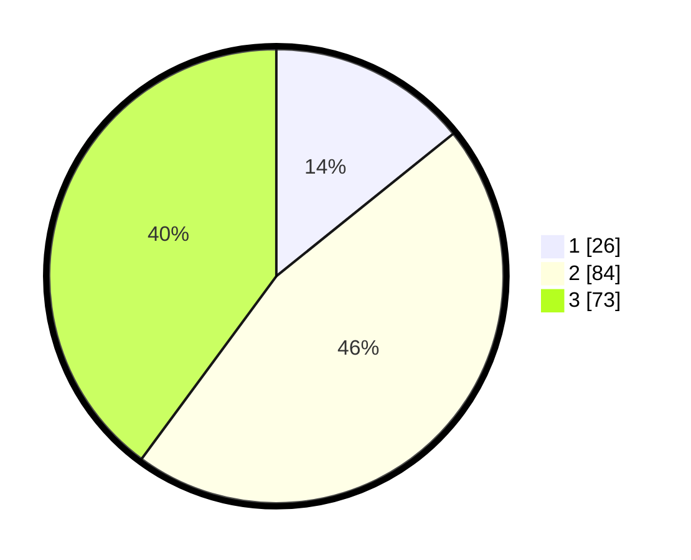

# Hasil

## Grafik

## Tabel

| No. | Nama Paslon    | Suara | Suara (raw) | Persentase |
|:--- |:-------------- | -----:| -----------:| ----------:|
| 1   | ANIES MUHAIMIN | 26    | [26][p-1]   | 14,21      |
| 2   | PRABOWO GIBRAN | 84    | [84][p-2]   | 45,90      |
| 3   | GANJAR MAHFUD  | 73    | [73][p-3]   | 39,89      |

[p-1]: https://github.com/gigit-pemilu/pemilu-2024/blob/main/pilpres/hitung-suara/sub/16-sumatera-selatan/sub/71-kota-palembang/sub/18-ilir-timur-tiga/sub/1006-duku/sub/003-tps/sub/paslon-1.txt
[p-2]: https://github.com/gigit-pemilu/pemilu-2024/blob/main/pilpres/hitung-suara/sub/16-sumatera-selatan/sub/71-kota-palembang/sub/18-ilir-timur-tiga/sub/1006-duku/sub/003-tps/sub/paslon-2.txt
[p-3]: https://github.com/gigit-pemilu/pemilu-2024/blob/main/pilpres/hitung-suara/sub/16-sumatera-selatan/sub/71-kota-palembang/sub/18-ilir-timur-tiga/sub/1006-duku/sub/003-tps/sub/paslon-3.txt

## Foto C Plano

https://sirekap-obj-formc.kpu.go.id/d119/pemilu/ppwp/16/71/18/10/06/1671181006003-20240215-005825--62f3fdc1-e88b-4509-aa89-3799839e432e.jpg

https://sirekap-obj-formc.kpu.go.id/d119/pemilu/ppwp/16/71/18/10/06/1671181006003-20240215-005839--9e694d5e-b018-4946-b776-0c5c33453118.jpg

https://sirekap-obj-formc.kpu.go.id/d119/pemilu/ppwp/16/71/18/10/06/1671181006003-20240215-005853--843afd62-f47b-47bf-acda-bb7b6f24f751.jpg

## Metadata

| Key        | Value               |
| ---------- | ------------------- |
| Time Stamp | 2024-02-25 14:00:00 |

