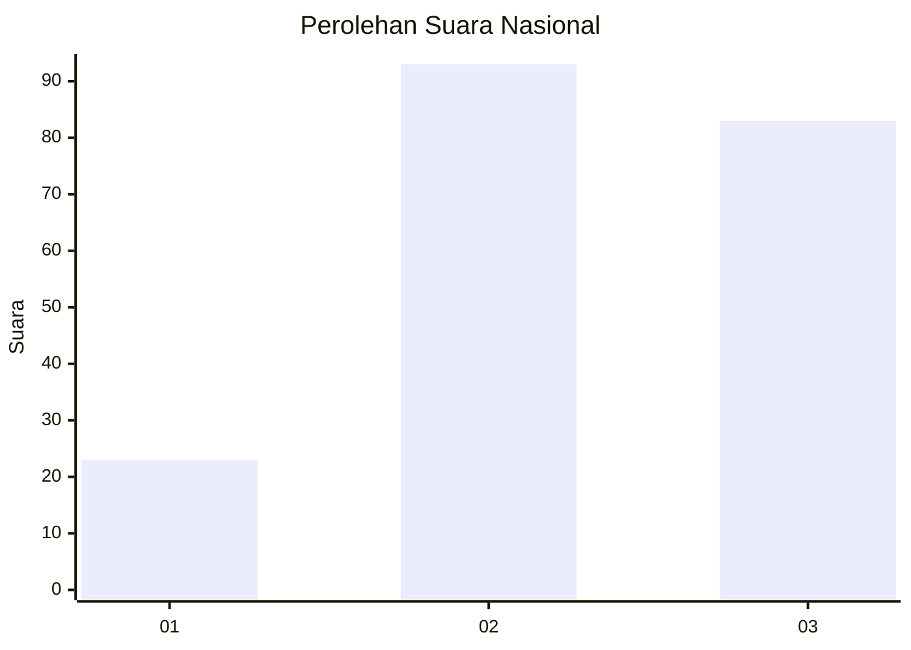
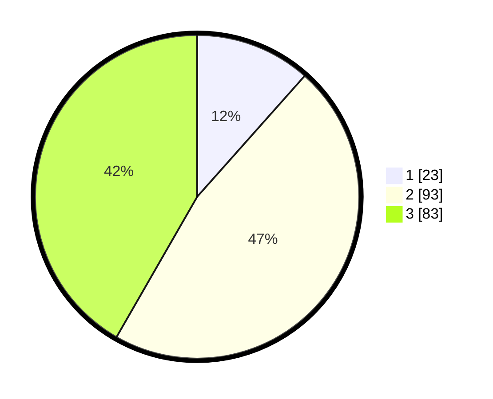

# Hasil

## Grafik

## Tabel

| No. | Nama Paslon    | Suara | Suara (raw) | Persentase |
|:--- |:-------------- | -----:| -----------:| ----------:|
| 1   | ANIES MUHAIMIN | 23    | [23][p-1]   | 11,56      |
| 2   | PRABOWO GIBRAN | 93    | [93][p-2]   | 46,73      |
| 3   | GANJAR MAHFUD  | 83    | [83][p-3]   | 41,71      |

[p-1]: https://github.com/gigit-pemilu/pemilu-2024/blob/main/pilpres/hitung-suara/sub/16-sumatera-selatan/sub/71-kota-palembang/sub/18-ilir-timur-tiga/sub/1006-duku/sub/020-tps/sub/paslon-1.txt
[p-2]: https://github.com/gigit-pemilu/pemilu-2024/blob/main/pilpres/hitung-suara/sub/16-sumatera-selatan/sub/71-kota-palembang/sub/18-ilir-timur-tiga/sub/1006-duku/sub/020-tps/sub/paslon-2.txt
[p-3]: https://github.com/gigit-pemilu/pemilu-2024/blob/main/pilpres/hitung-suara/sub/16-sumatera-selatan/sub/71-kota-palembang/sub/18-ilir-timur-tiga/sub/1006-duku/sub/020-tps/sub/paslon-3.txt

## Foto C Plano

https://sirekap-obj-formc.kpu.go.id/b7da/pemilu/ppwp/16/71/18/10/06/1671181006020-20240214-155920--7c8215df-f2de-424b-81e4-6994931da243.jpg

https://sirekap-obj-formc.kpu.go.id/b7da/pemilu/ppwp/16/71/18/10/06/1671181006020-20240214-160127--80a41d74-4ebc-48e4-9012-5b54eac8b240.jpg

https://sirekap-obj-formc.kpu.go.id/b7da/pemilu/ppwp/16/71/18/10/06/1671181006020-20240214-160121--51a7fb02-0061-4711-a49d-de948c44e771.jpg

## Metadata

| Key        | Value               |
| ---------- | ------------------- |
| Time Stamp | 2024-02-25 11:00:00 |

