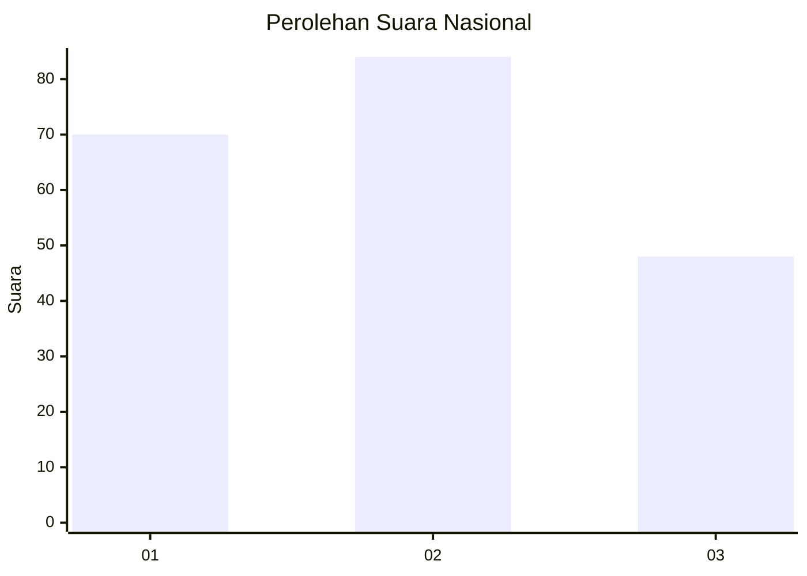
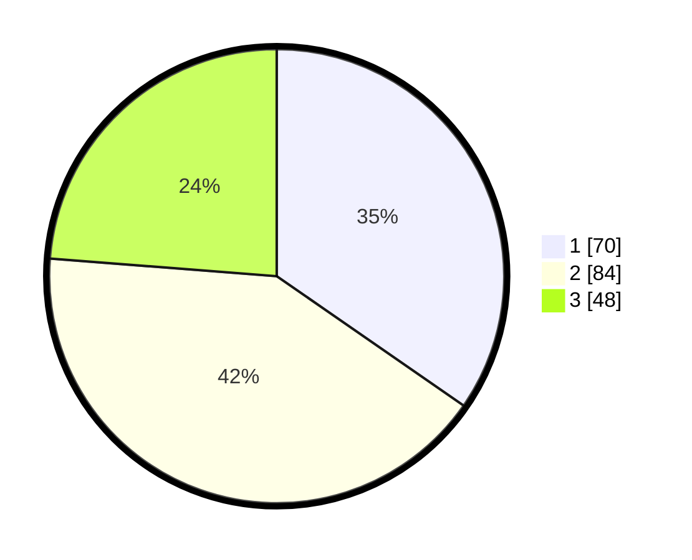

# Hasil

## Grafik

## Tabel

| No. | Nama Paslon    | Suara | Suara (raw) | Persentase |
|:--- |:-------------- | -----:| -----------:| ----------:|
| 1   | ANIES MUHAIMIN | 70    | [70][p-1]   | 34,65      |
| 2   | PRABOWO GIBRAN | 84    | [84][p-2]   | 41,58      |
| 3   | GANJAR MAHFUD  | 48    | [48][p-3]   | 23,76      |

[p-1]: https://github.com/gigit-pemilu/pemilu-2024/blob/main/pilpres/hitung-suara/sub/16-sumatera-selatan/sub/71-kota-palembang/sub/18-ilir-timur-tiga/sub/1006-duku/sub/041-tps/sub/paslon-1.txt
[p-2]: https://github.com/gigit-pemilu/pemilu-2024/blob/main/pilpres/hitung-suara/sub/16-sumatera-selatan/sub/71-kota-palembang/sub/18-ilir-timur-tiga/sub/1006-duku/sub/041-tps/sub/paslon-2.txt
[p-3]: https://github.com/gigit-pemilu/pemilu-2024/blob/main/pilpres/hitung-suara/sub/16-sumatera-selatan/sub/71-kota-palembang/sub/18-ilir-timur-tiga/sub/1006-duku/sub/041-tps/sub/paslon-3.txt

## Foto C Plano

https://sirekap-obj-formc.kpu.go.id/2d2d/pemilu/ppwp/16/71/18/10/06/1671181006041-20240218-175317--fa98e6e0-8b93-4917-9743-6a60bc29e295.jpg

https://sirekap-obj-formc.kpu.go.id/2d2d/pemilu/ppwp/16/71/18/10/06/1671181006041-20240218-175523--32f48c13-ec65-4512-93c4-a317bde81926.jpg

https://sirekap-obj-formc.kpu.go.id/2d2d/pemilu/ppwp/16/71/18/10/06/1671181006041-20240218-175400--0fdb2f55-e080-4c91-be1e-f1e59e8b5529.jpg

## Metadata

| Key        | Value               |
| ---------- | ------------------- |
| Time Stamp | 2024-02-25 21:00:00 |

