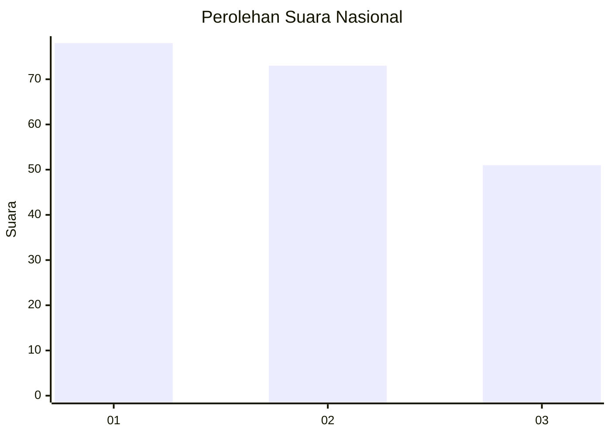
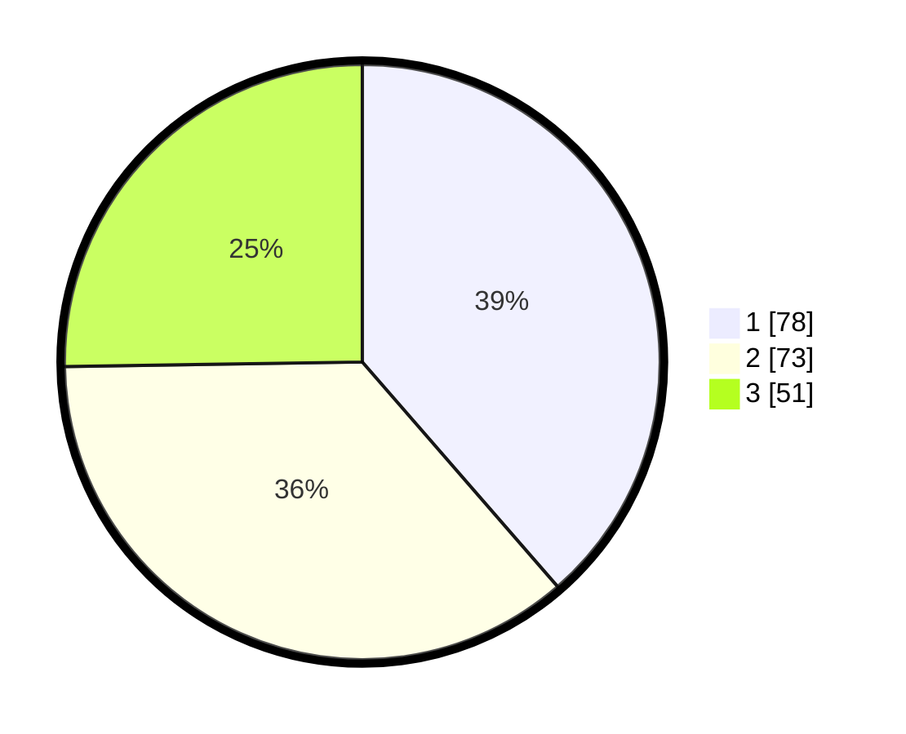

# Hasil

## Grafik

## Tabel

| No. | Nama Paslon    | Suara | Suara (raw) | Persentase |
|:--- |:-------------- | -----:| -----------:| ----------:|
| 1   | ANIES MUHAIMIN | 78    | [78][p-1]   | 38,61      |
| 2   | PRABOWO GIBRAN | 73    | [73][p-2]   | 36,14      |
| 3   | GANJAR MAHFUD  | 51    | [51][p-3]   | 25,25      |

[p-1]: https://github.com/gigit-pemilu/pemilu-2024/blob/main/pilpres/hitung-suara/sub/16-sumatera-selatan/sub/71-kota-palembang/sub/18-ilir-timur-tiga/sub/1006-duku/sub/046-tps/sub/paslon-1.txt
[p-2]: https://github.com/gigit-pemilu/pemilu-2024/blob/main/pilpres/hitung-suara/sub/16-sumatera-selatan/sub/71-kota-palembang/sub/18-ilir-timur-tiga/sub/1006-duku/sub/046-tps/sub/paslon-2.txt
[p-3]: https://github.com/gigit-pemilu/pemilu-2024/blob/main/pilpres/hitung-suara/sub/16-sumatera-selatan/sub/71-kota-palembang/sub/18-ilir-timur-tiga/sub/1006-duku/sub/046-tps/sub/paslon-3.txt

## Foto C Plano

https://sirekap-obj-formc.kpu.go.id/6146/pemilu/ppwp/16/71/18/10/06/1671181006046-20240302-174242--5d00319c-a498-4ece-ab68-56ef07894287.jpg

https://sirekap-obj-formc.kpu.go.id/6146/pemilu/ppwp/16/71/18/10/06/1671181006046-20240214-190803--6389e6d6-fd5f-4943-820d-41e661ad5cd5.jpg

https://sirekap-obj-formc.kpu.go.id/6146/pemilu/ppwp/16/71/18/10/06/1671181006046-20240214-191340--9cf4bded-788e-4df8-9901-bd1c82e7cedb.jpg

## Metadata

| Key        | Value               |
| ---------- | ------------------- |
| Time Stamp | 2024-03-02 18:00:00 |

