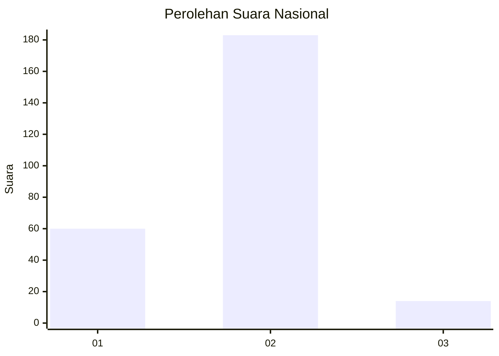
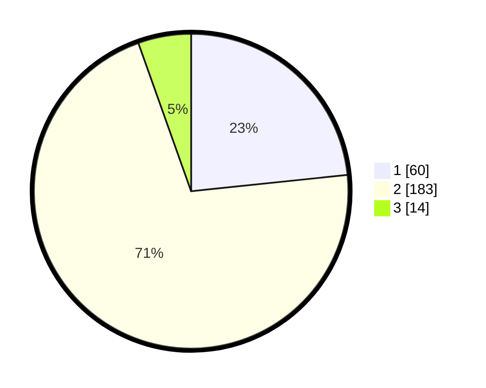

# Hasil

## Grafik

## Tabel

| No. | Nama Paslon    | Suara | Suara (raw) | Persentase |
|:--- |:-------------- | -----:| -----------:| ----------:|
| 1   | ANIES MUHAIMIN | 60    | [60][p-1]   | 23,35      |
| 2   | PRABOWO GIBRAN | 183   | [183][p-2]  | 71,21      |
| 3   | GANJAR MAHFUD  | 14    | [14][p-3]   | 5,45       |

[p-1]: https://github.com/gigit-pemilu/pemilu-2024/blob/main/pilpres/hitung-suara/sub/16-sumatera-selatan/sub/72-kota-pagar-alam/sub/01-pagar-alam-utara/sub/1002-bangun-rejo/sub/002-tps/sub/paslon-1.txt
[p-2]: https://github.com/gigit-pemilu/pemilu-2024/blob/main/pilpres/hitung-suara/sub/16-sumatera-selatan/sub/72-kota-pagar-alam/sub/01-pagar-alam-utara/sub/1002-bangun-rejo/sub/002-tps/sub/paslon-2.txt
[p-3]: https://github.com/gigit-pemilu/pemilu-2024/blob/main/pilpres/hitung-suara/sub/16-sumatera-selatan/sub/72-kota-pagar-alam/sub/01-pagar-alam-utara/sub/1002-bangun-rejo/sub/002-tps/sub/paslon-3.txt

## Foto C Plano

https://sirekap-obj-formc.kpu.go.id/c644/pemilu/ppwp/16/72/01/10/02/1672011002002-20240214-190814--7fcca851-45ba-43bb-9d7f-91ec61407366.jpg

https://sirekap-obj-formc.kpu.go.id/c644/pemilu/ppwp/16/72/01/10/02/1672011002002-20240215-011953--ee6ddfd7-5e66-4830-aacc-3795b4c9d85d.jpg

https://sirekap-obj-formc.kpu.go.id/c644/pemilu/ppwp/16/72/01/10/02/1672011002002-20240215-012322--8a22f60e-0f17-49e0-8788-e827a1424902.jpg

## Metadata

| Key        | Value               |
| ---------- | ------------------- |
| Time Stamp | 2024-02-20 17:00:00 |

