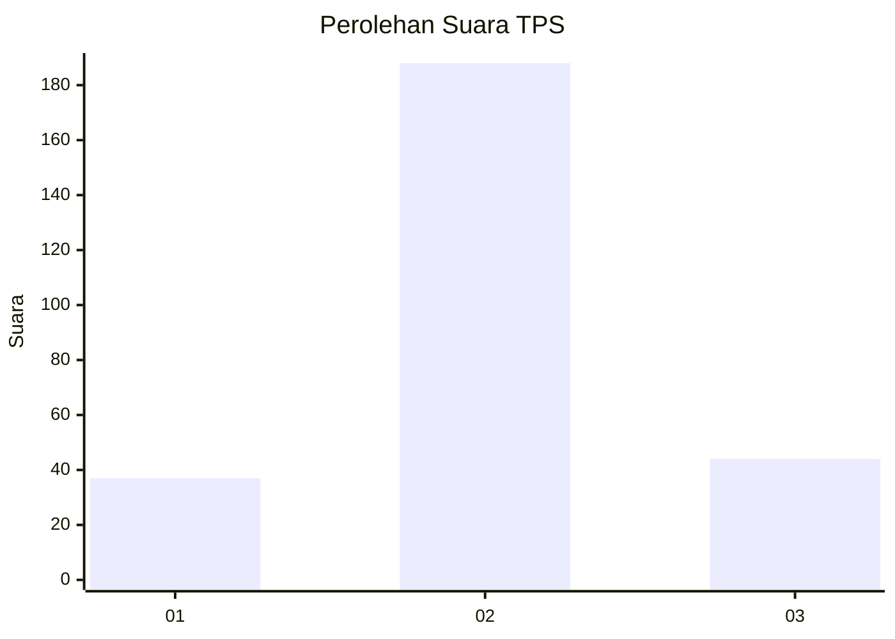
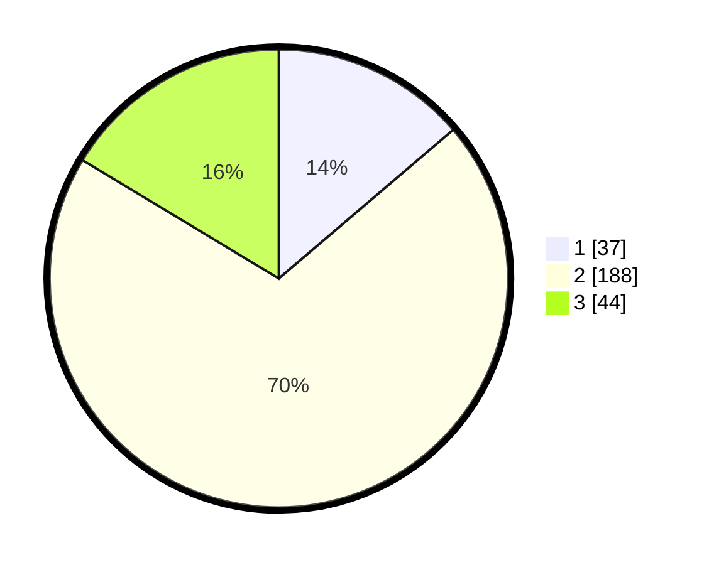

# Hasil

## Grafik

## Tabel

| No. | Nama Paslon    | Suara | Suara (raw) | Persentase |
|:--- |:-------------- | -----:| -----------:| ----------:|
| 1   | ANIES MUHAIMIN | 37    | [37][p-1]   | 13,75      |
| 2   | PRABOWO GIBRAN | 188   | [188][p-2]  | 69,89      |
| 3   | GANJAR MAHFUD  | 44    | [44][p-3]   | 16,36      |

[p-1]: https://github.com/gigit-pemilu/pemilu-2024-16-sumatera-selatan/blob/main/pilpres/hitung-suara/sub/16-sumatera-selatan/sub/72-kota-pagar-alam/sub/01-pagar-alam-utara/sub/1002-bangun-rejo/sub/005-tps/sub/paslon-1.txt
[p-2]: https://github.com/gigit-pemilu/pemilu-2024-16-sumatera-selatan/blob/main/pilpres/hitung-suara/sub/16-sumatera-selatan/sub/72-kota-pagar-alam/sub/01-pagar-alam-utara/sub/1002-bangun-rejo/sub/005-tps/sub/paslon-2.txt
[p-3]: https://github.com/gigit-pemilu/pemilu-2024-16-sumatera-selatan/blob/main/pilpres/hitung-suara/sub/16-sumatera-selatan/sub/72-kota-pagar-alam/sub/01-pagar-alam-utara/sub/1002-bangun-rejo/sub/005-tps/sub/paslon-3.txt

## Foto C Plano

https://sirekap-obj-formc.kpu.go.id/ad80/pemilu/ppwp/16/72/01/10/02/1672011002005-20240221-105330--ebc11345-667a-4aeb-86a6-fc466ab59f51.jpg

https://sirekap-obj-formc.kpu.go.id/ad80/pemilu/ppwp/16/72/01/10/02/1672011002005-20240221-105750--a9d0ff42-61bb-4083-9e1b-65925c2bce63.jpg

https://sirekap-obj-formc.kpu.go.id/ad80/pemilu/ppwp/16/72/01/10/02/1672011002005-20240221-105846--f943f361-218d-46e1-98c5-c2f1a5171a31.jpg

## Metadata

| Key        | Value               |
| ---------- | ------------------- |
| Time Stamp | 2024-02-22 12:00:00 |

