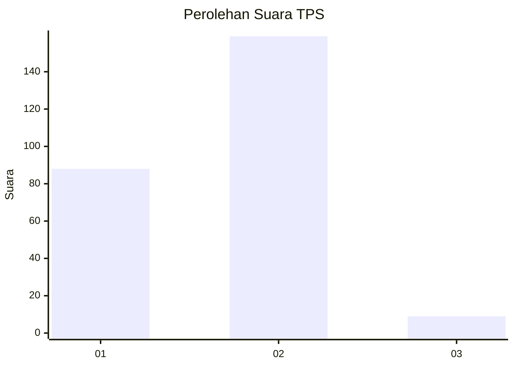
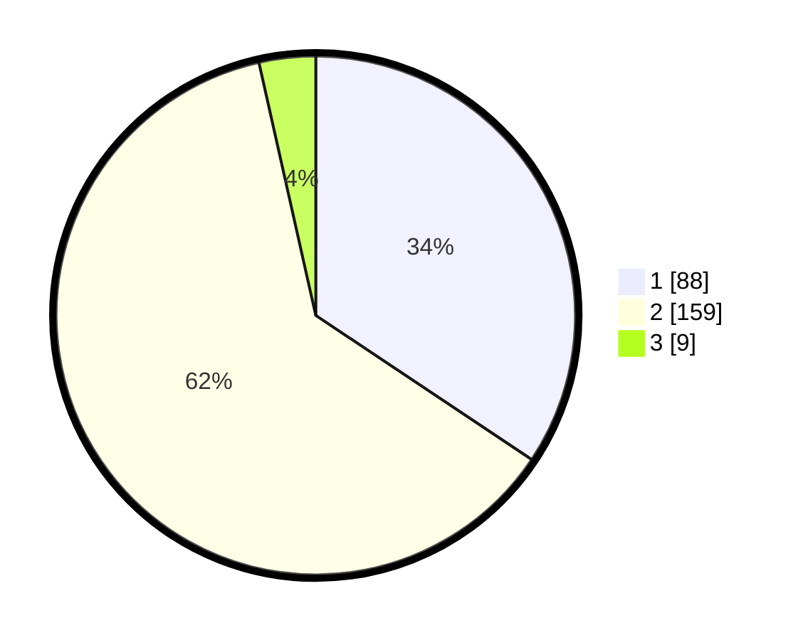

# Hasil

## Grafik

## Tabel

| No. | Nama Paslon    | Suara | Suara (raw) | Persentase |
|:--- |:-------------- | -----:| -----------:| ----------:|
| 1   | ANIES MUHAIMIN | 88    | [88][p-1]   | 34,38      |
| 2   | PRABOWO GIBRAN | 159   | [159][p-2]  | 62,11      |
| 3   | GANJAR MAHFUD  | 9     | [9][p-3]    | 3,52       |

[p-1]: https://github.com/gigit-pemilu/pemilu-2024-16-sumatera-selatan/blob/main/pilpres/hitung-suara/sub/16-sumatera-selatan/sub/72-kota-pagar-alam/sub/01-pagar-alam-utara/sub/1002-bangun-rejo/sub/014-tps/sub/paslon-1.txt
[p-2]: https://github.com/gigit-pemilu/pemilu-2024-16-sumatera-selatan/blob/main/pilpres/hitung-suara/sub/16-sumatera-selatan/sub/72-kota-pagar-alam/sub/01-pagar-alam-utara/sub/1002-bangun-rejo/sub/014-tps/sub/paslon-2.txt
[p-3]: https://github.com/gigit-pemilu/pemilu-2024-16-sumatera-selatan/blob/main/pilpres/hitung-suara/sub/16-sumatera-selatan/sub/72-kota-pagar-alam/sub/01-pagar-alam-utara/sub/1002-bangun-rejo/sub/014-tps/sub/paslon-3.txt

## Foto C Plano

https://sirekap-obj-formc.kpu.go.id/bb4b/pemilu/ppwp/16/72/01/10/02/1672011002014-20240221-140823--b725ce08-6c69-49de-b9d4-cf22d5e141ff.jpg

https://sirekap-obj-formc.kpu.go.id/bb4b/pemilu/ppwp/16/72/01/10/02/1672011002014-20240221-140854--ef4003fe-2f1f-4625-8ae6-56a282a1bb62.jpg

https://sirekap-obj-formc.kpu.go.id/bb4b/pemilu/ppwp/16/72/01/10/02/1672011002014-20240221-141010--3129c21e-b553-49b5-9bf0-ed9370a1e1c9.jpg

## Metadata

| Key        | Value               |
| ---------- | ------------------- |
| Time Stamp | 2024-02-22 12:00:00 |

