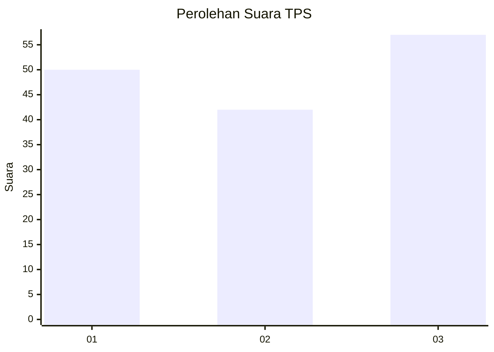
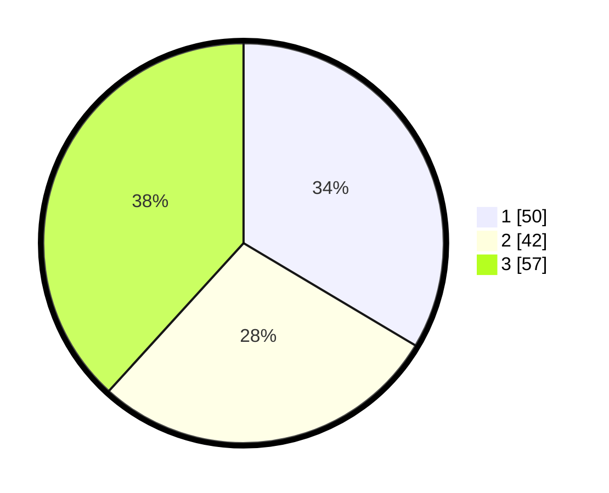

# Hasil

## Grafik

## Tabel

| No. | Nama Paslon    | Suara | Suara (raw) | Persentase |
|:--- |:-------------- | -----:| -----------:| ----------:|
| 1   | ANIES MUHAIMIN | 50    | [50][p-1]   | 33,56      |
| 2   | PRABOWO GIBRAN | 42    | [42][p-2]   | 28,19      |
| 3   | GANJAR MAHFUD  | 57    | [57][p-3]   | 38,26      |

[p-1]: https://github.com/gigit-pemilu/pemilu-2024-16-sumatera-selatan/blob/main/pilpres/hitung-suara/sub/16-sumatera-selatan/sub/72-kota-pagar-alam/sub/01-pagar-alam-utara/sub/1002-bangun-rejo/sub/019-tps/sub/paslon-1.txt
[p-2]: https://github.com/gigit-pemilu/pemilu-2024-16-sumatera-selatan/blob/main/pilpres/hitung-suara/sub/16-sumatera-selatan/sub/72-kota-pagar-alam/sub/01-pagar-alam-utara/sub/1002-bangun-rejo/sub/019-tps/sub/paslon-2.txt
[p-3]: https://github.com/gigit-pemilu/pemilu-2024-16-sumatera-selatan/blob/main/pilpres/hitung-suara/sub/16-sumatera-selatan/sub/72-kota-pagar-alam/sub/01-pagar-alam-utara/sub/1002-bangun-rejo/sub/019-tps/sub/paslon-3.txt

## Foto C Plano

https://sirekap-obj-formc.kpu.go.id/7234/pemilu/ppwp/16/72/01/10/02/1672011002019-20240221-153031--af8e0ced-d985-49e8-b659-59098519ac17.jpg

https://sirekap-obj-formc.kpu.go.id/7234/pemilu/ppwp/16/72/01/10/02/1672011002019-20240221-153100--6236861b-15b3-4899-b2f7-00f3cc206436.jpg

https://sirekap-obj-formc.kpu.go.id/7234/pemilu/ppwp/16/72/01/10/02/1672011002019-20240221-153240--a5b0cbcc-b94c-4505-89f4-62d6345002e7.jpg

## Metadata

| Key        | Value               |
| ---------- | ------------------- |
| Time Stamp | 2024-02-22 13:00:00 |

