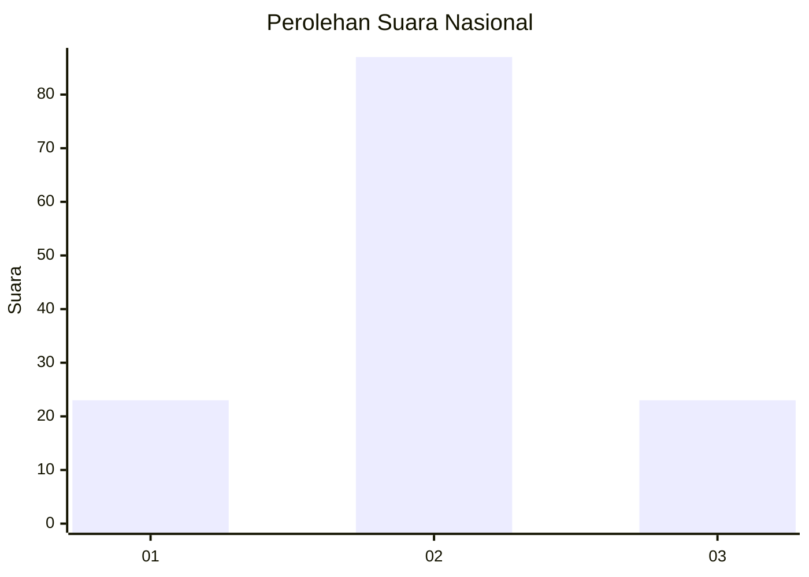
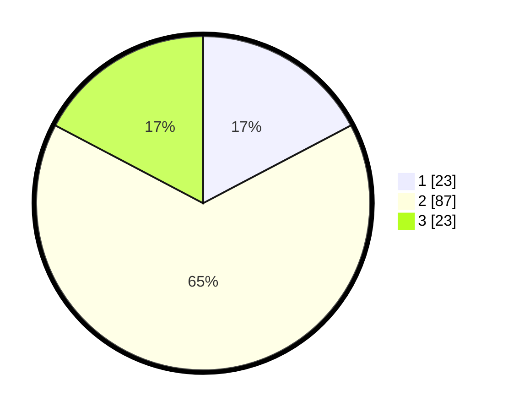

# Hasil

## Grafik

## Tabel

| No. | Nama Paslon    | Suara | Suara (raw) | Persentase |
|:--- |:-------------- | -----:| -----------:| ----------:|
| 1   | ANIES MUHAIMIN | 23    | [23][p-1]   | 17,29      |
| 2   | PRABOWO GIBRAN | 87    | [87][p-2]   | 65,41      |
| 3   | GANJAR MAHFUD  | 23    | [23][p-3]   | 17,29      |

[p-1]: https://github.com/gigit-pemilu/pemilu-2024/blob/main/pilpres/hitung-suara/sub/16-sumatera-selatan/sub/72-kota-pagar-alam/sub/01-pagar-alam-utara/sub/1007-alun-dua/sub/006-tps/sub/paslon-1.txt
[p-2]: https://github.com/gigit-pemilu/pemilu-2024/blob/main/pilpres/hitung-suara/sub/16-sumatera-selatan/sub/72-kota-pagar-alam/sub/01-pagar-alam-utara/sub/1007-alun-dua/sub/006-tps/sub/paslon-2.txt
[p-3]: https://github.com/gigit-pemilu/pemilu-2024/blob/main/pilpres/hitung-suara/sub/16-sumatera-selatan/sub/72-kota-pagar-alam/sub/01-pagar-alam-utara/sub/1007-alun-dua/sub/006-tps/sub/paslon-3.txt

## Foto C Plano

https://sirekap-obj-formc.kpu.go.id/c274/pemilu/ppwp/16/72/01/10/07/1672011007006-20240223-110337--33e39cb5-0954-460a-b7ab-3bb7b67e6b80.jpg

https://sirekap-obj-formc.kpu.go.id/c274/pemilu/ppwp/16/72/01/10/07/1672011007006-20240223-110442--90357b30-d7c5-429c-9226-56c1d84406b4.jpg

https://sirekap-obj-formc.kpu.go.id/c274/pemilu/ppwp/16/72/01/10/07/1672011007006-20240223-110528--25bf1f11-49bd-4999-a4af-28e5c9df1d88.jpg

## Metadata

| Key        | Value               |
| ---------- | ------------------- |
| Time Stamp | 2024-02-24 22:31:28 |

